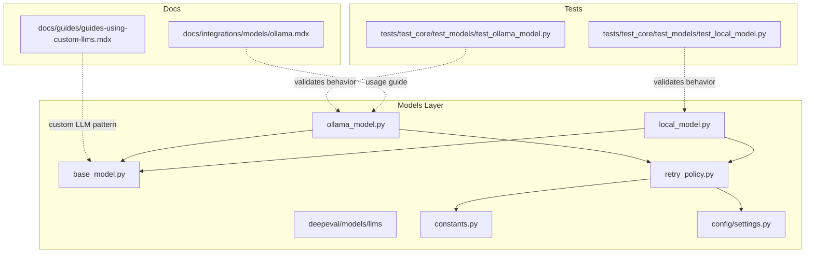
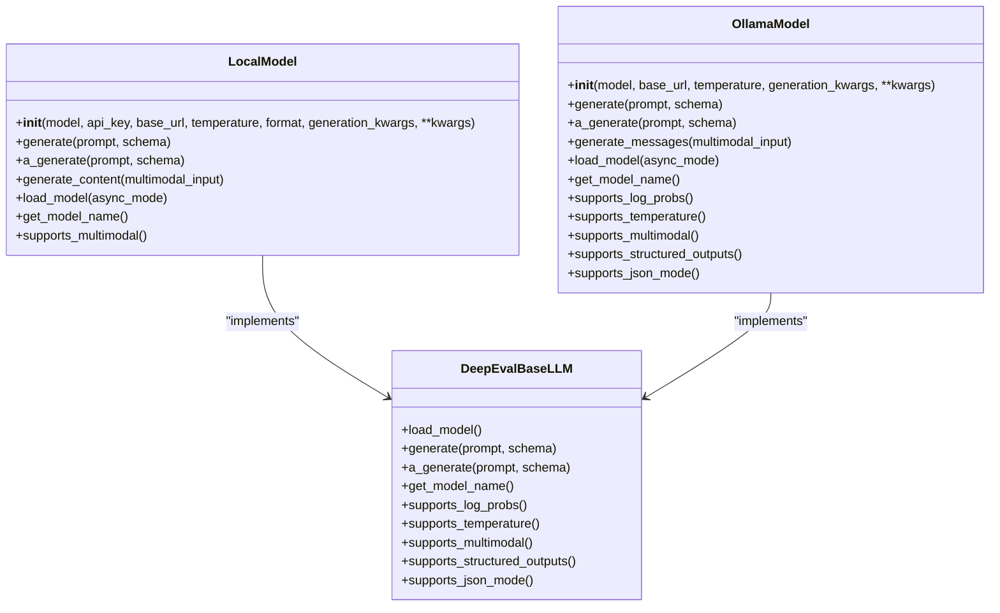
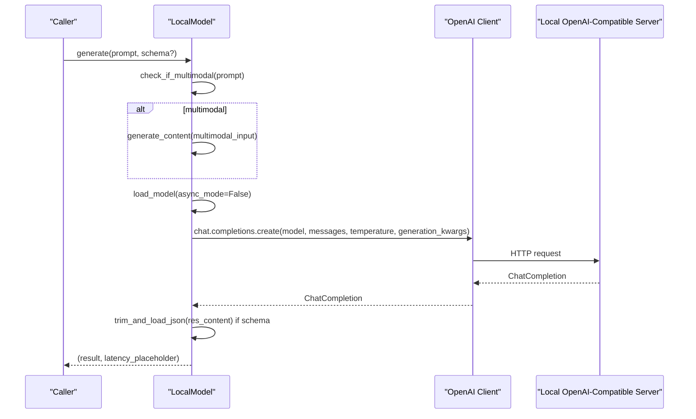
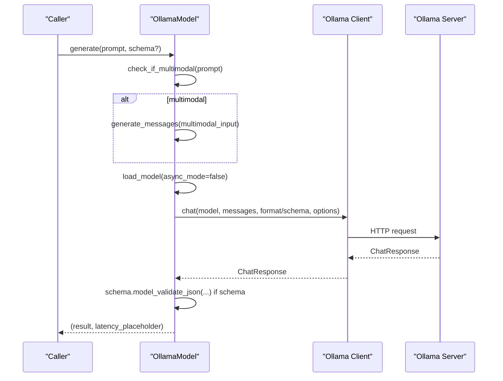
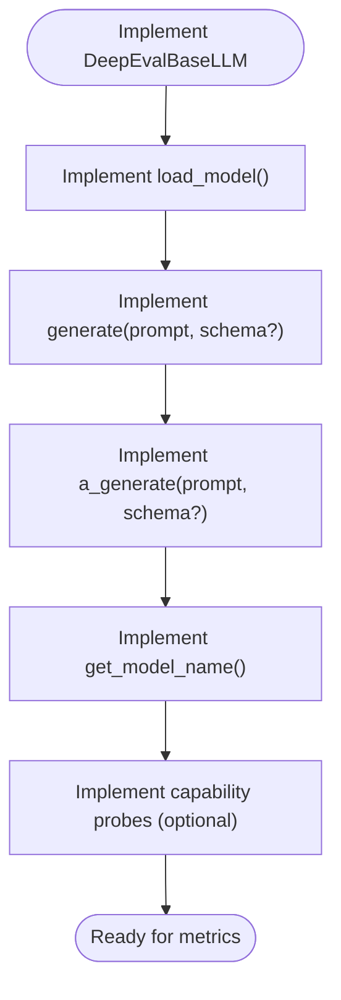
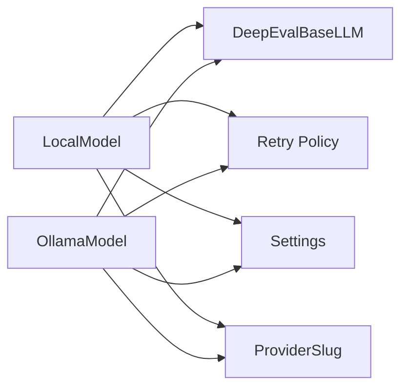

# Local Models Integration

<cite>
**Referenced Files in This Document**
- [local_model.py](file://deepeval/models/llms/local_model.py)
- [ollama_model.py](file://deepeval/models/llms/ollama_model.py)
- [base_model.py](file://deepeval/models/base_model.py)
- [retry_policy.py](file://deepeval/models/retry_policy.py)
- [constants.py](file://deepeval/constants.py)
- [settings.py](file://deepeval/config/settings.py)
- [ollama.mdx](file://docs/integrations/models/ollama.mdx)
- [guides-using-custom-llms.mdx](file://docs/guides/guides-using-custom-llms.mdx)
- [test_local_model.py](file://tests/test_core/test_models/test_local_model.py)
- [test_ollama_model.py](file://tests/test_core/test_models/test_ollama_model.py)
- [main.py](file://deepeval/cli/main.py)
</cite>

## Table of Contents
1. [Introduction](#introduction)
2. [Project Structure](#project-structure)
3. [Core Components](#core-components)
4. [Architecture Overview](#architecture-overview)
5. [Detailed Component Analysis](#detailed-component-analysis)
6. [Dependency Analysis](#dependency-analysis)
7. [Performance Considerations](#performance-considerations)
8. [Troubleshooting Guide](#troubleshooting-guide)
9. [Conclusion](#conclusion)
10. [Appendices](#appendices)

## Introduction
This document explains how to integrate local LLMs into DeepEval, focusing on two primary pathways:
- Using a local OpenAI-compatible server (e.g., LM Studio, Jan, or any compatible endpoint) via the LocalModel class.
- Using Ollama via the OllamaModel class.

It covers how LocalModel and OllamaModel implement the DeepEvalBaseLLM interface, how they connect to local servers, configuration options, and how they handle structured outputs and multimodal inputs. It also provides guidance on retry logic, timeouts, and performance trade-offs compared to cloud providers.

## Project Structure
DeepEval organizes local model integrations under the models/llms package. The key files are:
- LocalModel: wraps an OpenAI-compatible client to talk to local servers.
- OllamaModel: wraps the official ollama Python client to talk to a local Ollama server.
- DeepEvalBaseLLM: the abstract interface that both classes implement.
- Retry policy: shared retry and timeout utilities for transient failures.
- Settings and constants: environment variables and provider slugs used by the retry system.

**Diagram sources**
- [local_model.py](file://deepeval/models/llms/local_model.py#L1-L243)
- [ollama_model.py](file://deepeval/models/llms/ollama_model.py#L1-L238)
- [base_model.py](file://deepeval/models/base_model.py#L45-L124)
- [retry_policy.py](file://deepeval/models/retry_policy.py#L626-L686)
- [constants.py](file://deepeval/constants.py#L26-L49)
- [settings.py](file://deepeval/config/settings.py#L1-L200)
- [ollama.mdx](file://docs/integrations/models/ollama.mdx#L1-L101)
- [guides-using-custom-llms.mdx](file://docs/guides/guides-using-custom-llms.mdx#L1-L120)
- [test_local_model.py](file://tests/test_core/test_models/test_local_model.py#L1-L144)
- [test_ollama_model.py](file://tests/test_core/test_models/test_ollama_model.py#L1-L78)

**Section sources**
- [local_model.py](file://deepeval/models/llms/local_model.py#L1-L243)
- [ollama_model.py](file://deepeval/models/llms/ollama_model.py#L1-L238)
- [base_model.py](file://deepeval/models/base_model.py#L45-L124)
- [retry_policy.py](file://deepeval/models/retry_policy.py#L626-L686)
- [constants.py](file://deepeval/constants.py#L26-L49)
- [settings.py](file://deepeval/config/settings.py#L1-L200)
- [ollama.mdx](file://docs/integrations/models/ollama.mdx#L1-L101)
- [guides-using-custom-llms.mdx](file://docs/guides/guides-using-custom-llms.mdx#L1-L120)
- [test_local_model.py](file://tests/test_core/test_models/test_local_model.py#L1-L144)
- [test_ollama_model.py](file://tests/test_core/test_models/test_ollama_model.py#L1-L78)

## Core Components
- LocalModel
  - Implements DeepEvalBaseLLM to wrap an OpenAI-compatible client against a local base_url.
  - Supports structured outputs via schema and multimodal prompts.
  - Integrates with retry policy and respects SDK retry settings.
- OllamaModel
  - Implements DeepEvalBaseLLM to wrap the official ollama Python client.
  - Detects capabilities (log probs, temperature, multimodal, structured outputs, JSON mode) from a registry of known models.
  - Supports structured outputs via schema and multimodal prompts.
- DeepEvalBaseLLM
  - Defines the contract: load_model, generate, a_generate, get_model_name, and capability probes.
- Retry Policy
  - Provides a unified retry decorator and timeout utilities for transient failures.
  - Applies provider-specific policies and respects settings for SDK-managed retries.

**Section sources**
- [local_model.py](file://deepeval/models/llms/local_model.py#L30-L243)
- [ollama_model.py](file://deepeval/models/llms/ollama_model.py#L23-L238)
- [base_model.py](file://deepeval/models/base_model.py#L45-L124)
- [retry_policy.py](file://deepeval/models/retry_policy.py#L626-L686)

## Architecture Overview
LocalModel and OllamaModel both implement the same interface and share retry and timeout infrastructure. They differ in how they connect to the server and how they handle structured outputs and multimodal inputs.

**Diagram sources**
- [base_model.py](file://deepeval/models/base_model.py#L45-L124)
- [local_model.py](file://deepeval/models/llms/local_model.py#L30-L243)
- [ollama_model.py](file://deepeval/models/llms/ollama_model.py#L23-L238)

## Detailed Component Analysis

### LocalModel Analysis
LocalModel connects to a local OpenAI-compatible server (e.g., LM Studio, Jan, or any compatible endpoint). It:
- Resolves model name, base_url, and API key from constructor arguments or settings.
- Builds an OpenAI client with max_retries disabled when SDK retries are managed elsewhere.
- Generates completions via chat.completions.create and supports structured outputs via schema.
- Handles multimodal prompts by converting them into an OpenAI-compatible array of text and images.

**Diagram sources**
- [local_model.py](file://deepeval/models/llms/local_model.py#L88-L139)
- [local_model.py](file://deepeval/models/llms/local_model.py#L140-L196)
- [local_model.py](file://deepeval/models/llms/local_model.py#L207-L243)

Key implementation notes:
- Constructor resolves model, base_url, API key, format, and temperature from environment or constructor arguments.
- load_model builds an OpenAI client; _build_client handles SDK compatibility for max_retries.
- generate and a_generate both support schema-based structured outputs.
- Multimodal handling converts images to data URIs for servers that cannot fetch external URLs.

Common configuration options:
- model: name of the model to call.
- base_url: local server endpoint (e.g., http://localhost:1234/v1).
- api_key: API key for the local server (often "lm-studio" or "ollama").
- temperature: sampling temperature.
- format: response format hint for the server.
- generation_kwargs: additional parameters forwarded to the server.

**Section sources**
- [local_model.py](file://deepeval/models/llms/local_model.py#L30-L113)
- [local_model.py](file://deepeval/models/llms/local_model.py#L114-L196)
- [local_model.py](file://deepeval/models/llms/local_model.py#L207-L243)
- [test_local_model.py](file://tests/test_core/test_models/test_local_model.py#L1-L144)

### OllamaModel Analysis
OllamaModel connects to a local Ollama server and:
- Resolves model and base_url from constructor or settings.
- Uses the official ollama Python client to call chat with options like temperature and generation_kwargs.
- Supports structured outputs via schema and multimodal prompts.
- Capability detection comes from a registry of known models.

**Diagram sources**
- [ollama_model.py](file://deepeval/models/llms/ollama_model.py#L74-L132)
- [ollama_model.py](file://deepeval/models/llms/ollama_model.py#L134-L191)
- [ollama_model.py](file://deepeval/models/llms/ollama_model.py#L215-L238)

Key implementation notes:
- Constructor resolves model and base_url from environment or constructor arguments.
- load_model constructs ollama.Client or ollama.AsyncClient depending on async_mode.
- generate_messages converts multimodal inputs into a messages array compatible with Ollama’s images parameter.
- Capability probes (supports_log_probs, supports_temperature, supports_multimodal, supports_structured_outputs, supports_json_mode) are derived from a model data registry.

Common configuration options:
- model: name of the Ollama model (e.g., llama3.1:8b).
- base_url: local Ollama server address (default http://localhost:11434).
- temperature: sampling temperature.
- generation_kwargs: additional options forwarded to Ollama’s options.

**Section sources**
- [ollama_model.py](file://deepeval/models/llms/ollama_model.py#L23-L132)
- [ollama_model.py](file://deepeval/models/llms/ollama_model.py#L134-L210)
- [ollama_model.py](file://deepeval/models/llms/ollama_model.py#L215-L238)
- [test_ollama_model.py](file://tests/test_core/test_models/test_ollama_model.py#L1-L78)

### DeepEvalBaseLLM Interface
Both LocalModel and OllamaModel implement the same interface:
- load_model: returns a model object ready to generate.
- generate: synchronous generation with optional schema.
- a_generate: asynchronous generation with optional schema.
- get_model_name: returns a displayable model name.
- Capability probes: supports_log_probs, supports_temperature, supports_multimodal, supports_structured_outputs, supports_json_mode.

**Diagram sources**
- [base_model.py](file://deepeval/models/base_model.py#L45-L124)

**Section sources**
- [base_model.py](file://deepeval/models/base_model.py#L45-L124)

## Dependency Analysis
- Both LocalModel and OllamaModel depend on:
  - DeepEvalBaseLLM for the interface contract.
  - Retry policy for transient failure handling and timeouts.
  - Settings for environment-driven configuration.
  - Constants for provider slugs used by the retry system.

**Diagram sources**
- [local_model.py](file://deepeval/models/llms/local_model.py#L1-L243)
- [ollama_model.py](file://deepeval/models/llms/ollama_model.py#L1-L238)
- [retry_policy.py](file://deepeval/models/retry_policy.py#L626-L686)
- [constants.py](file://deepeval/constants.py#L26-L49)
- [settings.py](file://deepeval/config/settings.py#L1-L200)

**Section sources**
- [retry_policy.py](file://deepeval/models/retry_policy.py#L626-L686)
- [constants.py](file://deepeval/constants.py#L26-L49)
- [settings.py](file://deepeval/config/settings.py#L1-L200)

## Performance Considerations
- Local vs Cloud:
  - Latency: Local models typically offer lower latency for small-scale evaluations if the server is on the same machine or LAN.
  - Cost: Local models eliminate per-token costs; however, they require local compute resources.
  - Privacy: Local models keep prompts and outputs on-premises.
- Hardware requirements:
  - Quantization: Use 4-bit or 8-bit quantization to reduce memory footprint and improve throughput on consumer GPUs.
  - Batching: Prefer single requests for deterministic latency; batching is limited by the model’s server implementation.
- Optimization techniques:
  - Reduce max_tokens and temperature for faster responses.
  - Use streaming-aware clients when available.
  - Tune generation_kwargs (e.g., top_p, repetition_penalty) to balance quality and speed.
- Retry and timeouts:
  - Transient failures (network timeouts, server restarts) are retried according to the retry policy.
  - Per-attempt timeouts prevent long hangs; adjust DEEPEVAL_PER_ATTEMPT_TIMEOUT_SECONDS as needed.

[No sources needed since this section provides general guidance]

## Troubleshooting Guide
Common issues and debugging tips:
- Server startup and connectivity:
  - Ensure the local server is running and reachable at the configured base_url.
  - Verify the model is loaded or pulled (for Ollama).
- Model loading failures:
  - Confirm the model name matches the server’s loaded model.
  - For Ollama, pull the model first (e.g., ollama pull llama3.1:8b).
- Connection timeouts:
  - Increase DEEPEVAL_PER_ATTEMPT_TIMEOUT_SECONDS or reduce workload per attempt.
  - Check network/firewall settings between the client and the local server.
- Authentication:
  - For OpenAI-compatible servers, ensure the correct API key is configured.
  - For Ollama, the default API key is often "ollama".
- Structured outputs:
  - Ensure the server supports JSON mode or schema-based generation.
  - Validate that the schema is compatible with the model’s output format.
- Multimodal inputs:
  - Local servers may not fetch external images; ensure images are embedded as data URIs.

Retry and timeout behavior:
- LocalModel and OllamaModel apply a retry decorator that classifies transient vs non-transient errors and respects SDK-managed retries.
- Per-attempt timeouts are enforced; if exceeded, a TimeoutError is raised.

**Section sources**
- [retry_policy.py](file://deepeval/models/retry_policy.py#L626-L686)
- [retry_policy.py](file://deepeval/models/retry_policy.py#L956-L993)
- [local_model.py](file://deepeval/models/llms/local_model.py#L207-L243)
- [ollama_model.py](file://deepeval/models/llms/ollama_model.py#L215-L238)

## Conclusion
DeepEval’s LocalModel and OllamaModel provide robust, standards-aligned ways to evaluate LLMs locally:
- LocalModel integrates with any OpenAI-compatible local server and supports structured outputs and multimodal inputs.
- OllamaModel integrates with the official Ollama client, detects model capabilities, and supports structured outputs and multimodal inputs.
- Both implement the DeepEvalBaseLLM interface, share retry and timeout infrastructure, and can be configured via environment variables or constructor arguments.
Choose local models for privacy and cost control; choose cloud providers for scale and specialized features. Tune quantization, batching, and timeouts to meet your performance goals.

[No sources needed since this section summarizes without analyzing specific files]

## Appendices

### Configuration Examples and Environment Variables
- LocalModel:
  - Configure via constructor or environment variables:
    - LOCAL_MODEL_NAME, LOCAL_MODEL_BASE_URL, LOCAL_MODEL_API_KEY, LOCAL_MODEL_FORMAT, TEMPERATURE.
  - CLI helper to set defaults:
    - deepeval set-local-model --model-name <name> --base-url <url> [--api-key <key>] [--format <json>] [--save dotenv[:path]]

- OllamaModel:
  - Configure via constructor or environment variables:
    - OLLAMA_MODEL_NAME, LOCAL_MODEL_BASE_URL, TEMPERATURE.
  - CLI helper to set defaults:
    - deepeval set-ollama <model> [--base-url <url>] [--save dotenv[:path]]

- Retry and timeout controls:
  - DEEPEVAL_RETRY_MAX_ATTEMPTS, DEEPEVAL_RETRY_INITIAL_SECONDS, DEEPEVAL_RETRY_EXP_BASE, DEEPEVAL_RETRY_JITTER, DEEPEVAL_RETRY_CAP_SECONDS, DEEPEVAL_PER_ATTEMPT_TIMEOUT_SECONDS, DEEPEVAL_SDK_RETRY_PROVIDERS.

**Section sources**
- [main.py](file://deepeval/cli/main.py#L1016-L1050)
- [settings.py](file://deepeval/config/settings.py#L1-L200)
- [constants.py](file://deepeval/constants.py#L26-L49)
- [ollama.mdx](file://docs/integrations/models/ollama.mdx#L1-L101)

### When to Use Local Models vs Cloud APIs
- Use local models when:
  - Privacy and data sovereignty are critical.
  - You want to avoid per-token costs.
  - You have adequate local compute resources.
- Use cloud APIs when:
  - You need highly capable models or specialized endpoints.
  - You require enterprise-grade reliability and scaling.
  - You want to leverage provider-specific features (e.g., advanced JSON mode, structured outputs).

[No sources needed since this section provides general guidance]