# Model Integrations

<cite>
**Referenced Files in This Document**   
- [base_model.py](file://deepeval/models/base_model.py)
- [openai_model.py](file://deepeval/models/llms/openai_model.py)
- [anthropic_model.py](file://deepeval/models/llms/anthropic_model.py)
- [gemini_model.py](file://deepeval/models/llms/gemini_model.py)
- [azure_model.py](file://deepeval/models/llms/azure_model.py)
- [local_model.py](file://deepeval/models/llms/local_model.py)
- [litellm_model.py](file://deepeval/models/llms/litellm_model.py)
- [openai_embedding_model.py](file://deepeval/models/embedding_models/openai_embedding_model.py)
- [local_embedding_model.py](file://deepeval/models/embedding_models/local_embedding_model.py)
- [constants.py](file://deepeval/models/llms/constants.py)
- [retry_policy.py](file://deepeval/models/retry_policy.py)
- [types.py](file://deepeval/model_integrations/types.py)
- [utils.py](file://deepeval/model_integrations/utils.py)
</cite>

## Table of Contents
1. [Introduction](#introduction)
2. [Architecture Overview](#architecture-overview)
3. [Core Components](#core-components)
4. [Provider-Specific Implementations](#provider-specific-implementations)
5. [Configuration and Usage](#configuration-and-usage)
6. [Error Handling and Retry Policies](#error-handling-and-retry-policies)
7. [Performance Considerations](#performance-considerations)
8. [Best Practices](#best-practices)
9. [Conclusion](#conclusion)

## Introduction

DeepEval provides a comprehensive model integration system that enables seamless evaluation of various LLM providers and local models. The architecture is designed to support multiple providers including OpenAI, Anthropic, Google GenAI, Azure, and local models through a unified interface. This document explains the purpose, architecture, and practical usage of the model integration system, focusing on the `DeepEvalBaseLLM` interface, model configuration, API key management, and custom model implementation.

The system is built around the concept of provider-agnostic interfaces that abstract away the differences between various LLM providers while maintaining their unique capabilities. This allows users to switch between providers with minimal code changes while still accessing provider-specific features when needed.

**Section sources**
- [base_model.py](file://deepeval/models/base_model.py#L1-L177)

## Architecture Overview

The model integration system in DeepEval follows a modular architecture based on abstract base classes and concrete implementations for each provider. The core of the system is the `DeepEvalBaseLLM` class, which defines the contract for all LLM integrations. This base class provides a consistent interface for generating responses, handling structured outputs, and managing model capabilities.

The architecture consists of several key components:
- **Base Classes**: Define the common interface for all model integrations
- **Provider Implementations**: Concrete classes for each supported provider
- **Model Data Registry**: Centralized storage of model capabilities and pricing information
- **Retry Policy System**: Consistent error handling and retry mechanisms across providers
- **Configuration Management**: Environment variable and parameter-based configuration

```mermaid
classDiagram
class DeepEvalBaseLLM {
<<abstract>>
+str name
+model
+__init__(model : Optional[str])
+load_model() Model
+generate(prompt : str) str
+a_generate(prompt : str) str
+get_model_name() str
+supports_log_probs() bool
+supports_temperature() bool
+supports_multimodal() bool
+supports_structured_outputs() bool
+supports_json_mode() bool
}
class GPTModel {
+model_data
+calculate_cost(input_tokens : int, output_tokens : int) float
+generate_raw_response(prompt : str) Tuple[ChatCompletion, float]
+a_generate_raw_response(prompt : str) Tuple[ChatCompletion, float]
+generate_samples(prompt : str, n : int, temperature : float) list[str]
}
class AnthropicModel {
+model_data
+calculate_cost(input_tokens : int, output_tokens : int) float
+generate_content(multimodal_input : List[Union[str, MLLMImage]]) List[Dict]
}
class GeminiModel {
+model_data
+should_use_vertexai() bool
+generate_content(multimodal_input : List[Union[str, MLLMImage]]) List[Part]
}
class AzureOpenAIModel {
+str deployment_name
+str base_url
+str api_version
+calculate_cost(input_tokens : int, output_tokens : int) float
+generate_raw_response(prompt : str) Tuple[ChatCompletion, float]
+a_generate_raw_response(prompt : str) Tuple[ChatCompletion, float]
}
class LocalModel {
+str base_url
+str format
+generate_content(multimodal_input : List[Union[str, MLLMImage]]) List[Dict]
}
class LiteLLMModel {
+str base_url
+evaluation_cost
+get_evaluation_cost() float
+calculate_cost(response : Any) float
}
DeepEvalBaseLLM <|-- GPTModel
DeepEvalBaseLLM <|-- AnthropicModel
DeepEvalBaseLLM <|-- GeminiModel
DeepEvalBaseLLM <|-- AzureOpenAIModel
DeepEvalBaseLLM <|-- LocalModel
DeepEvalBaseLLM <|-- LiteLLMModel
class DeepEvalBaseEmbeddingModel {
<<abstract>>
+str name
+model
+__init__(model : Optional[str])
+load_model() Model
+embed_text(text : str) List[float]
+a_embed_text(text : str) List[float]
+embed_texts(texts : List[str]) List[List[float]]
+a_embed_texts(texts : List[str]) List[List[float]]
+get_model_name() str
}
class OpenAIEmbeddingModel {
+embed_text(text : str) List[float]
+embed_texts(texts : List[str]) List[List[float]]
+a_embed_text(text : str) List[float]
+a_embed_texts(texts : List[str]) List[List[float]]
}
class LocalEmbeddingModel {
+embed_text(text : str) List[float]
+embed_texts(texts : List[str]) List[List[float]]
+a_embed_text(text : str) List[float]
+a_embed_texts(texts : List[str]) List[List[float]]
}
DeepEvalBaseEmbeddingModel <|-- OpenAIEmbeddingModel
DeepEvalBaseEmbeddingModel <|-- LocalEmbeddingModel
class ModelDataRegistry {
+get(key : str, default : ModelDataValue) DeepEvalModelData
+__getitem__(key : str) DeepEvalModelData
}
class ErrorPolicy {
+Tuple[type[Exception], ...] auth_excs
+Tuple[type[Exception], ...] rate_limit_excs
+Tuple[type[Exception], ...] network_excs
+Tuple[type[Exception], ...] http_excs
+frozenset[str] non_retryable_codes
+bool retry_5xx
+Mapping[str, Iterable[str]] message_markers
}
class InputParameters {
+Optional[str] model
+Optional[str] input
+Optional[List[Dict[str, Any]]] tools
+Optional[str] instructions
+Optional[List[Dict[str, Any]]] messages
+Optional[Dict[str, str]] tool_descriptions
}
class OutputParameters {
+Optional[Any] output
+Optional[int] prompt_tokens
+Optional[int] completion_tokens
+Optional[List[ToolCall]] tools_called
}
```



**Diagram sources** 
- [base_model.py](file://deepeval/models/base_model.py#L45-L177)
- [openai_model.py](file://deepeval/models/llms/openai_model.py#L46-L487)
- [anthropic_model.py](file://deepeval/models/llms/anthropic_model.py#L33-L298)
- [gemini_model.py](file://deepeval/models/llms/gemini_model.py#L31-L433)
- [azure_model.py](file://deepeval/models/llms/azure_model.py#L39-L458)
- [local_model.py](file://deepeval/models/llms/local_model.py#L30-L243)
- [litellm_model.py](file://deepeval/models/llms/litellm_model.py#L42-L468)
- [constants.py](file://deepeval/models/llms/constants.py#L14-L800)
- [retry_policy.py](file://deepeval/models/retry_policy.py#L152-L800)
- [types.py](file://deepeval/model_integrations/types.py#L7-L21)

**Section sources**
- [base_model.py](file://deepeval/models/base_model.py#L1-L177)
- [constants.py](file://deepeval/models/llms/constants.py#L1-L800)
- [retry_policy.py](file://deepeval/models/retry_policy.py#L1-L800)

## Core Components

The model integration system is built around several core components that work together to provide a consistent interface across different LLM providers. The foundation is the `DeepEvalBaseLLM` abstract base class, which defines the essential methods and properties that all LLM implementations must provide.

The `DeepEvalBaseLLM` class includes methods for loading models, generating responses synchronously and asynchronously, and querying model capabilities. It also provides a standardized way to handle structured outputs through the `generate_with_schema` method, which automatically adapts to provider-specific mechanisms for structured output generation.

Each provider implementation extends this base class and provides provider-specific functionality. For example, the `GPTModel` class supports OpenAI's structured outputs and JSON mode features, while the `AnthropicModel` class handles Anthropic's message-based API. The `GeminiModel` class supports both Google's GenAI API and Vertex AI, providing flexibility for different deployment scenarios.

The system also includes embedding model support through the `DeepEvalBaseEmbeddingModel` class, which provides a consistent interface for generating text embeddings across different providers. This is particularly useful for evaluation tasks that require semantic similarity calculations or vector-based comparisons.


**Diagram sources** 
- [base_model.py](file://deepeval/models/base_model.py#L45-L177)
- [openai_model.py](file://deepeval/models/llms/openai_model.py#L46-L487)
- [anthropic_model.py](file://deepeval/models/llms/anthropic_model.py#L33-L298)
- [gemini_model.py](file://deepeval/models/llms/gemini_model.py#L31-L433)
- [azure_model.py](file://deepeval/models/llms/azure_model.py#L39-L458)
- [local_model.py](file://deepeval/models/llms/local_model.py#L30-L243)
- [litellm_model.py](file://deepeval/models/llms/litellm_model.py#L42-L468)
- [openai_embedding_model.py](file://deepeval/models/embedding_models/openai_embedding_model.py#L34-L136)
- [local_embedding_model.py](file://deepeval/models/embedding_models/local_embedding_model.py#L21-L133)

**Section sources**
- [base_model.py](file://deepeval/models/base_model.py#L1-L177)
- [openai_model.py](file://deepeval/models/llms/openai_model.py#L1-L487)
- [anthropic_model.py](file://deepeval/models/llms/anthropic_model.py#L1-L298)
- [gemini_model.py](file://deepeval/models/llms/gemini_model.py#L1-L433)
- [azure_model.py](file://deepeval/models/llms/azure_model.py#L1-L458)
- [local_model.py](file://deepeval/models/llms/local_model.py#L1-L243)
- [litellm_model.py](file://deepeval/models/llms/litellm_model.py#L1-L468)

## Provider-Specific Implementations

### OpenAI Integration

The OpenAI integration is implemented through the `GPTModel` class, which provides comprehensive support for OpenAI's API features. This includes support for structured outputs, JSON mode, log probabilities, and multimodal inputs. The implementation handles both standard OpenAI API endpoints and Azure OpenAI Service through the `AzureOpenAIModel` class.

The `GPTModel` class automatically detects and utilizes provider-specific features based on the model name. For example, it enables structured outputs for models like `gpt-4o` that support this feature natively, while falling back to JSON parsing for models that only support JSON mode. The implementation also includes cost calculation based on token usage, with pricing data stored in the `OPENAI_MODELS_DATA` registry.

```python
# Example usage of GPTModel
from deepeval.models import GPTModel

# Initialize with default settings
model = GPTModel(model="gpt-4o")

# Initialize with custom API key and temperature
model = GPTModel(
    model="gpt-3.5-turbo",
    api_key="your-api-key",
    temperature=0.7
)
```

**Section sources**
- [openai_model.py](file://deepeval/models/llms/openai_model.py#L46-L487)
- [constants.py](file://deepeval/models/llms/constants.py#L40-L370)

### Anthropic Integration

The Anthropic integration is implemented through the `AnthropicModel` class, which provides access to Anthropic's Claude models. The implementation supports the full range of Claude models, including Opus, Sonnet, and Haiku variants, with automatic capability detection based on the model name.

The `AnthropicModel` class handles multimodal inputs by converting them to Anthropic's message format, where images are represented as base64-encoded data or URLs. It also includes support for structured output generation through JSON parsing, as Anthropic does not natively support structured outputs like OpenAI.

```python
# Example usage of AnthropicModel
from deepeval.models import AnthropicModel

# Initialize with default settings
model = AnthropicModel(model="claude-3-5-sonnet-20241022")

# Initialize with custom API key
model = AnthropicModel(
    model="claude-3-opus-20240229",
    api_key="your-api-key"
)
```

**Section sources**
- [anthropic_model.py](file://deepeval/models/llms/anthropic_model.py#L33-L298)
- [constants.py](file://deepeval/models/llms/constants.py#L373-L560)

### Google GenAI Integration

The Google GenAI integration is implemented through the `GeminiModel` class, which supports both Google's GenAI API and Vertex AI. The implementation automatically detects which service to use based on the provided configuration parameters.

The `GeminiModel` class supports multimodal inputs by converting images to Google's Part format, which can handle both base64-encoded data and external URLs. It also includes support for structured output generation through Google's response schema feature, which is available in newer Gemini models.

```python
# Example usage of GeminiModel
from deepeval.models import GeminiModel

# Initialize with API key (GenAI)
model = GeminiModel(
    model="gemini-1.5-pro",
    api_key="your-api-key"
)

# Initialize with Vertex AI configuration
model = GeminiModel(
    model="gemini-1.5-pro",
    project="your-project-id",
    location="us-central1",
    service_account_key="path/to/service-account-key.json"
)
```

**Section sources**
- [gemini_model.py](file://deepeval/models/llms/gemini_model.py#L31-L433)
- [constants.py](file://deepeval/models/llms/constants.py#L563-L678)

### Azure OpenAI Integration

The Azure OpenAI integration is implemented through the `AzureOpenAIModel` class, which provides access to Azure's OpenAI service. This implementation requires additional configuration parameters compared to the standard OpenAI integration, including deployment name, API version, and endpoint URL.

The `AzureOpenAIModel` class inherits most of its functionality from the base `GPTModel` implementation but overrides the client initialization to use Azure-specific parameters. It supports the same features as the standard OpenAI integration, including structured outputs, JSON mode, and multimodal inputs.

```python
# Example usage of AzureOpenAIModel
from deepeval.models import AzureOpenAIModel

# Initialize with Azure configuration
model = AzureOpenAIModel(
    model="gpt-4",
    deployment_name="your-deployment-name",
    api_version="2023-05-15",
    api_key="your-api-key",
    base_url="https://your-resource-name.openai.azure.com"
)
```

**Section sources**
- [azure_model.py](file://deepeval/models/llms/azure_model.py#L39-L458)
- [constants.py](file://deepeval/models/llms/constants.py#L40-L370)

### Local Model Integration

The local model integration is implemented through the `LocalModel` class, which provides access to locally hosted LLMs that expose an OpenAI-compatible API. This includes popular local inference servers like Ollama, LM Studio, and vLLM.

The `LocalModel` class uses the same interface as the standard OpenAI integration but connects to a local endpoint instead of OpenAI's servers. It supports multimodal inputs by converting images to data URIs, as most local servers cannot fetch external URLs directly.

```python
# Example usage of LocalModel
from deepeval.models import LocalModel

# Initialize with local server configuration
model = LocalModel(
    model="llama3",
    api_key="your-api-key",
    base_url="http://localhost:11434/v1"
)
```

**Section sources**
- [local_model.py](file://deepeval/models/llms/local_model.py#L30-L243)

### LiteLLM Integration

The LiteLLM integration is implemented through the `LiteLLMModel` class, which acts as a router to multiple LLM providers through LiteLLM's unified interface. This allows users to access various providers through a single interface, with automatic routing based on the model name.

The `LiteLLMModel` class supports all providers that LiteLLM supports, including OpenAI, Anthropic, Google, Azure, and many others. It also includes cost tracking features that calculate the evaluation cost based on token usage.

```python
# Example usage of LiteLLMModel
from deepeval.models import LiteLLMModel

# Initialize with any supported provider
model = LiteLLMModel(model="gpt-3.5-turbo")
model = LiteLLMModel(model="claude-3-haiku-20240307")
model = LiteLLMModel(model="gemini/gemini-1.5-flash")
```

**Section sources**
- [litellm_model.py](file://deepeval/models/llms/litellm_model.py#L42-L468)

## Configuration and Usage

### Model Configuration

Model configuration in DeepEval can be done through multiple methods, including direct parameter passing, environment variables, and configuration files. The system follows a hierarchical configuration approach where more specific settings override more general ones.

The primary configuration parameters include:
- **model**: The name of the model to use
- **api_key**: The API key for authentication
- **base_url**: The base URL for the API endpoint (for local models or custom endpoints)
- **temperature**: The temperature parameter for controlling response randomness
- **cost_per_input_token**: Custom cost for input tokens (overrides default pricing)
- **cost_per_output_token**: Custom cost for output tokens (overrides default pricing)
- **generation_kwargs**: Additional parameters to pass to the underlying model

```python
# Configuration through parameters
model = GPTModel(
    model="gpt-4o",
    api_key="your-api-key",
    temperature=0.5,
    cost_per_input_token=0.0000025,
    cost_per_output_token=0.00001
)

# Configuration through environment variables
# Set environment variables: OPENAI_API_KEY, OPENAI_MODEL_NAME, TEMPERATURE
model = GPTModel()
```

**Section sources**
- [openai_model.py](file://deepeval/models/llms/openai_model.py#L48-L137)
- [anthropic_model.py](file://deepeval/models/llms/anthropic_model.py#L34-L123)
- [gemini_model.py](file://deepeval/models/llms/gemini_model.py#L60-L145)
- [azure_model.py](file://deepeval/models/llms/azure_model.py#L40-L157)
- [local_model.py](file://deepeval/models/llms/local_model.py#L31-L82)
- [litellm_model.py](file://deepeval/models/llms/litellm_model.py#L49-L130)

### API Key Management

DeepEval provides flexible API key management through multiple methods. API keys can be provided directly as parameters, loaded from environment variables, or stored in configuration files. The system uses the `SecretStr` type from Pydantic to keep API keys secure and prevent accidental logging or serialization.

The configuration priority order is:
1. Direct parameter (highest priority)
2. Environment variable
3. Configuration file (lowest priority)

```python
# API key through parameter (highest priority)
model = GPTModel(api_key="your-api-key")

# API key through environment variable
# export OPENAI_API_KEY="your-api-key"
model = GPTModel()

# The system will use the environment variable if no parameter is provided
```

**Section sources**
- [openai_model.py](file://deepeval/models/llms/openai_model.py#L86-L90)
- [anthropic_model.py](file://deepeval/models/llms/anthropic_model.py#L55-L59)
- [gemini_model.py](file://deepeval/models/llms/gemini_model.py#L77-L82)
- [azure_model.py](file://deepeval/models/llms/azure_model.py#L71-L75)
- [local_model.py](file://deepeval/models/llms/local_model.py#L44-L48)
- [litellm_model.py](file://deepeval/models/llms/litellm_model.py#L73-L83)

### Custom Model Implementation

Users can implement custom model integrations by extending the `DeepEvalBaseLLM` class. This allows for integration with LLM providers that are not natively supported by DeepEval.

To create a custom model implementation, follow these steps:
1. Create a new class that inherits from `DeepEvalBaseLLM`
2. Implement the `load_model` method to initialize the model client
3. Implement the `generate` and `a_generate` methods for synchronous and asynchronous response generation
4. Implement capability methods (`supports_*`) to indicate supported features
5. Optionally implement cost calculation and other utility methods

```python
from deepeval.models import DeepEvalBaseLLM
from typing import Optional

class CustomModel(DeepEvalBaseLLM):
    def __init__(self, model: Optional[str] = None, api_key: Optional[str] = None, **kwargs):
        self.model_name = model
        self.api_key = api_key
        self.kwargs = kwargs
        super().__init__(model)
    
    def load_model(self):
        # Initialize and return the model client
        pass
    
    def generate(self, prompt: str) -> str:
        # Generate a response synchronously
        pass
    
    async def a_generate(self, prompt: str) -> str:
        # Generate a response asynchronously
        pass
    
    def supports_structured_outputs(self) -> bool:
        # Return True if the model supports structured outputs
        return False
```

**Section sources**
- [base_model.py](file://deepeval/models/base_model.py#L45-L177)

## Error Handling and Retry Policies

### Common Issues and Solutions

The model integration system includes comprehensive error handling for common issues such as API rate limits, authentication errors, and network connectivity problems. The system uses a consistent retry policy across all providers to handle transient errors.

Common issues and their solutions include:

**API Rate Limits**: When a provider returns a rate limit error, the system automatically retries the request with exponential backoff. Users can configure the retry behavior through environment variables:

```bash
# Configure retry behavior
export DEEPEVAL_RETRY_MAX_ATTEMPTS=5
export DEEPEVAL_RETRY_INITIAL_SECONDS=1.0
export DEEPEVAL_RETRY_EXP_BASE=2.0
export DEEPEVAL_RETRY_JITTER=2.0
export DEEPEVAL_RETRY_CAP_SECONDS=10.0
```

**Authentication Errors**: Authentication errors are treated as non-retryable. The system will raise an exception immediately if the API key is invalid or missing. Users should verify their API key and ensure it has the necessary permissions.

**Network Connectivity**: Network errors such as timeouts and connection failures are treated as retryable. The system will automatically retry these errors with exponential backoff.

### Retry Policy System

The retry policy system is implemented through the `create_retry_decorator` function in the `retry_policy.py` module. This function creates a Tenacity retry decorator with provider-specific retry rules.

The retry policy considers several factors when determining whether to retry:
- **Authentication errors**: Never retried
- **Rate limit errors**: Retried unless the error code indicates insufficient quota
- **Network/timeout errors**: Always retried
- **HTTP 5xx errors**: Retried if `retry_5xx` is True
- **Other errors**: Not retried

Users can disable DeepEval's retry mechanism and use the provider's SDK retry mechanism by setting the `DEEPEVAL_SDK_RETRY_PROVIDERS` environment variable:

```bash
# Use provider's SDK retry mechanism for Azure
export DEEPEVAL_SDK_RETRY_PROVIDERS=azure

# Use provider's SDK retry mechanism for all providers
export DEEPEVAL_SDK_RETRY_PROVIDERS=*
```


**Diagram sources** 
- [retry_policy.py](file://deepeval/models/retry_policy.py#L279-L332)

**Section sources**
- [retry_policy.py](file://deepeval/models/retry_policy.py#L1-L800)
- [openai_model.py](file://deepeval/models/llms/openai_model.py#L31-L32)
- [anthropic_model.py](file://deepeval/models/llms/anthropic_model.py#L24-L25)
- [gemini_model.py](file://deepeval/models/llms/gemini_model.py#L27-L28)
- [azure_model.py](file://deepeval/models/llms/azure_model.py#L31-L32)
- [local_model.py](file://deepeval/models/llms/local_model.py#L26-L27)
- [litellm_model.py](file://deepeval/models/llms/litellm_model.py#L37-L38)

## Performance Considerations

### Model Type Performance

Different model types have varying performance characteristics that affect evaluation speed and cost. The system provides tools to monitor and optimize performance based on these characteristics.

**OpenAI Models**: Generally have low latency and high reliability. Newer models like `gpt-4o` and `gpt-4o-mini` offer better performance and lower costs compared to older models.

**Anthropic Models**: Claude models have varying performance based on the variant. Haiku is optimized for speed, Sonnet for balance, and Opus for quality.

**Google Gemini**: Offers multiple variants with different performance profiles. The `gemini-1.5-flash` model is optimized for speed, while `gemini-1.5-pro` offers higher quality at the cost of slower response times.

**Local Models**: Performance depends on the local hardware and model size. Smaller models like `llama3-8b` run faster but may have lower quality, while larger models like `llama3-70b` offer higher quality at the cost of slower response times.

### Cost Management

The system includes built-in cost tracking features that calculate the evaluation cost based on token usage. This helps users manage their budget and optimize their model usage.

Cost calculation is based on the model's pricing data stored in the `ModelDataRegistry`. Users can override the default pricing with custom values:

```python
# Override default pricing
model = GPTModel(
    model="gpt-4o",
    cost_per_input_token=0.0000025,
    cost_per_output_token=0.00001
)

# Get total evaluation cost
total_cost = model.calculate_cost(input_tokens, output_tokens)
```

Best practices for cost management include:
- Using smaller models for simple tasks
- Caching results to avoid redundant evaluations
- Monitoring token usage and optimizing prompts
- Using the LiteLLM integration to compare costs across providers

**Section sources**
- [openai_model.py](file://deepeval/models/llms/openai_model.py#L380-L383)
- [anthropic_model.py](file://deepeval/models/llms/anthropic_model.py#L229-L232)
- [gemini_model.py](file://deepeval/models/llms/gemini_model.py#L416-L419)
- [azure_model.py](file://deepeval/models/llms/azure_model.py#L388-L391)
- [litellm_model.py](file://deepeval/models/llms/litellm_model.py#L416-L440)
- [constants.py](file://deepeval/models/llms/constants.py#L40-L800)

## Best Practices

### Configuration Best Practices

1. **Use environment variables for sensitive information**: Store API keys and other sensitive information in environment variables rather than hardcoding them in your code.

2. **Set appropriate retry policies**: Configure retry policies based on your application's requirements. For production systems, consider using the provider's SDK retry mechanism.

3. **Monitor token usage**: Keep track of token usage to avoid unexpected costs and optimize your prompts.

4. **Use appropriate models for the task**: Choose models based on the complexity of your evaluation tasks. Use smaller, faster models for simple tasks and larger models for complex reasoning.

### Performance Optimization

1. **Cache results**: Cache evaluation results to avoid redundant computations, especially for expensive models.

2. **Batch requests**: When possible, batch multiple evaluation requests to reduce overhead.

3. **Optimize prompts**: Design prompts to be as concise as possible while still conveying the necessary information.

4. **Use local models for development**: Use local models during development and testing to avoid API costs and reduce latency.

### Error Handling

1. **Implement proper error handling**: Handle exceptions appropriately and provide meaningful error messages.

2. **Monitor retry behavior**: Keep an eye on retry counts and adjust retry policies as needed.

3. **Set appropriate timeouts**: Configure timeouts to prevent hanging requests and ensure timely responses.

4. **Use structured outputs**: When possible, use structured outputs to reduce parsing errors and improve reliability.

**Section sources**
- [openai_model.py](file://deepeval/models/llms/openai_model.py#L36-L137)
- [anthropic_model.py](file://deepeval/models/llms/anthropic_model.py#L34-L123)
- [gemini_model.py](file://deepeval/models/llms/gemini_model.py#L60-L145)
- [azure_model.py](file://deepeval/models/llms/azure_model.py#L40-L157)
- [local_model.py](file://deepeval/models/llms/local_model.py#L31-L82)
- [litellm_model.py](file://deepeval/models/llms/litellm_model.py#L49-L130)
- [retry_policy.py](file://deepeval/models/retry_policy.py#L1-L800)

## Conclusion

The model integration system in DeepEval provides a comprehensive and flexible framework for evaluating various LLM providers and local models. By following the architecture and best practices outlined in this document, users can effectively configure and use different model integrations while managing performance and costs.

The system's modular design allows for easy extension to support new providers, while the consistent interface makes it simple to switch between different models and providers. The built-in error handling and retry policies ensure reliable operation, even in the face of transient errors.

By leveraging the features described in this document, users can create robust evaluation workflows that are both efficient and cost-effective, enabling them to make informed decisions about their LLM deployments.