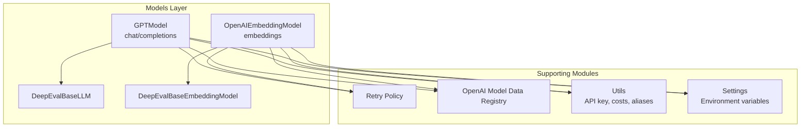
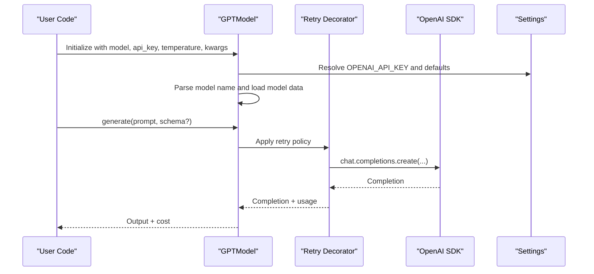
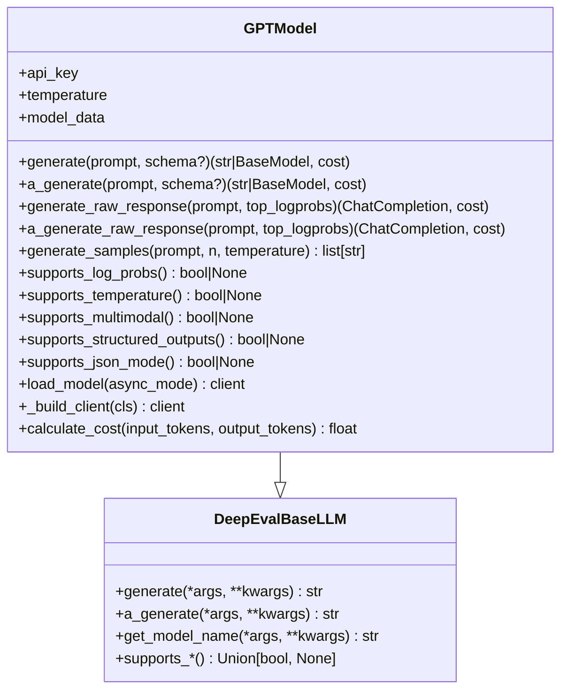
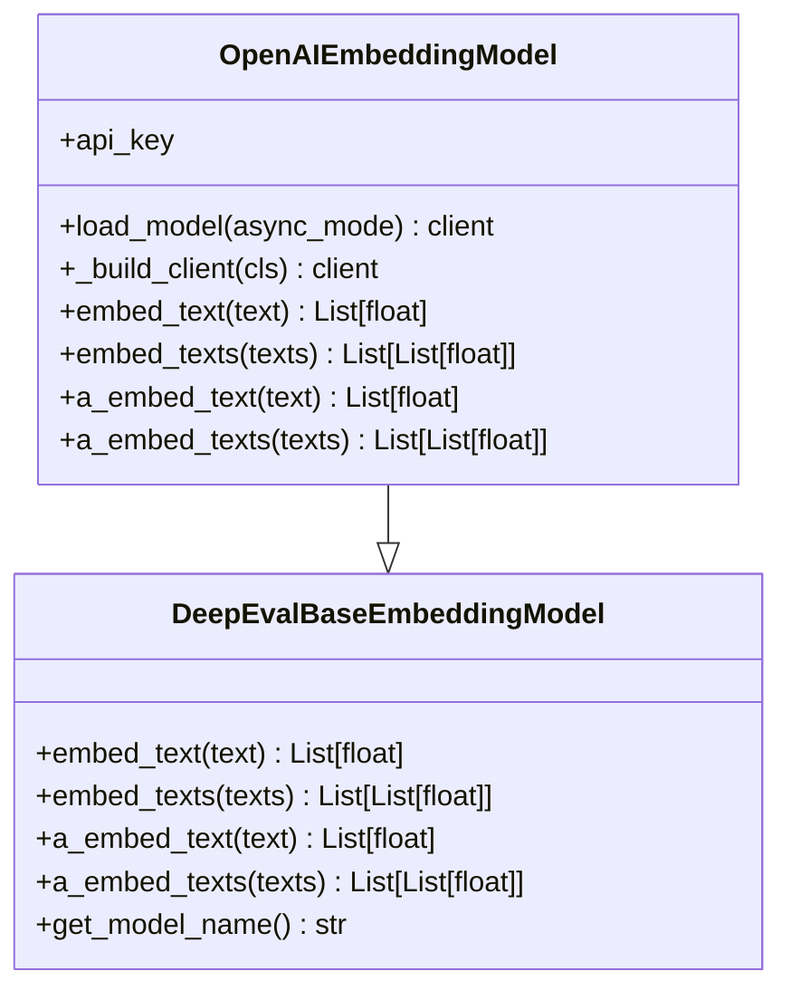
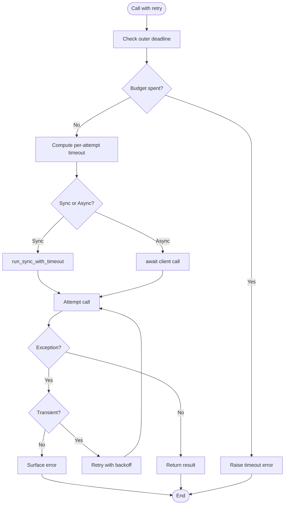
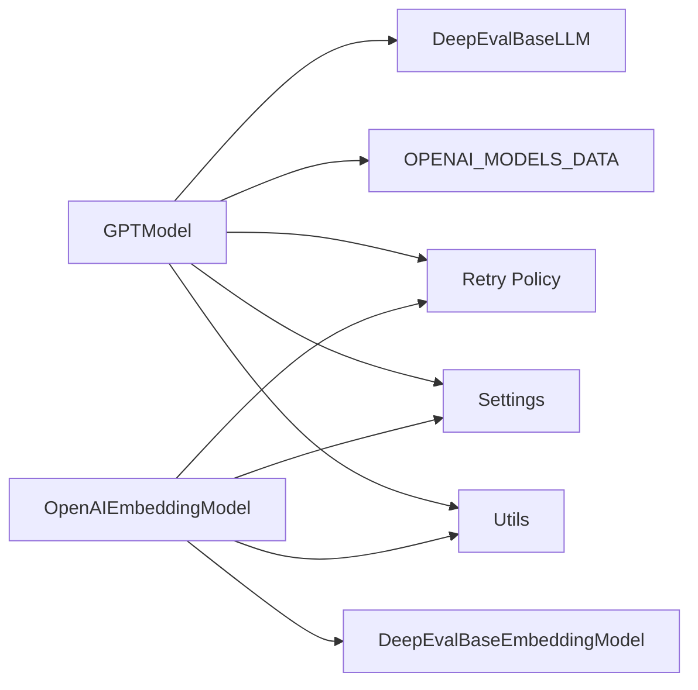

# OpenAI Integration

<cite>
**Referenced Files in This Document**
- [openai_model.py](file://deepeval/models/llms/openai_model.py)
- [openai_embedding_model.py](file://deepeval/models/embedding_models/openai_embedding_model.py)
- [base_model.py](file://deepeval/models/base_model.py)
- [retry_policy.py](file://deepeval/models/retry_policy.py)
- [constants.py](file://deepeval/models/llms/constants.py)
- [utils.py](file://deepeval/models/utils.py)
- [settings.py](file://deepeval/config/settings.py)
- [key_handler.py](file://deepeval/key_handler.py)
- [openai.ipynb](file://examples/notebooks/openai.ipynb)
- [test_openai_model.py](file://tests/test_integrations/test_openai/test_openai_model.py)
- [test_openai_embedding_model.py](file://tests/test_core/test_models/test_embedding_models/test_openai_embedding_model.py)
</cite>

## Table of Contents
1. [Introduction](#introduction)
2. [Project Structure](#project-structure)
3. [Core Components](#core-components)
4. [Architecture Overview](#architecture-overview)
5. [Detailed Component Analysis](#detailed-component-analysis)
6. [Dependency Analysis](#dependency-analysis)
7. [Performance Considerations](#performance-considerations)
8. [Troubleshooting Guide](#troubleshooting-guide)
9. [Conclusion](#conclusion)
10. [Appendices](#appendices)

## Introduction
This document explains how DeepEval integrates OpenAI’s LLMs and embeddings for evaluation tasks. It focuses on the OpenAIModel class for chat/completion-based evaluations, the OpenAIEmbeddingModel for vector embeddings, and how they align with the DeepEvalBaseLLM and DeepEvalBaseEmbeddingModel interfaces. You will learn how to configure models, handle API keys via environment variables, format requests, enable retry policies, and support both sync and async execution. The guide also covers common issues (rate limits, authentication, timeouts), performance and cost considerations, and how to switch between chat and completion models.

## Project Structure
DeepEval organizes OpenAI integration under the models layer:
- LLMs: chat/completion-based evaluation via GPTModel
- Embeddings: vector generation via OpenAIEmbeddingModel
- Shared abstractions: DeepEvalBaseLLM and DeepEvalBaseEmbeddingModel
- Retry policy: unified retry logic for transient failures
- Model capabilities: OpenAI model metadata registry
- Utilities: API key handling, cost validation, and alias normalization
- Settings: environment-driven configuration for API keys, model names, and pricing

**Diagram sources**
- [openai_model.py](file://deepeval/models/llms/openai_model.py#L1-L120)
- [openai_embedding_model.py](file://deepeval/models/embedding_models/openai_embedding_model.py#L1-L120)
- [base_model.py](file://deepeval/models/base_model.py#L45-L177)
- [retry_policy.py](file://deepeval/models/retry_policy.py#L626-L770)
- [constants.py](file://deepeval/models/llms/constants.py#L40-L120)
- [utils.py](file://deepeval/models/utils.py#L41-L178)
- [settings.py](file://deepeval/config/settings.py#L388-L404)

**Section sources**
- [openai_model.py](file://deepeval/models/llms/openai_model.py#L1-L120)
- [openai_embedding_model.py](file://deepeval/models/embedding_models/openai_embedding_model.py#L1-L120)
- [base_model.py](file://deepeval/models/base_model.py#L45-L177)
- [retry_policy.py](file://deepeval/models/retry_policy.py#L626-L770)
- [constants.py](file://deepeval/models/llms/constants.py#L40-L120)
- [utils.py](file://deepeval/models/utils.py#L41-L178)
- [settings.py](file://deepeval/config/settings.py#L388-L404)

## Core Components
- GPTModel (OpenAI LLM): Implements DeepEvalBaseLLM, supports chat/completions, structured outputs, JSON mode, multimodal prompts, raw response logprobs, and sampling.
- OpenAIEmbeddingModel (OpenAI Embeddings): Implements DeepEvalBaseEmbeddingModel, supports single and batch text embeddings.
- DeepEvalBaseLLM and DeepEvalBaseEmbeddingModel: Abstract interfaces defining method contracts for LLMs and embeddings.
- Retry Policy: Unified retry logic for transient failures, with configurable backoff and SDK-managed retries.
- Model Data Registry: Centralized metadata for OpenAI models (capabilities, pricing).
- Utilities: API key validation, cost validation, and alias normalization for legacy keywords.
- Settings: Environment-driven configuration for API keys, model names, pricing, and retry behavior.

**Section sources**
- [openai_model.py](file://deepeval/models/llms/openai_model.py#L46-L273)
- [openai_embedding_model.py](file://deepeval/models/embedding_models/openai_embedding_model.py#L34-L136)
- [base_model.py](file://deepeval/models/base_model.py#L45-L177)
- [retry_policy.py](file://deepeval/models/retry_policy.py#L626-L770)
- [constants.py](file://deepeval/models/llms/constants.py#L40-L120)
- [utils.py](file://deepeval/models/utils.py#L41-L178)
- [settings.py](file://deepeval/config/settings.py#L388-L404)

## Architecture Overview
The OpenAI integration follows a layered design:
- Initialization: API key resolution from environment or constructor, model name parsing, and capability detection from the model registry.
- Request Formatting: Chat/completions and embeddings requests are built with temperature, generation kwargs, and optional multimodal content.
- Execution: Sync and async clients are supported; timeouts and retries are managed centrally.
- Cost Tracking: Pricing metadata is used to compute cost per evaluation.

**Diagram sources**
- [openai_model.py](file://deepeval/models/llms/openai_model.py#L46-L207)
- [retry_policy.py](file://deepeval/models/retry_policy.py#L626-L770)
- [settings.py](file://deepeval/config/settings.py#L388-L404)

## Detailed Component Analysis

### GPTModel (OpenAI LLM)
- Initialization and API Key Handling:
  - Resolves OPENAI_API_KEY from environment or constructor.
  - Supports legacy keyword alias mapping for api_key.
  - Parses model name and loads capabilities/pricing from OPENAI_MODELS_DATA.
  - Validates and sets cost_per_input_token/cost_per_output_token.
- Request Formatting:
  - Supports chat.completions and beta structured outputs (when supported).
  - Supports JSON mode via response_format.
  - Multimodal content conversion for images/text.
  - Raw response logprobs when supported by the model.
  - Sampling via generate_samples with n and temperature.
- Execution:
  - Sync and async via load_model and _build_client.
  - Automatic retry via create_retry_decorator with OpenAI error policy.
  - Timeout enforcement via per-attempt timeout computed from settings.
- Cost Calculation:
  - Uses model input_price/output_price from registry to compute cost.

**Diagram sources**
- [openai_model.py](file://deepeval/models/llms/openai_model.py#L46-L487)
- [base_model.py](file://deepeval/models/base_model.py#L45-L123)

**Section sources**
- [openai_model.py](file://deepeval/models/llms/openai_model.py#L46-L273)
- [constants.py](file://deepeval/models/llms/constants.py#L40-L120)
- [utils.py](file://deepeval/models/utils.py#L41-L178)
- [retry_policy.py](file://deepeval/models/retry_policy.py#L626-L770)

### OpenAIEmbeddingModel (OpenAI Embeddings)
- Initialization and API Key Handling:
  - Validates model against supported OpenAI embedding models.
  - Resolves OPENAI_API_KEY from environment or constructor.
  - Supports legacy keyword alias mapping for api_key.
- Request Formatting:
  - Single and batch embeddings via embeddings.create.
  - Supports async and sync execution.
- Execution:
  - Automatic retry via create_retry_decorator with OpenAI error policy.
  - SDK-managed retries controlled by settings.

**Diagram sources**
- [openai_embedding_model.py](file://deepeval/models/embedding_models/openai_embedding_model.py#L34-L136)
- [base_model.py](file://deepeval/models/base_model.py#L124-L177)

**Section sources**
- [openai_embedding_model.py](file://deepeval/models/embedding_models/openai_embedding_model.py#L34-L136)
- [utils.py](file://deepeval/models/utils.py#L41-L178)
- [retry_policy.py](file://deepeval/models/retry_policy.py#L626-L770)

### Retry Policy and Async/Sync Execution
- Retry Decorator:
  - create_retry_decorator builds a Tenacity decorator with dynamic wait/stop/backoff and logging.
  - ErrorPolicy distinguishes authentication, rate limit, network, and HTTP errors; supports non-retryable codes.
  - sdk_retries_for controls whether SDK retries are delegated to the provider SDK.
- Timeouts:
  - resolve_effective_attempt_timeout computes per-attempt timeout from overrides and outer task budget.
  - run_sync_with_timeout enforces a soft timeout using a bounded semaphore and a worker thread.
- Async/Await:
  - AsyncOpenAI client is used when async_mode is True.
  - a_generate and a_embed_text methods wrap await around SDK calls.

**Diagram sources**
- [retry_policy.py](file://deepeval/models/retry_policy.py#L514-L686)

**Section sources**
- [retry_policy.py](file://deepeval/models/retry_policy.py#L626-L770)
- [retry_policy.py](file://deepeval/models/retry_policy.py#L514-L686)

### Configuration and Environment Variables
- API Key Resolution:
  - OPENAI_API_KEY is loaded from environment or constructor SecretStr.
  - require_secret_api_key validates presence and non-empty value.
- Model Selection and Pricing:
  - OPENAI_MODEL_NAME selects default model.
  - OPENAI_COST_PER_INPUT_TOKEN and OPENAI_COST_PER_OUTPUT_TOKEN set pricing defaults.
  - require_costs validates pricing availability and raises meaningful errors when missing.
- Temperature Defaults:
  - TEMPERATURE can be set globally; models that require temperature=1 auto-adjust.
- Alias Normalization:
  - normalize_kwargs_and_extract_aliases maps legacy keywords to canonical parameters.

**Section sources**
- [settings.py](file://deepeval/config/settings.py#L388-L404)
- [utils.py](file://deepeval/models/utils.py#L41-L178)
- [openai_model.py](file://deepeval/models/llms/openai_model.py#L83-L121)
- [openai_embedding_model.py](file://deepeval/models/embedding_models/openai_embedding_model.py#L45-L66)

### Switching Between Chat and Completion Models
- Chat Models:
  - Use chat.completions.create for text and multimodal prompts.
  - Structured outputs via beta chat.completions.parse when supported.
- Completion Models:
  - Use chat.completions.create with n and temperature for sampling.
- Logprobs:
  - generate_raw_response and a_generate_raw_response enable logprobs and top_logprobs when supported.

**Section sources**
- [openai_model.py](file://deepeval/models/llms/openai_model.py#L142-L207)
- [openai_model.py](file://deepeval/models/llms/openai_model.py#L278-L355)

### Examples and Usage Patterns
- Notebook Example:
  - Demonstrates integrating OpenAI SDK with DeepEval tracing and metrics.
- Tests:
  - Verify legacy keyword mapping and API key handling for both LLM and embedding models.

**Section sources**
- [openai.ipynb](file://examples/notebooks/openai.ipynb#L1-L236)
- [test_openai_model.py](file://tests/test_integrations/test_openai/test_openai_model.py#L421-L462)
- [test_openai_embedding_model.py](file://tests/test_core/test_models/test_embedding_models/test_openai_embedding_model.py#L78-L93)

## Dependency Analysis
- Coupling:
  - GPTModel depends on DeepEvalBaseLLM, OPENAI_MODELS_DATA, retry policy, settings, and utils.
  - OpenAIEmbeddingModel depends on DeepEvalBaseEmbeddingModel, retry policy, settings, and utils.
- External Dependencies:
  - OpenAI SDK clients (OpenAI, AsyncOpenAI) and pydantic SecretStr.
- Potential Circularities:
  - None observed; modules are layered (models -> retry -> settings/utils).

**Diagram sources**
- [openai_model.py](file://deepeval/models/llms/openai_model.py#L46-L120)
- [openai_embedding_model.py](file://deepeval/models/embedding_models/openai_embedding_model.py#L34-L99)
- [constants.py](file://deepeval/models/llms/constants.py#L40-L120)
- [retry_policy.py](file://deepeval/models/retry_policy.py#L626-L770)
- [settings.py](file://deepeval/config/settings.py#L388-L404)
- [utils.py](file://deepeval/models/utils.py#L41-L178)

**Section sources**
- [openai_model.py](file://deepeval/models/llms/openai_model.py#L46-L120)
- [openai_embedding_model.py](file://deepeval/models/embedding_models/openai_embedding_model.py#L34-L99)
- [constants.py](file://deepeval/models/llms/constants.py#L40-L120)
- [retry_policy.py](file://deepeval/models/retry_policy.py#L626-L770)
- [settings.py](file://deepeval/config/settings.py#L388-L404)
- [utils.py](file://deepeval/models/utils.py#L41-L178)

## Performance Considerations
- Cost Implications:
  - Pricing metadata is used to compute cost per evaluation. Choose models with appropriate input/output prices for your workload.
  - Some models (e.g., o1/o3 series) restrict temperature and may have different pricing tiers.
- Throughput and Latency:
  - Use async execution paths (a_generate, a_embed_text) for concurrent workloads.
  - Tune DEEPEVAL_RETRY_MAX_ATTEMPTS and DEEPEVAL_RETRY_INITIAL_SECONDS to balance resilience and latency.
  - Control per-attempt timeout via DEEPEVAL_PER_ATTEMPT_TIMEOUT_SECONDS_OVERRIDE to avoid long waits on slow networks.
- Token Efficiency:
  - Prefer smaller models (e.g., gpt-4o-mini) for cost-sensitive tasks; reserve larger models for complex reasoning.
  - Use structured outputs (beta chat.completions.parse) to reduce post-processing overhead.

[No sources needed since this section provides general guidance]

## Troubleshooting Guide
- Authentication Errors:
  - Ensure OPENAI_API_KEY is set in environment or passed via constructor. require_secret_api_key raises a clear error if missing or empty.
- Rate Limiting:
  - The retry policy treats RateLimitError as transient and retries with exponential backoff. If quota is exhausted, it is treated as non-retryable.
- Timeouts:
  - Per-attempt timeout is enforced; adjust DEEPEVAL_PER_ATTEMPT_TIMEOUT_SECONDS_OVERRIDE or DEEPEVAL_PER_TASK_TIMEOUT_SECONDS_OVERRIDE as needed.
  - Soft timeout mechanism uses a bounded semaphore and worker thread; excessive timeouts may indicate concurrency pressure.
- Legacy Keyword Issues:
  - Use canonical parameters (e.g., api_key) and avoid passing deprecated aliases; normalize_kwargs_and_extract_aliases logs warnings for deprecated names.
- Multimodal Prompts:
  - Ensure multimodal content is formatted correctly; check supports_multimodal for the selected model.

**Section sources**
- [utils.py](file://deepeval/models/utils.py#L41-L81)
- [retry_policy.py](file://deepeval/models/retry_policy.py#L626-L770)
- [retry_policy.py](file://deepeval/models/retry_policy.py#L514-L686)
- [openai_model.py](file://deepeval/models/llms/openai_model.py#L142-L207)

## Conclusion
DeepEval’s OpenAI integration provides a robust, configurable, and resilient evaluation pipeline. GPTModel and OpenAIEmbeddingModel implement standardized interfaces, integrate seamlessly with retry and timeout policies, and support both sync and async execution. By leveraging environment variables, model metadata, and structured outputs, users can efficiently evaluate LLM applications while controlling costs and performance.

[No sources needed since this section summarizes without analyzing specific files]

## Appendices

### Configuration Options Summary
- Environment Variables:
  - OPENAI_API_KEY: API key for OpenAI.
  - OPENAI_MODEL_NAME: Default model name.
  - OPENAI_COST_PER_INPUT_TOKEN, OPENAI_COST_PER_OUTPUT_TOKEN: Pricing defaults.
  - TEMPERATURE: Global default temperature.
- Settings Controls:
  - DEEPEVAL_SDK_RETRY_PROVIDERS: Delegate retries to SDK or use DeepEval’s retry policy.
  - DEEPEVAL_RETRY_MAX_ATTEMPTS, DEEPEVAL_RETRY_INITIAL_SECONDS, DEEPEVAL_RETRY_EXP_BASE, DEEPEVAL_RETRY_JITTER, DEEPEVAL_RETRY_CAP_SECONDS: Retry backoff and jitter.
  - DEEPEVAL_PER_ATTEMPT_TIMEOUT_SECONDS_OVERRIDE, DEEPEVAL_PER_TASK_TIMEOUT_SECONDS_OVERRIDE: Per-attempt and outer task timeouts.
  - DEEPEVAL_TIMEOUT_THREAD_LIMIT, DEEPEVAL_TIMEOUT_SEMAPHORE_WARN_AFTER_SECONDS: Concurrency and timeout worker controls.

**Section sources**
- [settings.py](file://deepeval/config/settings.py#L388-L404)
- [settings.py](file://deepeval/config/settings.py#L420-L448)
- [settings.py](file://deepeval/config/settings.py#L482-L531)
- [settings.py](file://deepeval/config/settings.py#L506-L531)