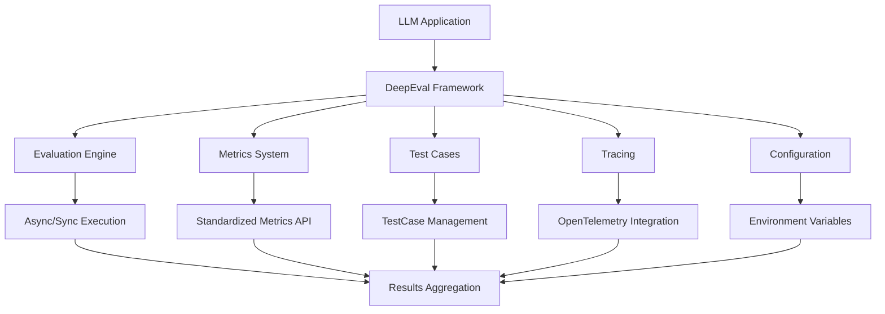
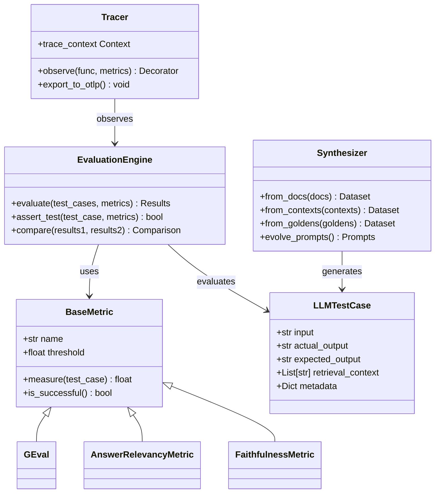
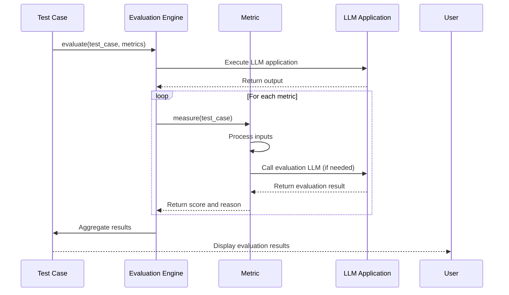
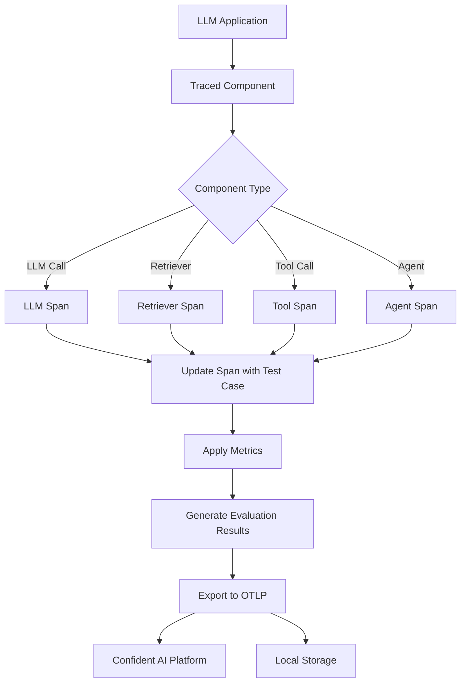
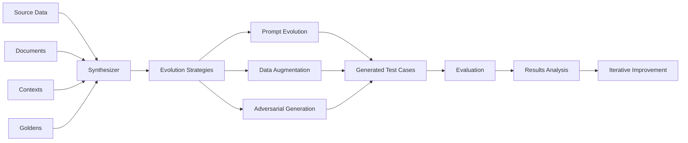
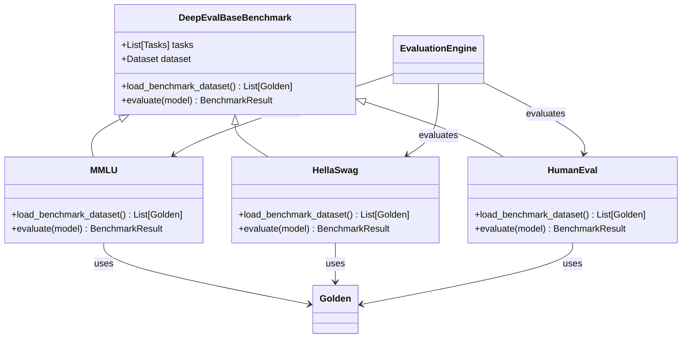
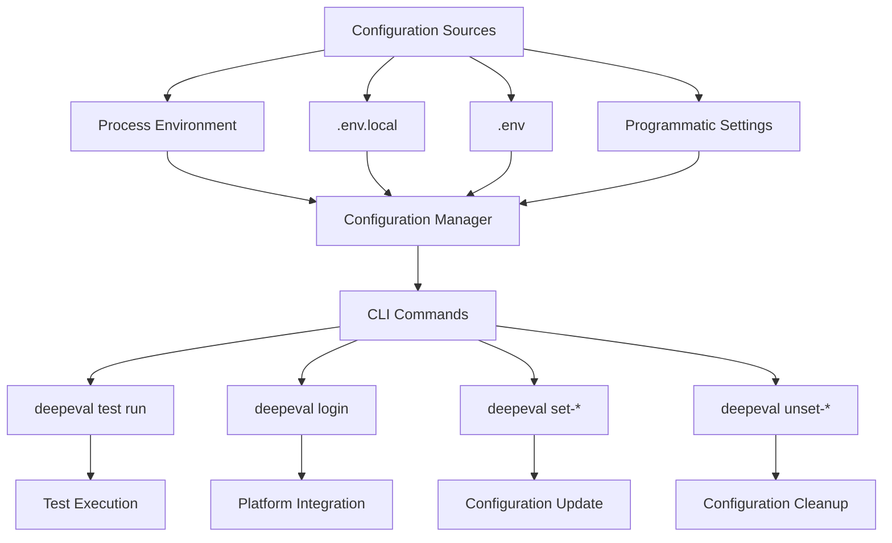
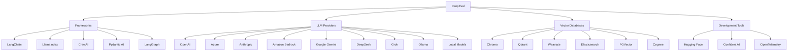

# Project Overview

<cite>
**Referenced Files in This Document**   
- [__init__.py](file://deepeval/__init__.py)
- [constants.py](file://deepeval/constants.py)
- [README.md](file://README.md)
- [pyproject.toml](file://pyproject.toml)
- [evaluate/__init__.py](file://deepeval/evaluate/__init__.py)
- [test_case/__init__.py](file://deepeval/test_case/__init__.py)
- [metrics/__init__.py](file://deepeval/metrics/__init__.py)
- [tracing/__init__.py](file://deepeval/tracing/__init__.py)
- [synthesizer/__init__.py](file://deepeval/synthesizer/__init__.py)
- [cli/main.py](file://deepeval/cli/main.py)
- [config/settings.py](file://deepeval/config/settings.py)
- [benchmarks/base_benchmark.py](file://deepeval/benchmarks/base_benchmark.py)
- [dataset/dataset.py](file://deepeval/dataset/dataset.py)
- [models/__init__.py](file://deepeval/models/__init__.py)
</cite>

## Table of Contents
1. [Introduction](#introduction)
2. [Core Architecture](#core-architecture)
3. [Key Components](#key-components)
4. [Evaluation Framework](#evaluation-framework)
5. [Tracing and Observability](#tracing-and-observability)
6. [Synthetic Data Generation](#synthetic-data-generation)
7. [Benchmarks and Testing](#benchmarks-and-testing)
8. [Configuration and CLI](#configuration-and-cli)
9. [Integration Ecosystem](#integration-ecosystem)
10. [Practical Examples](#practical-examples)

## Introduction

DeepEval is an open-source LLM evaluation framework designed for testing and evaluating large language model applications. The framework provides a comprehensive suite of tools for assessing LLM performance across various dimensions including accuracy, relevance, safety, and efficiency. DeepEval supports both end-to-end and component-level evaluations of LLM applications, enabling developers to benchmark model performance, generate synthetic data, and conduct red teaming exercises.

The framework is designed with a modular architecture that separates concerns between different evaluation components. It provides a rich set of metrics such as G-Eval, hallucination detection, answer relevancy, and RAGAS for evaluating LLM outputs. DeepEval integrates with various LLM providers and frameworks including LangChain, LlamaIndex, and Hugging Face, making it versatile for different LLM application architectures.

DeepEval's architecture emphasizes ease of use while maintaining flexibility for advanced use cases. The framework supports both pytest-style testing and programmatic evaluation, allowing teams to incorporate LLM evaluation into their existing CI/CD pipelines. With its comprehensive metrics system and tracing capabilities, DeepEval enables developers to gain deep insights into their LLM applications' behavior and performance characteristics.

**Section sources**
- [README.md](file://README.md#L56-L121)
- [__init__.py](file://deepeval/__init__.py#L1-L107)

## Core Architecture

DeepEval's architecture follows a modular design with clear separation of concerns between evaluation components, metrics, test cases, and configuration management. The framework is organized into distinct modules that handle specific aspects of the evaluation process, enabling developers to use individual components independently or in combination.

The core architecture consists of several key layers: the evaluation engine, metrics system, test case management, tracing infrastructure, and configuration framework. These layers work together to provide a comprehensive evaluation environment for LLM applications. The evaluation engine coordinates the execution of test cases against various metrics, while the metrics system provides a standardized interface for different evaluation criteria.

DeepEval's architecture supports both synchronous and asynchronous evaluation modes, allowing for flexible integration with different application patterns. The framework uses OpenTelemetry for tracing, enabling detailed observability into the evaluation process. This tracing capability allows developers to analyze not just the final evaluation results but also the intermediate steps and decisions made during evaluation.



**Diagram sources**
- [__init__.py](file://deepeval/__init__.py#L1-L107)
- [evaluate/__init__.py](file://deepeval/evaluate/__init__.py#L1-L15)

**Section sources**
- [__init__.py](file://deepeval/__init__.py#L1-L107)
- [evaluate/__init__.py](file://deepeval/evaluate/__init__.py#L1-L15)

## Key Components

DeepEval's functionality is organized into several key components that work together to provide a comprehensive evaluation framework. The primary components include metrics, test cases, evaluation engine, tracing system, and synthesizer for generating synthetic data.

The metrics component provides a wide range of evaluation criteria for assessing LLM outputs, including G-Eval, answer relevancy, faithfulness, contextual recall, and toxicity detection. Each metric implements a standardized interface that allows for consistent evaluation across different types of LLM applications. The test case component defines the structure for evaluation inputs, expected outputs, and associated metadata, enabling systematic testing of LLM behavior.

The evaluation engine orchestrates the execution of test cases against configured metrics, handling both synchronous and asynchronous evaluation patterns. The tracing system provides observability into the evaluation process, capturing detailed information about each evaluation step. The synthesizer component enables the generation of synthetic test data from various sources, supporting efficient evaluation without requiring extensive manual test case creation.



**Diagram sources**
- [metrics/__init__.py](file://deepeval/metrics/__init__.py#L1-L134)
- [test_case/__init__.py](file://deepeval/test_case/__init__.py#L1-L38)
- [evaluate/__init__.py](file://deepeval/evaluate/__init__.py#L1-L15)
- [tracing/__init__.py](file://deepeval/tracing/__init__.py#L1-L27)
- [synthesizer/__init__.py](file://deepeval/synthesizer/__init__.py#L1-L9)

**Section sources**
- [metrics/__init__.py](file://deepeval/metrics/__init__.py#L1-L134)
- [test_case/__init__.py](file://deepeval/test_case/__init__.py#L1-L38)
- [evaluate/__init__.py](file://deepeval/evaluate/__init__.py#L1-L15)
- [tracing/__init__.py](file://deepeval/tracing/__init__.py#L1-L27)
- [synthesizer/__init__.py](file://deepeval/synthesizer/__init__.py#L1-L9)

## Evaluation Framework

The evaluation framework in DeepEval provides a comprehensive system for assessing LLM application performance through both end-to-end and component-level evaluations. The framework supports multiple evaluation patterns, including pytest-style assertions, programmatic evaluation, and bulk dataset evaluation.

At the core of the evaluation framework is the `evaluate` function, which executes test cases against configured metrics and returns detailed results. The `assert_test` function provides a convenient way to validate that evaluation results meet specified thresholds, making it ideal for integration into automated testing pipelines. The framework also includes a `compare` function for benchmarking different model versions or configurations against each other.

DeepEval supports various evaluation configurations through its config system, allowing developers to customize aspects such as asynchronous execution, result display, caching, and error handling. The framework can evaluate both individual test cases and entire datasets, making it suitable for both targeted testing and comprehensive benchmarking.



**Diagram sources**
- [evaluate/__init__.py](file://deepeval/evaluate/__init__.py#L1-L15)
- [metrics/__init__.py](file://deepeval/metrics/__init__.py#L1-L134)
- [test_case/__init__.py](file://deepeval/test_case/__init__.py#L1-L38)

**Section sources**
- [evaluate/__init__.py](file://deepeval/evaluate/__init__.py#L1-L15)
- [README.md](file://README.md#L166-L286)

## Tracing and Observability

DeepEval's tracing system provides comprehensive observability into LLM application behavior during evaluation. The framework uses the `@observe` decorator to trace components within LLM applications, enabling component-level evaluations without requiring significant code changes. This non-intrusive approach allows developers to evaluate individual components such as LLM calls, retrievers, tool calls, and agents within their application architecture.

The tracing system integrates with OpenTelemetry, providing detailed span information for each traced component. This enables developers to analyze not just the final output but also the intermediate steps and decisions made by their LLM applications. The system supports updating span information with test cases and metrics, allowing for targeted evaluation of specific components.

Tracing data can be exported to various backends, including the Confident AI platform, for visualization and analysis. This capability enables teams to debug evaluation results, identify performance bottlenecks, and understand the flow of information through their LLM applications. The tracing system also supports offline evaluation of traces, allowing for post-hoc analysis of application behavior.



**Diagram sources**
- [tracing/__init__.py](file://deepeval/tracing/__init__.py#L1-L27)
- [README.md](file://README.md#L214-L243)

**Section sources**
- [tracing/__init__.py](file://deepeval/tracing/__init__.py#L1-L27)
- [README.md](file://README.md#L214-L243)

## Synthetic Data Generation

DeepEval's synthesizer component enables the generation of synthetic test data for evaluating LLM applications. This capability supports multiple generation strategies, including generating test cases from documents, contexts, and existing goldens. The synthesizer uses LLMs to create realistic test scenarios, reducing the need for manual test case creation.

The synthesizer supports various evolution strategies for generating diverse test cases, including prompt evolution and data augmentation. This allows developers to create comprehensive test suites that cover edge cases and challenging scenarios. The generated test cases include not only inputs but also expected outputs and retrieval contexts, making them suitable for evaluating RAG pipelines and other complex LLM applications.

Synthetic data generation is particularly valuable for red teaming exercises, where the goal is to identify vulnerabilities in LLM applications. By generating adversarial test cases, developers can proactively identify and address potential issues before deployment. The synthesizer also supports generating test cases for specific evaluation metrics, ensuring comprehensive coverage of different quality dimensions.



**Diagram sources**
- [synthesizer/__init__.py](file://deepeval/synthesizer/__init__.py#L1-L9)
- [README.md](file://README.md#L99-L100)

**Section sources**
- [synthesizer/__init__.py](file://deepeval/synthesizer/__init__.py#L1-L9)
- [README.md](file://README.md#L99-L100)

## Benchmarks and Testing

DeepEval provides comprehensive support for benchmarking LLM applications against established evaluation datasets and metrics. The framework includes implementations of popular benchmarks such as MMLU, HellaSwag, DROP, BIG-Bench Hard, TruthfulQA, HumanEval, and GSM8K, enabling developers to evaluate their models against standardized test suites.

The benchmarking system follows a consistent pattern across different datasets, with each benchmark inheriting from the `DeepEvalBaseBenchmark` class. This base class defines the interface for loading benchmark datasets and evaluating models, ensuring a uniform experience across different benchmarks. Developers can evaluate any LLM on these benchmarks with minimal code, typically requiring less than 10 lines of code.

In addition to standardized benchmarks, DeepEval supports custom dataset creation and evaluation. The framework can load test cases from various formats including CSV, JSON, and JSONL, making it easy to incorporate existing test data. The evaluation system supports both single-turn and multi-turn conversational test cases, accommodating different types of LLM applications.



**Diagram sources**
- [benchmarks/base_benchmark.py](file://deepeval/benchmarks/base_benchmark.py#L1-L33)
- [dataset/dataset.py](file://deepeval/dataset/dataset.py#L68-L200)
- [README.md](file://README.md#L106-L113)

**Section sources**
- [benchmarks/base_benchmark.py](file://deepeval/benchmarks/base_benchmark.py#L1-L33)
- [dataset/dataset.py](file://deepeval/dataset/dataset.py#L68-L200)
- [README.md](file://README.md#L106-L113)

## Configuration and CLI

DeepEval provides a comprehensive configuration system and command-line interface for managing evaluation settings and executing tests. The framework automatically loads environment variables from `.env.local` and `.env` files, following a precedence order of process environment → `.env.local` → `.env`. This allows developers to manage configuration settings across different environments while keeping sensitive information out of version control.

The CLI provides commands for running evaluations, managing configuration, and interacting with the Confident AI platform. The `deepeval test run` command executes test files and generates evaluation reports, supporting options for parallel execution and result display. The `deepeval login` command enables integration with the Confident AI platform for cloud-based evaluation management and reporting.

Configuration options include settings for LLM providers, evaluation timeouts, tracing behavior, and result storage. Developers can configure these settings through environment variables, configuration files, or programmatically in code. The framework also supports saving configuration changes to dotenv files, making it easy to persist settings across sessions.



**Diagram sources**
- [config/settings.py](file://deepeval/config/settings.py#L1-L200)
- [cli/main.py](file://deepeval/cli/main.py#L1-L200)
- [README.md](file://README.md#L337-L392)

**Section sources**
- [config/settings.py](file://deepeval/config/settings.py#L1-L200)
- [cli/main.py](file://deepeval/cli/main.py#L1-L200)
- [README.md](file://README.md#L337-L392)

## Integration Ecosystem

DeepEval integrates with a wide range of LLM frameworks, providers, and tools, creating a comprehensive ecosystem for LLM evaluation. The framework supports integration with popular LLM orchestration frameworks including LangChain, LlamaIndex, CrewAI, and Pydantic AI, enabling seamless evaluation of applications built with these tools.

For LLM providers, DeepEval supports multiple platforms including OpenAI, Azure, Anthropic, Amazon Bedrock, Google Gemini, DeepSeek, Grok, and local models through Ollama. This multi-provider support allows developers to evaluate their applications across different LLM backends and compare performance characteristics. The framework also supports custom LLM implementations, providing flexibility for specialized use cases.

DeepEval integrates with vector databases such as Chroma, Qdrant, Weaviate, Elasticsearch, and PGVector, enabling evaluation of RAG pipelines that use these storage backends. The framework also supports integration with Hugging Face for real-time evaluations during model fine-tuning. These integrations make DeepEval a versatile tool for evaluating LLM applications across different architectures and deployment scenarios.



**Diagram sources**
- [models/__init__.py](file://deepeval/models/__init__.py#L1-L46)
- [integrations/](file://deepeval/integrations/)
- [pyproject.toml](file://pyproject.toml#L88-L98)

**Section sources**
- [models/__init__.py](file://deepeval/models/__init__.py#L1-L46)
- [integrations/](file://deepeval/integrations/)
- [pyproject.toml](file://pyproject.toml#L88-L98)

## Practical Examples

DeepEval provides several practical examples demonstrating common evaluation scenarios for LLM applications. These examples illustrate how to implement end-to-end evaluations, component-level evaluations, dataset-based testing, and standalone metric usage.

For end-to-end evaluations, developers can create test cases with inputs, expected outputs, and evaluation metrics, then use the `assert_test` function to validate that the LLM application meets quality thresholds. Component-level evaluations use the `@observe` decorator to trace specific components within an LLM application, enabling targeted evaluation of individual system parts.

Dataset-based testing allows for bulk evaluation of multiple test cases, supporting both manual creation and synthetic generation of test data. The framework also supports standalone usage of metrics, enabling developers to integrate specific evaluation criteria into their applications without the full testing framework.

```mermaid
flowchart TD
A[End-to-End Evaluation] --> B[Create Test Case]
B --> C[Define Input and Expected Output]
C --> D[Select Metrics]
D --> E[Run assert_test]
E --> F[Check Results]
G[Component-Level Evaluation] --> H[Apply @observe Decorator]
H --> I[Define Test Case in Component]
I --> J[Execute Application]
J --> K[Evaluate Traced Components]
L[Dataset Evaluation] --> M[Create EvaluationDataset]
M --> N[Add Goldens]
N --> O[Generate Test Cases]
O --> P[Run evaluate]
P --> Q[Analyze Results]
R[Standalone Metrics] --> S[Initialize Metric]
S --> T[Create Test Case]
T --> U[Call measure()]
U --> V[Access Score and Reason]
```

**Diagram sources**
- [README.md](file://README.md#L166-L335)
- [test_case/__init__.py](file://deepeval/test_case/__init__.py#L1-L38)
- [metrics/__init__.py](file://deepeval/metrics/__init__.py#L1-L134)

**Section sources**
- [README.md](file://README.md#L166-L335)
- [examples/](file://examples/)