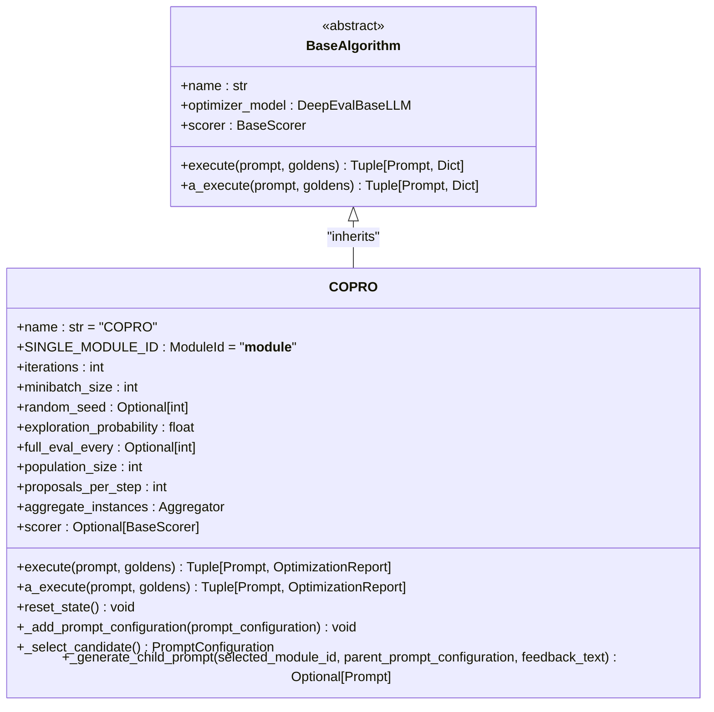
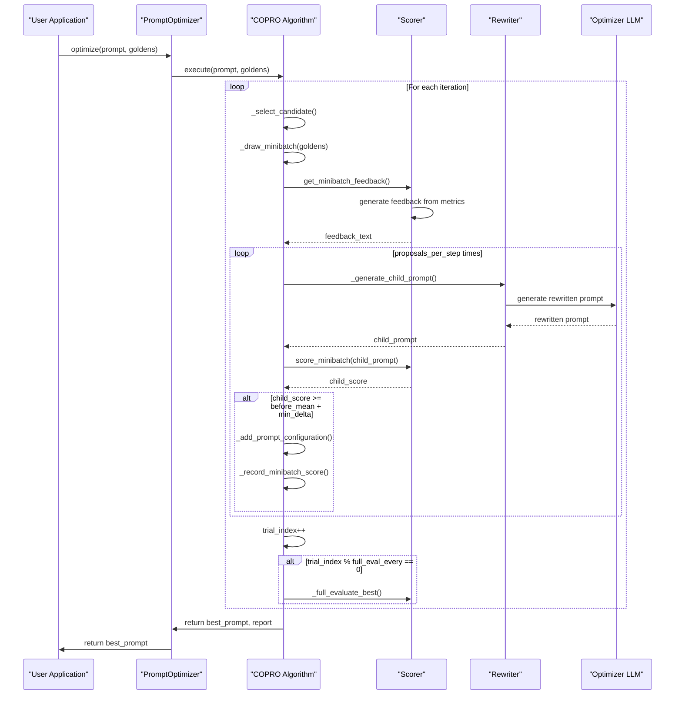
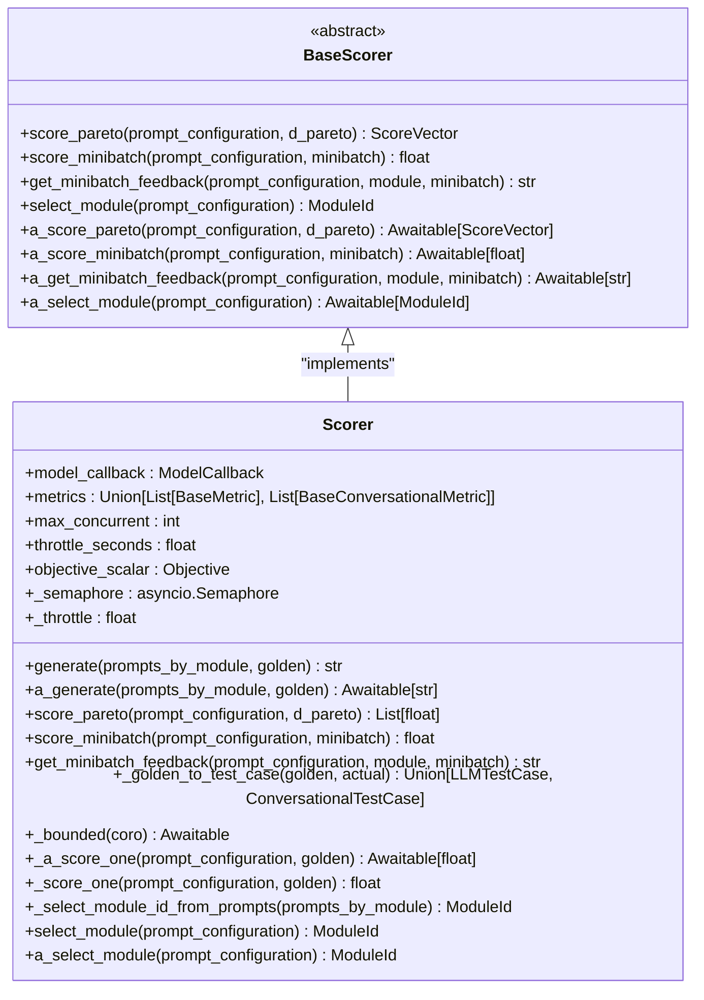
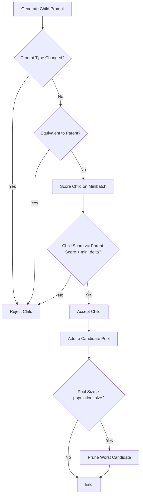
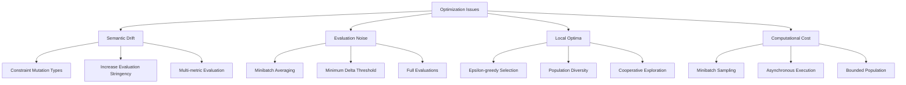
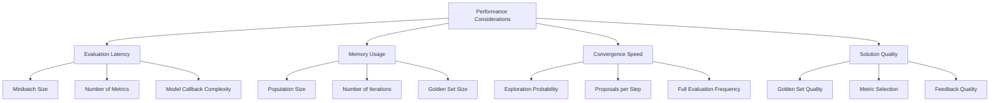

# COPRO Algorithm

<cite>
**Referenced Files in This Document**   
- [copro.py](file://deepeval/optimizer/algorithms/copro/copro.py)
- [base.py](file://deepeval/optimizer/algorithms/base.py)
- [scorer.py](file://deepeval/optimizer/scorer/scorer.py)
- [rewriter.py](file://deepeval/optimizer/rewriter/rewriter.py)
- [types.py](file://deepeval/optimizer/types.py)
- [utils.py](file://deepeval/optimizer/utils.py)
- [prompt_optimizer.py](file://deepeval/optimizer/prompt_optimizer.py)
</cite>

## Table of Contents
1. [Introduction](#introduction)
2. [COPRO Class Interface and Inheritance](#copro-class-interface-and-inheritance)
3. [Configuration Parameters](#configuration-parameters)
4. [Optimization Process](#optimization-process)
5. [Scorer Role and Feedback Generation](#scorer-role-and-feedback-generation)
6. [Mutation Acceptance Policy](#mutation-acceptance-policy)
7. [Semantic Drift and Optimization Issues](#semantic-drift-and-optimization-issues)
8. [Performance Considerations](#performance-considerations)
9. [Conclusion](#conclusion)

## Introduction

The COPRO (Chain-of-Prompts Optimization) algorithm is a bounded-population, zero-shot prompt optimization technique implemented in the DeepEval framework. It evolves chains of reasoning and instructions through iterative refinement to optimize prompts for LLM applications. COPRO maintains a population of candidate prompts and uses cooperative mutation strategies to explore the prompt space efficiently.

The algorithm works by starting with an initial prompt and a set of golden examples, then iteratively generating and evaluating prompt variations. At each iteration, it selects a parent prompt using an epsilon-greedy strategy, generates multiple child prompts cooperatively from shared feedback, and accepts improvements that meet a minimum delta threshold. This approach allows for efficient exploration of the prompt space while maintaining a bounded candidate pool.

**Section sources**
- [copro.py](file://deepeval/optimizer/algorithms/copro/copro.py#L1-L837)

## COPRO Class Interface and Inheritance

The COPRO class implements a sophisticated prompt optimization algorithm that inherits from the base `BaseAlgorithm` class. This inheritance structure provides a consistent interface for various optimization algorithms within the DeepEval framework while allowing COPRO to implement its specific cooperative optimization strategy.



**Diagram sources**
- [copro.py](file://deepeval/optimizer/algorithms/copro/copro.py#L61-L805)
- [base.py](file://deepeval/optimizer/algorithms/base.py#L10-L30)

**Section sources**
- [copro.py](file://deepeval/optimizer/algorithms/copro/copro.py#L61-L805)
- [base.py](file://deepeval/optimizer/algorithms/base.py#L10-L30)

## Configuration Parameters

The COPRO algorithm is highly configurable through several parameters that control its optimization behavior. These parameters allow users to fine-tune the algorithm's exploration strategy, population management, and evaluation frequency according to their specific use cases and computational constraints.

```mermaid
flowchart TD
A[COPRO Configuration] --> B[iterations: int = 5]
A --> C[minibatch_size: int = 8]
A --> D[random_seed: Optional[int] = None]
A --> E[exploration_probability: float = 0.2]
A --> F[full_eval_every: Optional[int] = 5]
A --> G[population_size: int = 4]
A --> H[proposals_per_step: int = 4]
A --> I[aggregate_instances: Aggregator = mean_of_all]
A --> J[scorer: Optional[BaseScorer] = None]
```

The configuration parameters serve specific purposes in the optimization process:

- **iterations**: Controls the total number of optimization trials. Higher values allow for more extensive exploration but increase computation time.
- **minibatch_size**: Determines the number of examples drawn per iteration for scoring. Smaller values reduce computational cost but may lead to noisier evaluations.
- **random_seed**: Enables reproducibility by setting the random number generator seed. If not provided, it's derived from the current time.
- **exploration_probability**: Implements epsilon-greedy exploration, balancing between exploiting high-performing candidates and exploring new possibilities.
- **full_eval_every**: Specifies how frequently to perform a full evaluation of the best candidate on the complete golden set, providing a more accurate performance assessment.
- **population_size**: Limits the maximum number of candidate prompts in the pool, preventing unbounded memory usage.
- **proposals_per_step**: Controls the number of child prompts proposed per iteration, enabling cooperative exploration from a shared parent.
- **aggregate_instances**: Defines the aggregation function used to combine scores across instances, with `mean_of_all` as the default.

**Section sources**
- [copro.py](file://deepeval/optimizer/algorithms/copro/copro.py#L71-L117)

## Optimization Process

The COPRO optimization process follows a structured iterative approach that balances exploration and exploitation while maintaining computational efficiency. The algorithm operates through a series of well-defined steps that are executed for each iteration until the configured number of trials is completed.



The optimization process begins by seeding the candidate pool with the root prompt configuration. For each iteration, the algorithm:

1. Selects a parent prompt from the population using an epsilon-greedy strategy based on mean minibatch scores
2. Draws a minibatch of golden examples for evaluation
3. Computes shared feedback for the parent-minibatch combination that will be used by all cooperative child proposals
4. Generates multiple child prompts (up to `proposals_per_step`) from the same parent using the shared feedback
5. Scores each child on the same minibatch and accepts those that improve on the parent by at least `min_delta`
6. Adds accepted children to the pool and prunes low-scoring candidates if the population exceeds `population_size`
7. Periodically performs full evaluations of the best candidate when `full_eval_every` iterations are reached

This cooperative approach allows the algorithm to efficiently explore multiple variations from a single parent, leveraging shared computation for feedback generation while maintaining diversity in the candidate pool.

**Diagram sources**
- [copro.py](file://deepeval/optimizer/algorithms/copro/copro.py#L151-L805)

**Section sources**
- [copro.py](file://deepeval/optimizer/algorithms/copro/copro.py#L151-L805)

## Scorer Role and Feedback Generation

The Scorer plays a critical role in the COPRO optimization process by evaluating prompt quality and generating feedback for the Rewriter. It serves as the evaluation engine that assesses the performance of candidate prompts against the golden examples using configured metrics.



**Diagram sources**
- [scorer.py](file://deepeval/optimizer/scorer/scorer.py#L50-L317)
- [base.py](file://deepeval/optimizer/scorer/base.py#L10-L87)

The Scorer evaluates prompt quality through three primary methods:

1. **score_pareto**: Computes per-instance scores on a validation set (D_pareto), providing a comprehensive evaluation of prompt performance across all examples.
2. **score_minibatch**: Calculates the average score on a minibatch from the feedback set (D_feedback), enabling efficient candidate selection and acceptance decisions.
3. **get_minibatch_feedback**: Generates textual feedback that summarizes the strengths and weaknesses of a prompt based on metric results, which is used by the Rewriter to guide prompt mutations.

The feedback generation process combines reasons from multiple metrics across the minibatch, removes duplicates, and limits the output to a manageable size (currently capped at 8 unique reasons). This feedback serves as the instruction for the Rewriter to improve the prompt, focusing on the most critical issues identified by the evaluation metrics.

**Section sources**
- [scorer.py](file://deepeval/optimizer/scorer/scorer.py#L50-L317)
- [base.py](file://deepeval/optimizer/scorer/base.py#L10-L87)

## Mutation Acceptance Policy

The COPRO algorithm implements a sophisticated mutation acceptance policy that balances exploration and exploitation while preventing degradation of prompt quality. The policy determines whether to accept or reject a generated child prompt based on its performance relative to its parent.

The acceptance criteria are defined in the `_generate_child_prompt` and `_make_child` methods, where a child prompt is accepted if it meets two conditions:
1. The prompt type remains unchanged (preventing unintended structural changes)
2. The child's performance improves on the parent by at least a minimum delta threshold



The minimum delta threshold is calculated as the maximum of `MIPROV2_MIN_DELTA` (0.0) and a small jitter value (1e-6), ensuring numerical stability. This threshold prevents the acceptance of marginal improvements that might be due to evaluation noise rather than genuine quality improvements.

When a child is accepted, it is added to the candidate pool through the `_add_prompt_configuration` method, which also handles population management by pruning the worst-performing candidate if the pool exceeds the configured `population_size`. This ensures that only the highest-quality prompts are retained, maintaining a bounded memory footprint while preserving the best solutions found during optimization.

**Section sources**
- [copro.py](file://deepeval/optimizer/algorithms/copro/copro.py#L224-L260)
- [copro.py](file://deepeval/optimizer/algorithms/copro/copro.py#L726-L731)

## Semantic Drift and Optimization Issues

During the prompt optimization process, several challenges can arise that may degrade the quality of the optimized prompts or lead to suboptimal results. The most significant issue is semantic drift, where successive mutations gradually alter the prompt's meaning or intent, potentially leading to solutions that perform well on the evaluation metrics but fail to meet the original requirements.

Semantic drift can occur when the feedback mechanism emphasizes certain aspects of performance while neglecting others, causing the optimization process to "overfit" to the evaluation criteria. For example, a prompt might become overly verbose or include redundant instructions that improve metric scores but reduce usability or increase token costs.

To mitigate semantic drift and other optimization issues, the COPRO algorithm implements several safeguards:



The algorithm addresses these issues through various strategies:

1. **Constraint mutation types**: By configuring the `list_mutation_config` parameter in the Rewriter, users can restrict the types of mutations applied to prompts, preventing undesirable changes to prompt structure or content.

2. **Increase evaluation stringency**: Using a higher `minibatch_size` or more comprehensive metrics can reduce the impact of evaluation noise and prevent acceptance of marginal improvements.

3. **Multi-metric evaluation**: Configuring the Scorer with multiple complementary metrics ensures that prompts are evaluated across different dimensions of quality, reducing the risk of overfitting to a single metric.

4. **Epsilon-greedy selection**: The exploration probability parameter allows the algorithm to occasionally select non-optimal candidates, helping to escape local optima and maintain diversity in the search process.

5. **Bounded population**: The `population_size` parameter limits memory usage and forces the algorithm to maintain only the highest-quality candidates, promoting convergence to better solutions.

**Section sources**
- [copro.py](file://deepeval/optimizer/algorithms/copro/copro.py#L448-L481)
- [rewriter.py](file://deepeval/optimizer/rewriter/rewriter.py#L30-L48)

## Performance Considerations

The COPRO algorithm's performance is influenced by several factors that affect both optimization quality and computational efficiency. Understanding these considerations is crucial for effectively applying the algorithm to real-world prompt optimization tasks.



Key performance considerations include:

**Evaluation Latency**: The time required to evaluate each candidate prompt depends on the minibatch size, the number of metrics used, and the complexity of the model callback. Larger minibatches provide more reliable evaluations but increase computation time. The algorithm mitigates this through minibatch sampling and asynchronous execution capabilities.

**Memory Usage**: Memory consumption is primarily determined by the population size and the number of stored prompt configurations. The bounded population approach ensures that memory usage remains predictable and controllable, making the algorithm suitable for resource-constrained environments.

**Batch Processing**: The COPRO algorithm supports batch processing of prompt candidates through its minibatch evaluation strategy. By processing multiple golden examples together, it amortizes the cost of model calls and metric evaluations, improving overall efficiency. The `max_concurrent` parameter in the Scorer configuration allows for parallel execution of evaluations when using asynchronous optimization.

**Optimization Trade-offs**: Users must balance various parameters to achieve optimal performance:
- Higher `iterations` and `proposals_per_step` values enable more thorough exploration but increase computation time
- Larger `population_size` values maintain more diversity but consume more memory
- More frequent `full_eval_every` evaluations provide better quality assessment but increase computational cost
- Higher `exploration_probability` values promote diversity but may slow convergence

The algorithm's design allows for flexible configuration to match specific performance requirements, whether prioritizing speed, memory efficiency, or solution quality.

**Section sources**
- [copro.py](file://deepeval/optimizer/algorithms/copro/copro.py#L118-L123)
- [scorer.py](file://deepeval/optimizer/scorer/scorer.py#L58-L74)
- [prompt_optimizer.py](file://deepeval/optimizer/prompt_optimizer.py#L54-L80)

## Conclusion

The COPRO (Chain-of-Prompts Optimization) algorithm provides a powerful and flexible approach to prompt optimization through iterative refinement of prompt variations. By maintaining a bounded population of candidate prompts and using cooperative mutation strategies, COPRO efficiently explores the prompt space while balancing exploration and exploitation.

The algorithm's implementation demonstrates several key design principles:
- **Modularity**: Clear separation of concerns between optimization logic, evaluation, and mutation components
- **Configurability**: Extensive parameterization allowing users to tailor the optimization process to their specific needs
- **Efficiency**: Bounded resource usage through population limits and minibatch evaluation
- **Robustness**: Multiple safeguards against common optimization issues like semantic drift and local optima

COPRO's integration within the DeepEval framework enables seamless use with various metrics, models, and evaluation strategies, making it a versatile tool for improving prompt quality in LLM applications. By understanding its configuration parameters, optimization process, and performance characteristics, users can effectively apply COPRO to enhance the performance of their prompt-based systems.

**Section sources**
- [copro.py](file://deepeval/optimizer/algorithms/copro/copro.py#L1-L837)
- [prompt_optimizer.py](file://deepeval/optimizer/prompt_optimizer.py#L54-L264)