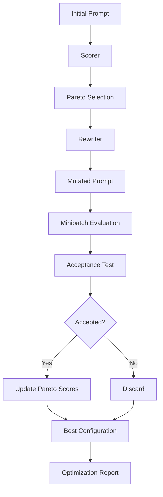
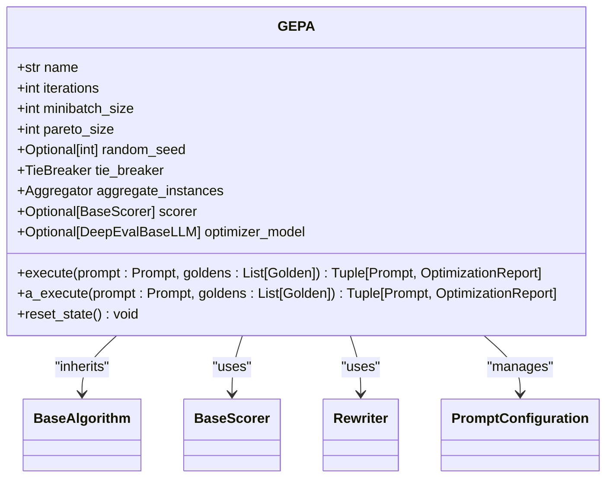
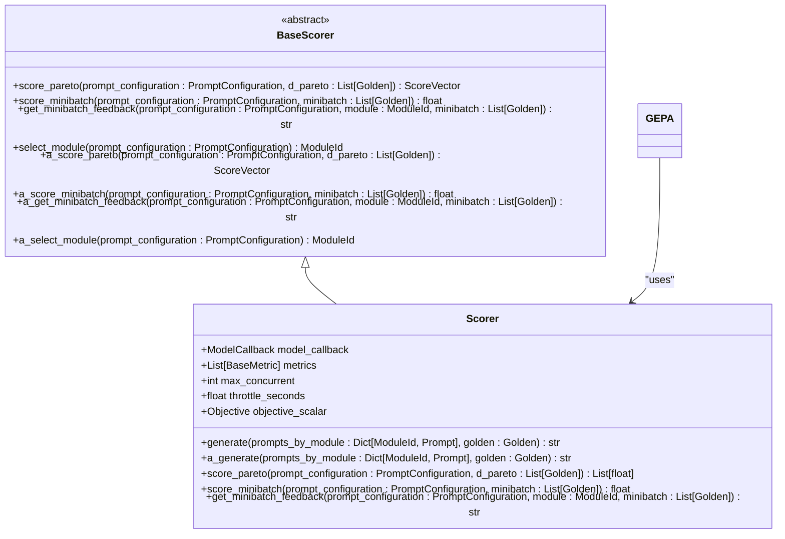
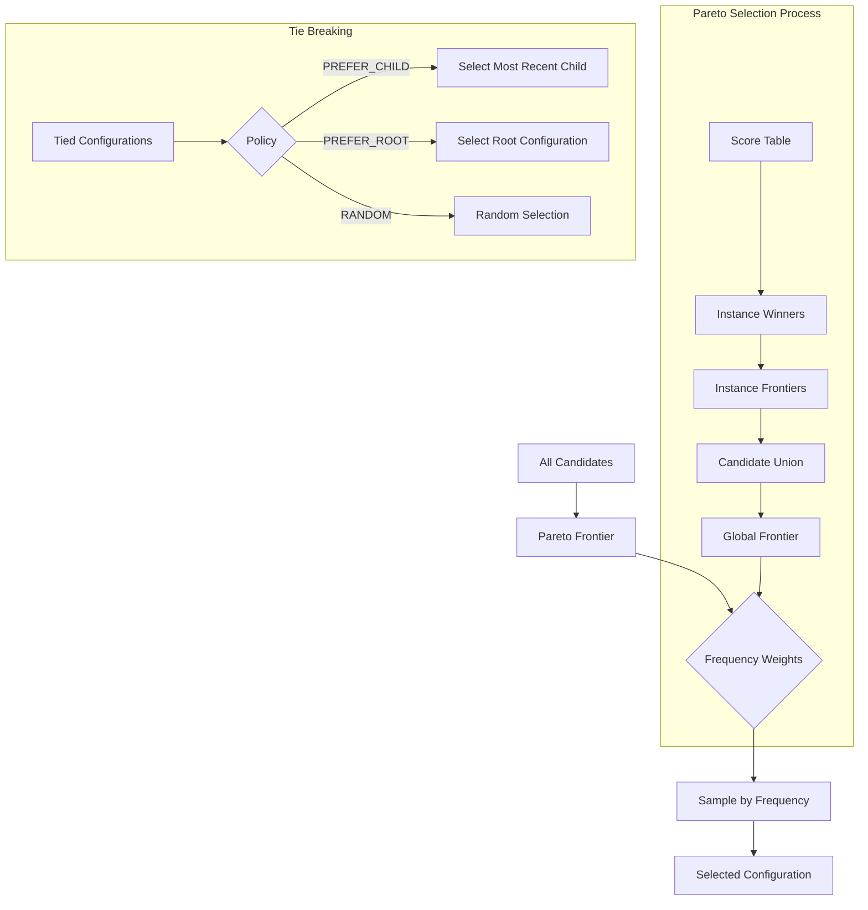
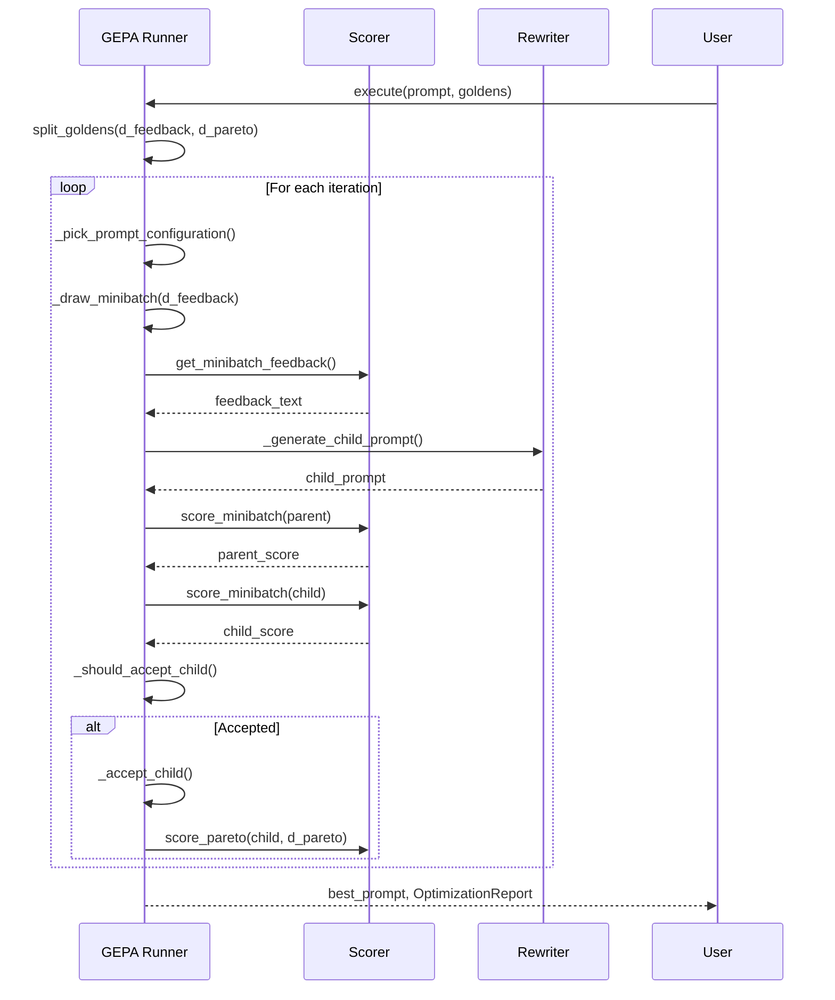

# GEPA Algorithm

<cite>
**Referenced Files in This Document**   
- [gepa.py](file://deepeval/optimizer/algorithms/gepa/gepa.py)
- [base.py](file://deepeval/optimizer/algorithms/base.py)
- [configs.py](file://deepeval/optimizer/algorithms/configs.py)
- [scorer.py](file://deepeval/optimizer/scorer/scorer.py)
- [rewriter.py](file://deepeval/optimizer/rewriter/rewriter.py)
- [types.py](file://deepeval/optimizer/types.py)
- [utils.py](file://deepeval/optimizer/utils.py)
</cite>

## Table of Contents
1. [Introduction](#introduction)
2. [Core Components](#core-components)
3. [Architecture Overview](#architecture-overview)
4. [Detailed Component Analysis](#detailed-component-analysis)
5. [Performance Considerations](#performance-considerations)
6. [Troubleshooting Guide](#troubleshooting-guide)
7. [Conclusion](#conclusion)

## Introduction
The GEPA (Gradient-based Evolutionary Prompt Optimization) algorithm is a hybrid evolutionary-gradient approach designed to iteratively improve prompts through evaluation and mutation. It combines mutation operators with gradient-inspired selection to optimize prompt configurations. The algorithm operates by evaluating prompt variants using a scorer, generating feedback, and applying mutations through a rewriter component. GEPA maintains a population of prompt configurations and uses Pareto-based selection to guide the evolutionary process. The implementation supports both synchronous and asynchronous execution, making it adaptable to various optimization scenarios.

## Core Components

The GEPA algorithm is implemented as a class that inherits from the base `BaseAlgorithm` and follows a structured approach to prompt optimization. The core components include the GEPA runner, scorer, rewriter, and various utility functions that support the optimization process. The algorithm uses a feedback-driven approach where prompt variants are evaluated, scored, and selected based on their performance. The implementation includes mechanisms for handling ties, managing state across iterations, and ensuring reproducibility through random seed management.

**Section sources**
- [gepa.py](file://deepeval/optimizer/algorithms/gepa/gepa.py#L58-L738)
- [base.py](file://deepeval/optimizer/algorithms/base.py#L10-L30)

## Architecture Overview

The GEPA algorithm follows a structured architecture that orchestrates the prompt optimization process through several interconnected components. The system begins with an initial prompt configuration and iteratively generates improved variants through a cycle of evaluation, feedback generation, mutation, and selection.

**Diagram sources **
- [gepa.py](file://deepeval/optimizer/algorithms/gepa/gepa.py#L134-L241)
- [scorer.py](file://deepeval/optimizer/scorer/scorer.py#L50-L317)
- [rewriter.py](file://deepeval/optimizer/rewriter/rewriter.py#L21-L125)

## Detailed Component Analysis

### GEPA Class Interface
The GEPA class provides a comprehensive interface for prompt optimization with configurable parameters that control the evolutionary process. The class implements both synchronous and asynchronous execution methods, allowing flexibility in optimization scenarios.

**Diagram sources **
- [gepa.py](file://deepeval/optimizer/algorithms/gepa/gepa.py#L58-L738)
- [types.py](file://deepeval/optimizer/types.py#L32-L46)

### Configuration Options
The GEPA algorithm exposes several configuration options that control its behavior and optimization strategy. These configurations are defined in the class constructor and influence various aspects of the evolutionary process.

| Configuration Parameter | Default Value | Description |
|------------------------|-------------|-------------|
| iterations | 5 | Total number of GEPA loop iterations (mutation attempts) |
| minibatch_size | 8 | Number of examples drawn from D_feedback per iteration |
| pareto_size | 3 | Size of the Pareto validation subset D_pareto |
| random_seed | None | RNG seed for reproducibility |
| tie_breaker | TieBreaker.PREFER_CHILD | Policy for breaking ties between equally performing prompts |
| aggregate_instances | mean_of_all | Function for aggregating scores across instances |

**Section sources**
- [gepa.py](file://deepeval/optimizer/algorithms/gepa/gepa.py#L69-L93)
- [configs.py](file://deepeval/optimizer/algorithms/configs.py#L2-L4)

### Scorer Role in Evaluation
The scorer component plays a critical role in the GEPA algorithm by evaluating prompt variants and providing feedback for mutation. It implements the `BaseScorer` interface and provides methods for scoring prompts on different datasets.

**Diagram sources **
- [scorer.py](file://deepeval/optimizer/scorer/scorer.py#L50-L317)
- [base.py](file://deepeval/optimizer/scorer/base.py#L10-L87)

### Mutation Selection Policy
The GEPA algorithm employs a sophisticated policy for selecting mutations based on Pareto optimization principles. The selection process involves multiple stages including candidate evaluation, dominance checking, and frequency-weighted sampling.

**Diagram sources **
- [policies.py](file://deepeval/optimizer/policies.py#L10-L228)
- [gepa.py](file://deepeval/optimizer/algorithms/gepa/gepa.py#L486-L527)

### Optimization Workflow
The GEPA optimization process follows a systematic workflow that iteratively improves prompt configurations through evaluation and mutation. The workflow is designed to balance exploration and exploitation in the search for optimal prompts.

**Diagram sources **
- [gepa.py](file://deepeval/optimizer/algorithms/gepa/gepa.py#L134-L241)
- [utils.py](file://deepeval/optimizer/utils.py#L39-L95)

## Performance Considerations

The GEPA algorithm involves several computational considerations that impact its performance and efficiency. The algorithm's computational cost is primarily determined by the number of iterations, the size of the minibatch, and the complexity of the evaluation metrics. Each iteration requires multiple model calls for scoring and feedback generation, which can be resource-intensive. The asynchronous implementation helps mitigate some of these costs by allowing concurrent execution of independent operations. The algorithm also includes throttling mechanisms to prevent overwhelming external services. For large-scale optimization tasks, users should consider adjusting the `max_concurrent` parameter and implementing appropriate throttling to balance performance and resource usage.

**Section sources**
- [scorer.py](file://deepeval/optimizer/scorer/scorer.py#L62-L64)
- [gepa.py](file://deepeval/optimizer/algorithms/gepa/gepa.py#L87-L93)

## Troubleshooting Guide

### Common Issues and Solutions
The GEPA algorithm may encounter several common issues during execution. Understanding these issues and their solutions can help users optimize their prompt optimization process.

| Issue | Symptoms | Solutions |
|------|---------|---------|
| Slow Convergence | Minimal improvement across iterations | Increase mutation rate, adjust GEPA_MIN_DELTA, or modify the rewriter's mutation strategy |
| Premature Convergence | Algorithm settles on suboptimal solution | Increase population diversity, adjust tie-breaking policy, or modify selection pressure |
| High Computational Cost | Long execution times, resource exhaustion | Reduce minibatch size, decrease number of iterations, or implement more aggressive throttling |
| Evaluation Inconsistency | Fluctuating scores across similar prompts | Ensure consistent model settings, verify metric stability, or increase pareto_size for more reliable evaluation |

### Hyperparameter Tuning Best Practices
Effective tuning of GEPA hyperparameters is crucial for achieving optimal performance. The following best practices are recommended:

1. **Iterations**: Start with the default value of 5 and increase gradually based on convergence behavior
2. **Minibatch Size**: Use larger sizes for more stable gradient estimates but balance against computational cost
3. **Pareto Size**: Ensure sufficient validation examples (minimum 3) while maintaining adequate feedback data
4. **Random Seed**: Set explicitly for reproducible results during development and testing
5. **Tie Breaker**: Choose based on optimization goals - PREFER_CHILD for exploration, PREFER_ROOT for stability

**Section sources**
- [gepa.py](file://deepeval/optimizer/algorithms/gepa/gepa.py#L69-L93)
- [configs.py](file://deepeval/optimizer/algorithms/configs.py#L2-L4)
- [policies.py](file://deepeval/optimizer/policies.py#L170-L174)

## Conclusion
The GEPA algorithm represents a sophisticated approach to prompt optimization that combines evolutionary principles with gradient-inspired selection mechanisms. By systematically evaluating prompt variants and applying targeted mutations, GEPA enables iterative improvement of prompt configurations. The algorithm's modular design, with separate components for scoring, rewriting, and selection, provides flexibility and extensibility. The implementation supports both synchronous and asynchronous execution, making it adaptable to various use cases and performance requirements. With proper configuration and hyperparameter tuning, GEPA can effectively optimize prompts for a wide range of applications, balancing exploration and exploitation in the search for optimal solutions.