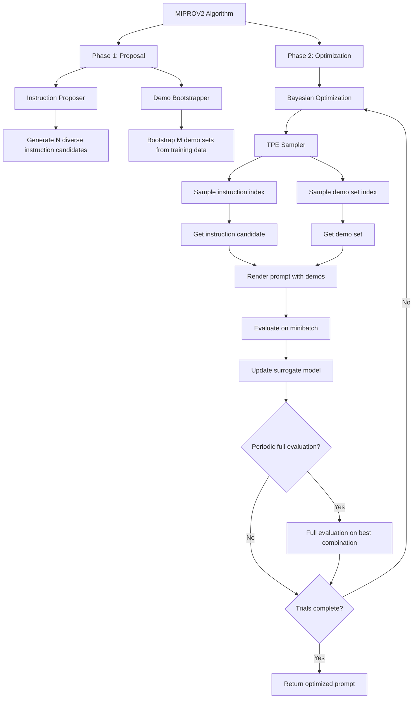
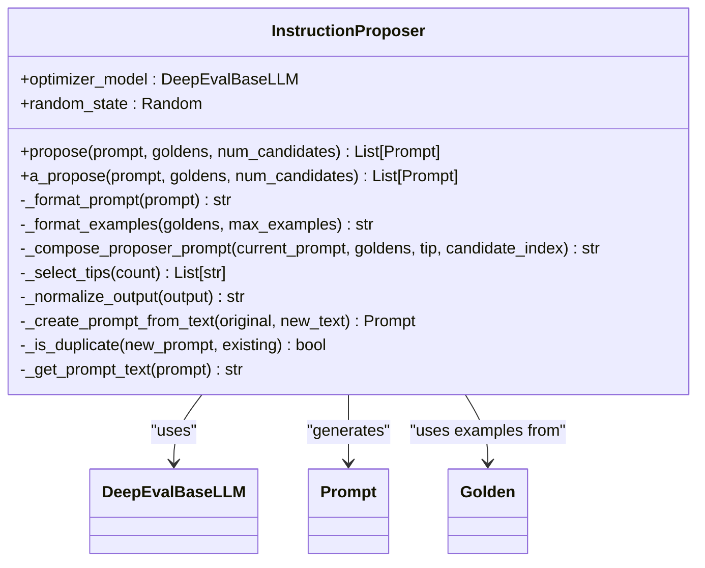
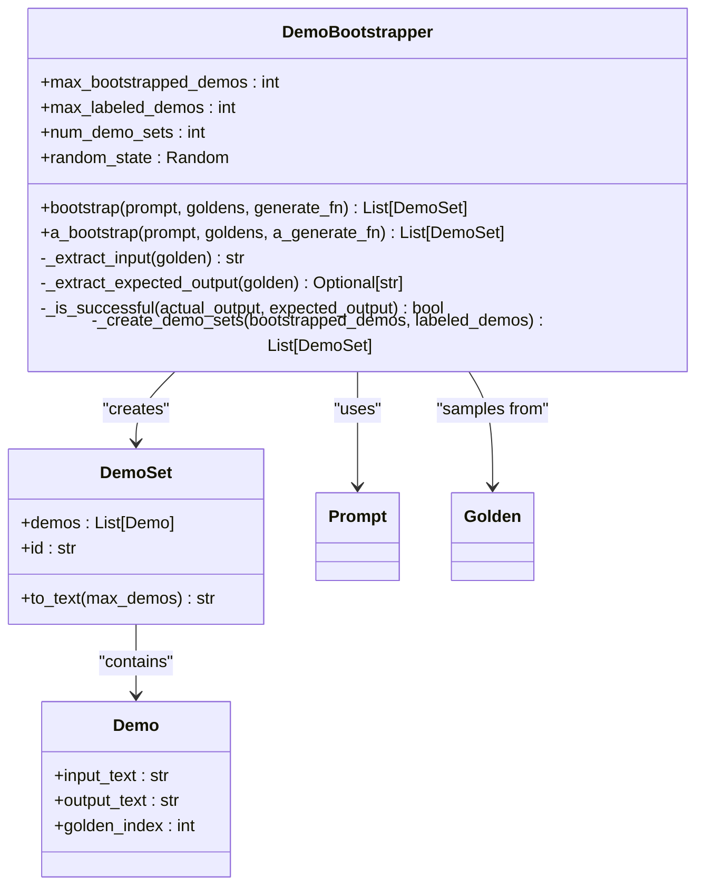
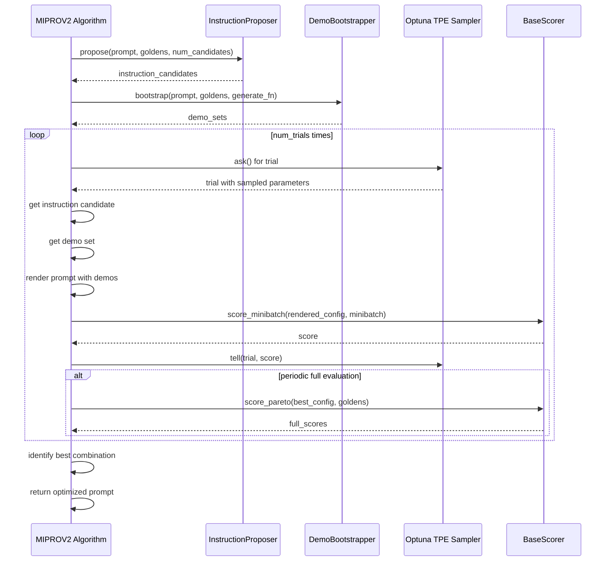
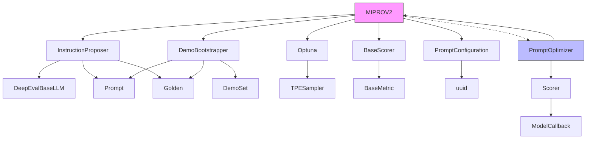

# MIPROv2 Algorithm

<cite>
**Referenced Files in This Document**   
- [miprov2.py](file://deepeval/optimizer/algorithms/miprov2/miprov2.py)
- [proposer.py](file://deepeval/optimizer/algorithms/miprov2/proposer.py)
- [bootstrapper.py](file://deepeval/optimizer/algorithms/miprov2/bootstrapper.py)
- [configs.py](file://deepeval/optimizer/algorithms/configs.py)
- [base.py](file://deepeval/optimizer/algorithms/base.py)
- [types.py](file://deepeval/optimizer/types.py)
- [scorer/base.py](file://deepeval/optimizer/scorer/base.py)
- [utils.py](file://deepeval/optimizer/utils.py)
- [prompt_optimizer.py](file://deepeval/optimizer/prompt_optimizer.py)
</cite>

## Table of Contents
1. [Introduction](#introduction)
2. [Core Components](#core-components)
3. [Architecture Overview](#architecture-overview)
4. [Detailed Component Analysis](#detailed-component-analysis)
5. [Dependency Analysis](#dependency-analysis)
6. [Performance Considerations](#performance-considerations)
7. [Troubleshooting Guide](#troubleshooting-guide)
8. [Conclusion](#conclusion)

## Introduction
The MIPROv2 (Multiprompt Instruction PRoposal Optimizer Version 2) algorithm is a sophisticated prompt optimization framework that combines intelligent instruction proposal with few-shot demonstration bootstrapping, using Bayesian Optimization to find optimal prompt configurations. Based on the original MIPROv2 paper and DSPy implementation, this algorithm systematically searches the joint space of instruction candidates and demonstration sets to maximize prompt effectiveness. The implementation follows a two-phase approach: first generating diverse instruction candidates and bootstrapped demonstration sets, then using Optuna's TPE sampler for Bayesian Optimization over the combined space. This approach enables efficient exploration of the prompt space while balancing computational cost with optimization quality.

## Core Components

The MIPROv2 algorithm consists of three core components: the MIPROV2 class that orchestrates the optimization process, the InstructionProposer that generates diverse instruction candidates, and the DemoBootstrapper that creates effective demonstration sets. These components work together to implement the two-phase optimization strategy, with the MIPROV2 class managing the overall workflow, the proposer ensuring diversity in instruction generation, and the bootstrapper creating high-quality few-shot examples. The algorithm integrates with the scoring system through the BaseScorer interface, enabling evaluation of prompt effectiveness across various metrics.

**Section sources**
- [miprov2.py](file://deepeval/optimizer/algorithms/miprov2/miprov2.py#L91-L753)
- [proposer.py](file://deepeval/optimizer/algorithms/miprov2/proposer.py#L41-L302)
- [bootstrapper.py](file://deepeval/optimizer/algorithms/miprov2/bootstrapper.py#L71-L436)

## Architecture Overview

**Diagram sources **
- [miprov2.py](file://deepeval/optimizer/algorithms/miprov2/miprov2.py#L91-L753)
- [proposer.py](file://deepeval/optimizer/algorithms/miprov2/proposer.py#L41-L302)
- [bootstrapper.py](file://deepeval/optimizer/algorithms/miprov2/bootstrapper.py#L71-L436)

## Detailed Component Analysis

### MIPROV2 Class Analysis
The MIPROV2 class implements the core optimization algorithm, following a two-phase approach. In the proposal phase, it generates diverse instruction candidates using the InstructionProposer and bootstraps demonstration sets using the DemoBootstrapper. In the optimization phase, it employs Bayesian Optimization via Optuna's TPE sampler to search the joint space of (instruction candidate, demo set) combinations. The algorithm maintains state through various data structures including instruction_candidates, demo_sets, and combination_scores, tracking performance across trials. It supports both synchronous and asynchronous execution through execute() and a_execute() methods, with the asynchronous version enabling concurrent proposal and bootstrapping.

**Section sources**
- [miprov2.py](file://deepeval/optimizer/algorithms/miprov2/miprov2.py#L91-L753)

### Instruction Proposer Analysis
The InstructionProposer generates diverse instruction candidates by leveraging different "tips" to encourage variation in the generated prompts. It uses a predefined list of 15 tips such as "Be creative and think outside the box" and "Use step-by-step reasoning" to guide the generation process. For each candidate, it composes a specialized prompt that includes the current prompt, example inputs/outputs from goldens, and a specific tip. The proposer ensures diversity by selecting different tips for each candidate and includes mechanisms to avoid duplicates through text comparison and similarity checking. It supports both synchronous and asynchronous generation, with the asynchronous version enabling concurrent candidate generation.

**Diagram sources **
- [proposer.py](file://deepeval/optimizer/algorithms/miprov2/proposer.py#L41-L302)

### Demo Bootstrapper Analysis
The DemoBootstrapper creates multiple demonstration sets by running the prompt on training examples and collecting successful outputs. Each demo set can contain both bootstrapped demos (model-generated outputs that passed validation) and labeled demos (taken directly from expected_output in goldens). The bootstrapper implements a success check that validates outputs based on non-emptiness and word overlap with expected outputs (minimum 30% overlap). It creates diverse demo sets by randomly sampling from available demos and always includes a 0-shot option (empty demo set) to allow the optimizer to determine whether few-shot examples improve performance. The bootstrapper supports both synchronous and asynchronous operation, with the asynchronous version enabling concurrent generation of multiple demos.

**Diagram sources **
- [bootstrapper.py](file://deepeval/optimizer/algorithms/miprov2/bootstrapper.py#L71-L436)

### Optimization Process Analysis
The optimization process in MIPROv2 follows a systematic approach to find the best prompt configuration. During the Bayesian Optimization phase, each trial samples an instruction index and demo set index using Optuna's TPE sampler, renders the prompt with the selected demos, and evaluates it on a minibatch of goldens. The algorithm tracks scores for each combination and periodically performs full evaluations on the best combination to obtain accurate performance estimates. The optimization balances exploration (trying new combinations) and exploitation (focusing on promising regions) through the TPE sampler's probabilistic modeling of good vs. bad parameter values. The process concludes by returning the optimized prompt with the best instruction and demonstration set rendered inline.

**Diagram sources **
- [miprov2.py](file://deepeval/optimizer/algorithms/miprov2/miprov2.py#L463-L633)
- [proposer.py](file://deepeval/optimizer/algorithms/miprov2/proposer.py#L136-L178)
- [bootstrapper.py](file://deepeval/optimizer/algorithms/miprov2/bootstrapper.py#L170-L251)

## Dependency Analysis

**Diagram sources **
- [miprov2.py](file://deepeval/optimizer/algorithms/miprov2/miprov2.py#L91-L753)
- [prompt_optimizer.py](file://deepeval/optimizer/prompt_optimizer.py#L53-L264)
- [scorer/base.py](file://deepeval/optimizer/scorer/base.py#L10-L87)

**Section sources**
- [miprov2.py](file://deepeval/optimizer/algorithms/miprov2/miprov2.py#L91-L753)
- [prompt_optimizer.py](file://deepeval/optimizer/prompt_optimizer.py#L53-L264)
- [base.py](file://deepeval/optimizer/algorithms/base.py#L10-L30)

## Performance Considerations
The MIPROv2 algorithm involves significant API call volume due to its iterative evaluation process. Each optimization trial requires API calls for prompt generation and scoring, with the total number of calls scaling with num_trials and minibatch_size. To manage costs and latency, the algorithm uses minibatch sampling for most evaluations, only performing full dataset evaluations periodically. The default configuration (20 trials with 25 examples each) results in 500 evaluation calls during the optimization phase, plus additional calls for instruction proposal and demo bootstrapping. Users should configure iteration limits based on their budget and performance requirements, with higher num_trials providing more thorough search but increased costs. The algorithm's asynchronous capabilities can help reduce wall-clock time by enabling concurrent operations.

**Section sources**
- [miprov2.py](file://deepeval/optimizer/algorithms/miprov2/miprov2.py#L133-L177)
- [configs.py](file://deepeval/optimizer/algorithms/configs.py#L9-L15)

## Troubleshooting Guide
Common issues with MIPROv2 include getting stuck in local optima, excessive API costs, and suboptimal results. To address local optima, users can increase the mutation pool size by raising num_candidates or num_demo_sets to explore a broader search space. Adjusting the temperature parameter of the optimizer model can also increase diversity in instruction generation. For API cost concerns, reducing minibatch_size or num_trials can lower costs, though this may impact optimization quality. If the algorithm fails to improve over the baseline, verifying the quality of goldens and ensuring the scorer metrics align with desired outcomes is recommended. The random_seed parameter can be set to ensure reproducible results during debugging. Users should also ensure optuna is installed, as MIPROv2 depends on it for Bayesian Optimization.

**Section sources**
- [miprov2.py](file://deepeval/optimizer/algorithms/miprov2/miprov2.py#L146-L150)
- [prompt_optimizer.py](file://deepeval/optimizer/prompt_optimizer.py#L53-L264)
- [docs/docs/prompt-optimization-miprov2.mdx](file://docs/docs/prompt-optimization-miprov2.mdx#L1-L194)

## Conclusion
The MIPROv2 algorithm provides a comprehensive framework for prompt optimization that effectively balances exploration and exploitation in the prompt space. By combining diverse instruction proposal, demonstration bootstrapping, and Bayesian Optimization, it offers a systematic approach to finding optimal prompt configurations. The algorithm's modular design separates concerns between candidate generation, demonstration creation, and optimization strategy, enabling flexible configuration and extension. Its integration with the DeepEval ecosystem allows seamless use with various metrics and models, making it a powerful tool for improving LLM performance across diverse tasks. The implementation demonstrates careful consideration of practical concerns including computational efficiency, reproducibility, and user configurability.