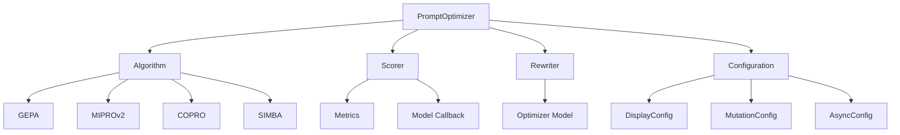
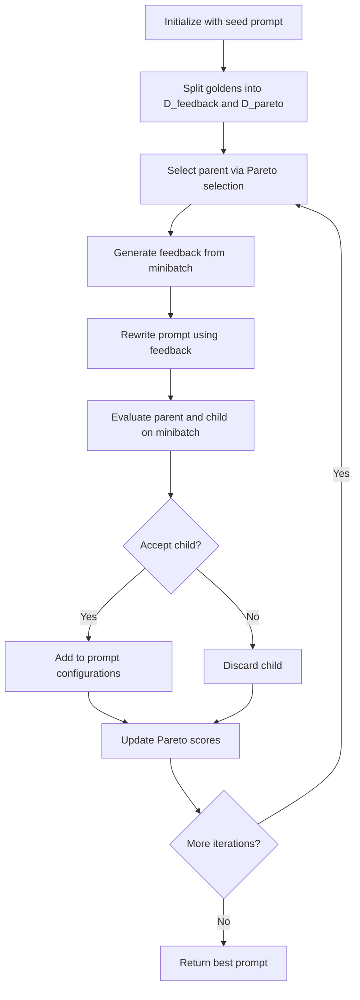
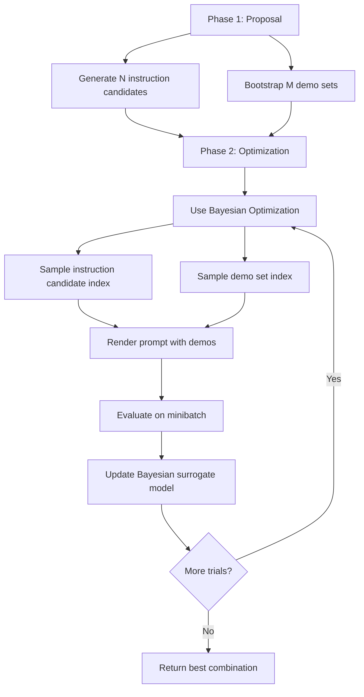
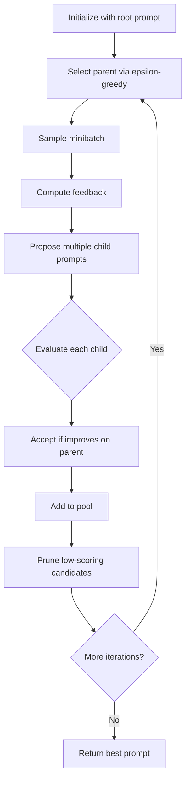
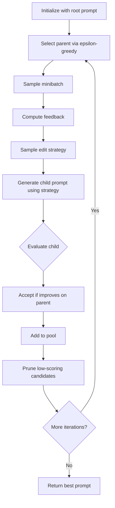
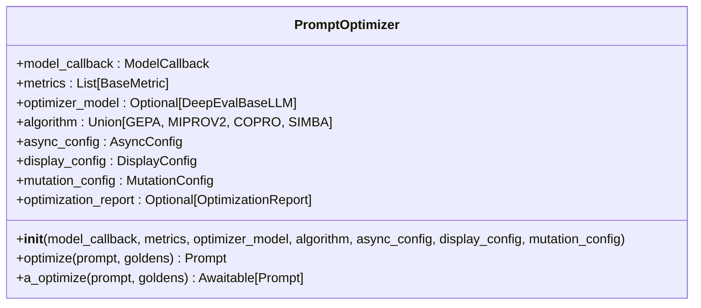

# Prompt Optimization

<cite>
**Referenced Files in This Document**   
- [prompt_optimizer.py](file://deepeval/optimizer/prompt_optimizer.py)
- [types.py](file://deepeval/optimizer/types.py)
- [configs.py](file://deepeval/optimizer/configs.py)
- [gepa.py](file://deepeval/optimizer/algorithms/gepa/gepa.py)
- [miprov2.py](file://deepeval/optimizer/algorithms/miprov2/miprov2.py)
- [copro.py](file://deepeval/optimizer/algorithms/copro/copro.py)
- [simba.py](file://deepeval/optimizer/algorithms/simba/simba.py)
- [scorer.py](file://deepeval/optimizer/scorer/scorer.py)
- [rewriter.py](file://deepeval/optimizer/rewriter/rewriter.py)
- [policies.py](file://deepeval/optimizer/policies.py)
- [utils.py](file://deepeval/optimizer/utils.py)
</cite>

## Table of Contents
1. [Introduction](#introduction)
2. [Architecture Overview](#architecture-overview)
3. [Optimization Algorithms](#optimization-algorithms)
4. [Public Interfaces](#public-interfaces)
5. [Practical Examples](#practical-examples)
6. [Common Issues and Solutions](#common-issues-and-solutions)
7. [Performance Considerations](#performance-considerations)
8. [Best Practices](#best-practices)

## Introduction

Prompt optimization in DeepEval is an automated process that improves prompt effectiveness through research-backed algorithms. The system uses various optimization strategies to iteratively refine prompts based on feedback from evaluation metrics. The core component is the `PromptOptimizer` class, which orchestrates the optimization process by coordinating algorithms, scorers, and rewriters to systematically improve prompt performance.

The optimization process works by creating mutations of the original prompt, evaluating their effectiveness against a set of golden test cases using specified metrics, and selecting improvements based on the evaluation scores. This iterative approach allows for continuous refinement of prompts to achieve better performance on specific tasks.

**Section sources**
- [prompt_optimizer.py](file://deepeval/optimizer/prompt_optimizer.py#L53-L264)

## Architecture Overview

The prompt optimization system in DeepEval follows a modular architecture with distinct components that work together to improve prompt effectiveness. The system is built around several key components: the PromptOptimizer, algorithms, scorer, rewriter, and various configuration and utility classes.



**Diagram sources**
- [prompt_optimizer.py](file://deepeval/optimizer/prompt_optimizer.py#L53-L264)
- [gepa.py](file://deepeval/optimizer/algorithms/gepa/gepa.py#L58-L738)
- [miprov2.py](file://deepeval/optimizer/algorithms/miprov2/miprov2.py#L91-L753)
- [copro.py](file://deepeval/optimizer/algorithms/copro/copro.py#L61-L800)
- [simba.py](file://deepeval/optimizer/algorithms/simba/simba.py#L63-L1000)
- [scorer.py](file://deepeval/optimizer/scorer/scorer.py#L50-L317)
- [rewriter.py](file://deepeval/optimizer/rewriter/rewriter.py#L21-L125)

The architecture follows a clear separation of concerns:
- **PromptOptimizer**: The main orchestrator that coordinates the optimization process
- **Algorithms**: Different optimization strategies (GEPA, MIPROv2, COPRO, SIMBA) that implement the core optimization logic
- **Scorer**: Evaluates prompt performance using specified metrics and a model callback
- **Rewriter**: Generates mutated versions of prompts based on feedback
- **Configuration**: Various configuration classes that control optimization behavior

The system uses a feedback loop where the scorer evaluates prompt performance, the algorithm decides which prompts to keep and which to mutate, and the rewriter creates new prompt variations based on the evaluation feedback.

**Section sources**
- [prompt_optimizer.py](file://deepeval/optimizer/prompt_optimizer.py#L53-L264)
- [types.py](file://deepeval/optimizer/types.py#L1-L149)
- [configs.py](file://deepeval/optimizer/configs.py#L1-L32)

## Optimization Algorithms

DeepEval implements several research-backed algorithms for prompt optimization, each with its own approach to improving prompt effectiveness. These algorithms represent different strategies for navigating the space of possible prompt variations to find optimal solutions.

### GEPA (Gradient-free Evolutionary Prompt Algorithm)

GEPA is an evolutionary algorithm that uses a Pareto-based selection strategy to identify promising prompt candidates. The algorithm maintains a population of prompt configurations and iteratively improves them through mutation and selection.

Key features of GEPA:
- Uses Pareto frontier analysis to select parent prompts for mutation
- Implements a tie-breaking policy for handling equivalent scores
- Supports both synchronous and asynchronous execution
- Uses a minibatch approach for efficient evaluation



**Diagram sources**
- [gepa.py](file://deepeval/optimizer/algorithms/gepa/gepa.py#L58-L738)

### MIPROv2 (Multiprompt Instruction PRoposal Optimizer Version 2)

MIPROv2 uses Bayesian optimization with Optuna's TPE sampler to search for the best combination of instruction candidates and few-shot demonstrations. The algorithm works in two phases: proposal and optimization.

Key features of MIPROv2:
- Generates diverse instruction candidates upfront
- Bootstraps few-shot demonstration sets from training data
- Uses Bayesian optimization to search the joint space of (instruction_candidate, demo_set)
- Periodically performs full evaluation to get accurate scores



**Diagram sources**
- [miprov2.py](file://deepeval/optimizer/algorithms/miprov2/miprov2.py#L91-L753)

### COPRO (COoperative PROmpt optimization)

COPRO is a cooperative optimization algorithm that maintains a bounded population of candidate prompts. At each iteration, it selects a parent via epsilon-greedy selection, computes feedback, and proposes multiple child prompts cooperatively from the same parent.

Key features of COPRO:
- Maintains a bounded population of candidate prompts
- Uses epsilon-greedy selection for parent selection
- Proposes multiple child prompts from the same parent
- Periodically evaluates the best candidate on the full dataset



**Diagram sources**
- [copro.py](file://deepeval/optimizer/algorithms/copro/copro.py#L61-L800)

### SIMBA (SIMultaneous prompt BAsed optimization)

SIMBA is a multi-strategy optimization algorithm that extends COPRO by using different edit strategies (e.g., APPEND_DEMO or APPEND_RULE) when generating child prompts. This allows for more diverse mutations and potentially better exploration of the prompt space.

Key features of SIMBA:
- Uses multiple edit strategies for prompt mutation
- Maintains a bounded population of candidate prompts
- Uses epsilon-greedy selection for parent selection
- Periodically evaluates the best candidate on the full dataset



**Diagram sources**
- [simba.py](file://deepeval/optimizer/algorithms/simba/simba.py#L63-L1000)

## Public Interfaces

The prompt optimization system in DeepEval provides a clean and consistent public interface through the `PromptOptimizer` class. This interface allows users to configure and execute the optimization process with minimal code.

### PromptOptimizer Class

The `PromptOptimizer` class is the main entry point for prompt optimization. It provides methods for synchronous and asynchronous optimization, as well as configuration options for various aspects of the optimization process.



**Diagram sources**
- [prompt_optimizer.py](file://deepeval/optimizer/prompt_optimizer.py#L53-L264)

### Configuration Options

The optimization process can be configured through several configuration classes that control different aspects of the optimization behavior.

#### DisplayConfig
Controls the display of progress indicators and status messages.

```python
class DisplayConfig(BaseModel):
    show_indicator: bool = True
    announce_ties: bool = False
```

#### MutationConfig
Controls the mutation behavior when rewriting prompts.

```python
class MutationConfig(BaseModel):
    target_type: MutationTargetType = MutationTargetType.RANDOM
    target_role: Optional[str] = None
    target_index: conint(ge=0) = 0
```

#### AsyncConfig
Controls asynchronous execution parameters.

```python
class AsyncConfig(BaseModel):
    run_async: bool = False
    max_concurrent: int = 5
    throttle_value: float = 0.0
```

**Section sources**
- [prompt_optimizer.py](file://deepeval/optimizer/prompt_optimizer.py#L53-L264)
- [configs.py](file://deepeval/optimizer/configs.py#L1-L32)
- [types.py](file://deepeval/optimizer/types.py#L1-L149)

## Practical Examples

This section provides practical examples demonstrating how to use the PromptOptimizer to improve prompt performance.

### Basic Usage

The simplest way to use the PromptOptimizer is to create an instance with a model callback, metrics, and optional configuration, then call the `optimize` method with a prompt and golden test cases.

```python
from deepeval.optimizer import PromptOptimizer
from deepeval.metrics import AnswerRelevancyMetric
from deepeval.test_case import LLMTestCase

# Define a model callback function
def model_callback(prompt, golden):
    # Implementation of model generation
    pass

# Create optimizer instance
optimizer = PromptOptimizer(
    model_callback=model_callback,
    metrics=[AnswerRelevancyMetric()],
    algorithm=GEPA()
)

# Optimize a prompt
optimized_prompt = optimizer.optimize(
    prompt=my_prompt,
    goldens=my_goldens
)
```

### Advanced Configuration

For more control over the optimization process, you can configure various aspects of the optimizer.

```python
from deepeval.optimizer import PromptOptimizer
from deepeval.optimizer.configs import DisplayConfig, MutationConfig, AsyncConfig
from deepeval.optimizer.algorithms import GEPA

# Create optimizer with custom configuration
optimizer = PromptOptimizer(
    model_callback=model_callback,
    metrics=[AnswerRelevancyMetric()],
    optimizer_model="gpt-4",
    algorithm=GEPA(iterations=10, minibatch_size=10, pareto_size=5),
    display_config=DisplayConfig(show_indicator=True, announce_ties=True),
    mutation_config=MutationConfig(target_type=MutationTargetType.FIXED_INDEX, target_index=0),
    async_config=AsyncConfig(run_async=True, max_concurrent=10)
)

# Optimize a prompt
optimized_prompt = optimizer.optimize(
    prompt=my_prompt,
    goldens=my_goldens
)
```

### Using Different Algorithms

You can easily switch between different optimization algorithms by changing the algorithm parameter.

```python
# Using MIPROv2
optimizer = PromptOptimizer(
    model_callback=model_callback,
    metrics=[AnswerRelevancyMetric()],
    algorithm=MIPROV2(num_candidates=15, num_trials=30)
)

# Using COPRO
optimizer = PromptOptimizer(
    model_callback=model_callback,
    metrics=[AnswerRelevancyMetric()],
    algorithm=COPRO(iterations=20, proposals_per_step=5)
)

# Using SIMBA
optimizer = PromptOptimizer(
    model_callback=model_callback,
    metrics=[AnswerRelevancyMetric()],
    algorithm=SIMBA(iterations=15, max_demos_per_proposal=4)
)
```

**Section sources**
- [prompt_optimizer.py](file://deepeval/optimizer/prompt_optimizer.py#L53-L264)
- [gepa.py](file://deepeval/optimizer/algorithms/gepa/gepa.py#L58-L738)
- [miprov2.py](file://deepeval/optimizer/algorithms/miprov2/miprov2.py#L91-L753)
- [copro.py](file://deepeval/optimizer/algorithms/copro/copro.py#L61-L800)
- [simba.py](file://deepeval/optimizer/algorithms/simba/simba.py#L63-L1000)

## Common Issues and Solutions

This section addresses common issues related to optimization convergence and their solutions.

### Convergence Issues

#### Problem: Optimization not converging
Sometimes the optimization process may not converge to a better solution, or may converge slowly.

**Solutions:**
- Increase the number of iterations
- Adjust the minibatch size
- Try a different optimization algorithm
- Use a more powerful optimizer model
- Increase the diversity of golden test cases

```python
# Example: Increasing iterations for better convergence
optimizer = PromptOptimizer(
    model_callback=model_callback,
    metrics=[AnswerRelevancyMetric()],
    algorithm=GEPA(iterations=20)  # Increased from default 5
)
```

#### Problem: Getting stuck in local optima
The optimization process may get stuck in local optima, preventing it from finding better solutions.

**Solutions:**
- Increase exploration probability in COPRO and SIMBA
- Use a different algorithm with better exploration capabilities
- Increase the population size in COPRO and SIMBA
- Use a more diverse set of golden test cases

```python
# Example: Increasing exploration in COPRO
optimizer = PromptOptimizer(
    model_callback=model_callback,
    metrics=[AnswerRelevancyMetric()],
    algorithm=COPRO(exploration_probability=0.5)  # Increased from default 0.2
)
```

### Performance Issues

#### Problem: Slow optimization
The optimization process may be too slow for practical use.

**Solutions:**
- Use asynchronous execution
- Reduce the number of concurrent requests
- Use a faster optimizer model
- Reduce the size of golden test cases
- Adjust throttling parameters

```python
# Example: Using asynchronous execution for better performance
optimizer = PromptOptimizer(
    model_callback=model_callback,
    metrics=[AnswerRelevancyMetric()],
    async_config=AsyncConfig(run_async=True, max_concurrent=20)
)
```

#### Problem: High resource usage
The optimization process may consume too many resources.

**Solutions:**
- Reduce the number of concurrent requests
- Use a smaller optimizer model
- Reduce the size of golden test cases
- Adjust throttling parameters
- Use a smaller population size in COPRO and SIMBA

```python
# Example: Reducing concurrent requests to save resources
optimizer = PromptOptimizer(
    model_callback=model_callback,
    metrics=[AnswerRelevancyMetric()],
    async_config=AsyncConfig(max_concurrent=5)  # Reduced from default 10
)
```

**Section sources**
- [prompt_optimizer.py](file://deepeval/optimizer/prompt_optimizer.py#L53-L264)
- [gepa.py](file://deepeval/optimizer/algorithms/gepa/gepa.py#L58-L738)
- [miprov2.py](file://deepeval/optimizer/algorithms/miprov2/miprov2.py#L91-L753)
- [copro.py](file://deepeval/optimizer/algorithms/copro/copro.py#L61-L800)
- [simba.py](file://deepeval/optimizer/algorithms/simba/simba.py#L63-L1000)

## Performance Considerations

When using the prompt optimization system, several performance considerations should be taken into account to ensure efficient and effective optimization.

### Optimization Runtime

The runtime of the optimization process depends on several factors:
- Number of iterations or trials
- Size of golden test cases
- Complexity of metrics
- Speed of the model callback
- Choice of optimization algorithm

To minimize runtime:
- Use asynchronous execution when possible
- Optimize the model callback for speed
- Use simpler metrics for initial optimization
- Start with fewer iterations and increase as needed
- Use a faster optimizer model

### Memory Usage

The optimization process can consume significant memory, especially when:
- Using large populations of candidate prompts
- Working with large golden test cases
- Using complex metrics that store intermediate results
- Running multiple optimizations concurrently

To reduce memory usage:
- Limit the population size in COPRO and SIMBA
- Use smaller golden test cases
- Clear unused objects from memory
- Use generators instead of lists when possible
- Process golden test cases in batches

### Network Usage

When using remote models, network usage can be a bottleneck:
- Each prompt evaluation requires network requests
- Multiple concurrent requests can saturate bandwidth
- Latency can significantly impact overall performance

To optimize network usage:
- Use throttling to control request rate
- Implement caching for repeated evaluations
- Use local models when possible
- Batch requests when the API supports it
- Monitor and adjust concurrent request limits

**Section sources**
- [prompt_optimizer.py](file://deepeval/optimizer/prompt_optimizer.py#L53-L264)
- [scorer.py](file://deepeval/optimizer/scorer/scorer.py#L50-L317)
- [rewriter.py](file://deepeval/optimizer/rewriter/rewriter.py#L21-L125)
- [utils.py](file://deepeval/optimizer/utils.py#L1-L481)

## Best Practices

This section outlines best practices for using the prompt optimization system effectively.

### Parameter Tuning

Effective parameter tuning is crucial for successful prompt optimization. Here are some guidelines:

#### Algorithm Parameters
- **GEPA**: Start with default parameters and increase iterations if needed
- **MIPROv2**: Adjust num_candidates and num_trials based on available resources
- **COPRO/SIMBA**: Tune exploration_probability and population_size for balance between exploration and exploitation

#### Performance Parameters
- Set max_concurrent based on your system's capabilities
- Use throttle_value to avoid rate limiting
- Adjust minibatch_size based on golden set size and performance requirements

### Golden Test Cases

The quality and diversity of golden test cases significantly impact optimization effectiveness:
- Use a diverse set of examples that cover different scenarios
- Ensure golden test cases are representative of real-world usage
- Include edge cases and challenging examples
- Regularly update golden test cases as requirements change

### Metric Selection

Choose metrics that align with your optimization goals:
- Use multiple metrics to capture different aspects of performance
- Balance between comprehensive evaluation and computational efficiency
- Consider the interpretability of metric scores
- Validate that metrics correlate with real-world performance

### Iterative Optimization

Use an iterative approach to optimization:
- Start with a small number of iterations to get initial improvements
- Analyze results and adjust parameters as needed
- Gradually increase complexity and resources
- Validate optimized prompts on separate test sets

### Monitoring and Evaluation

Monitor the optimization process and evaluate results carefully:
- Track optimization progress and convergence
- Analyze the optimization report to understand improvements
- Validate optimized prompts on unseen data
- Compare results across different algorithms and configurations

**Section sources**
- [prompt_optimizer.py](file://deepeval/optimizer/prompt_optimizer.py#L53-L264)
- [gepa.py](file://deepeval/optimizer/algorithms/gepa/gepa.py#L58-L738)
- [miprov2.py](file://deepeval/optimizer/algorithms/miprov2/miprov2.py#L91-L753)
- [copro.py](file://deepeval/optimizer/algorithms/copro/copro.py#L61-L800)
- [simba.py](file://deepeval/optimizer/algorithms/simba/simba.py#L63-L1000)
- [scorer.py](file://deepeval/optimizer/scorer/scorer.py#L50-L317)
- [utils.py](file://deepeval/optimizer/utils.py#L1-L481)