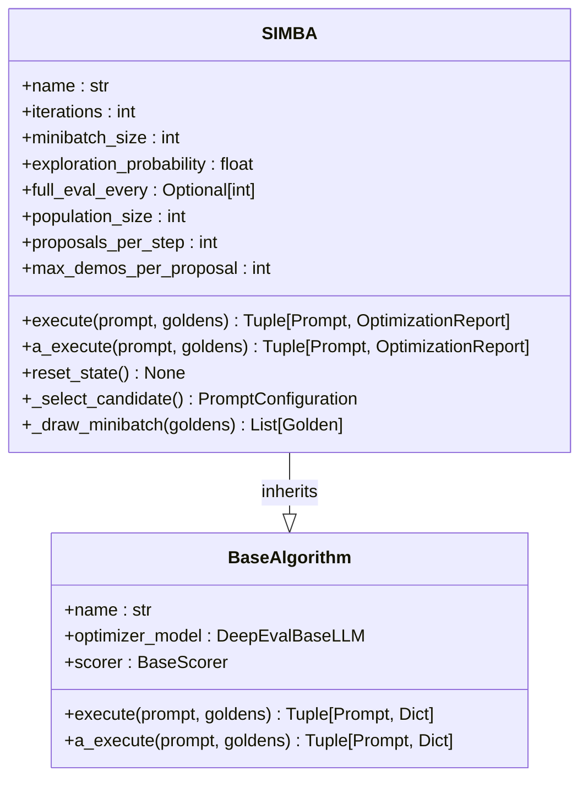
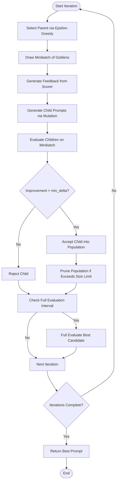
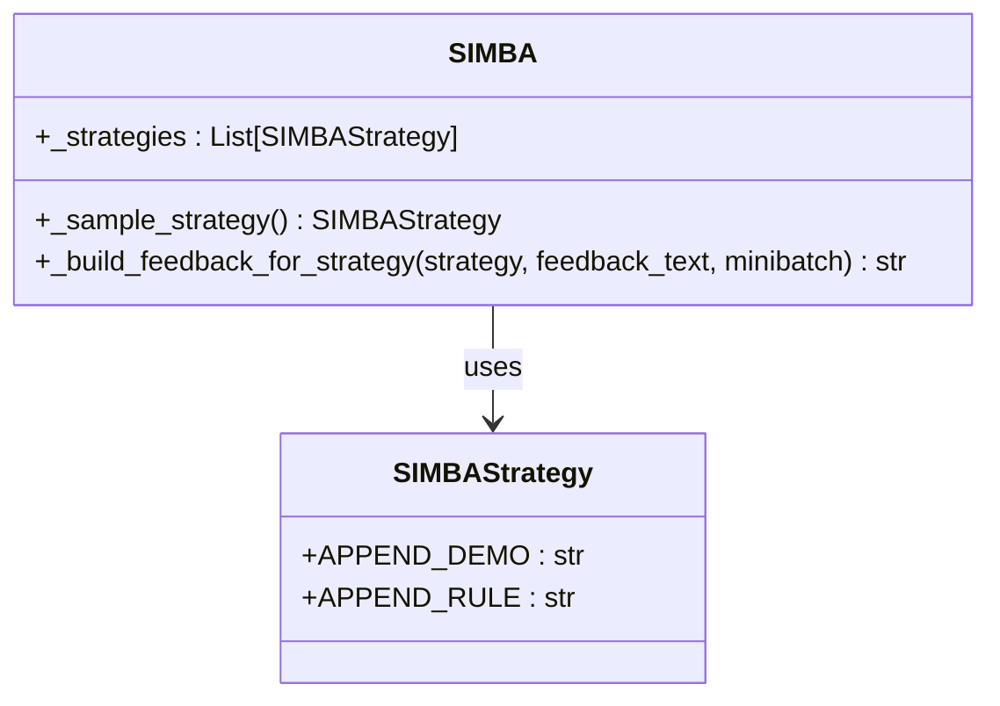
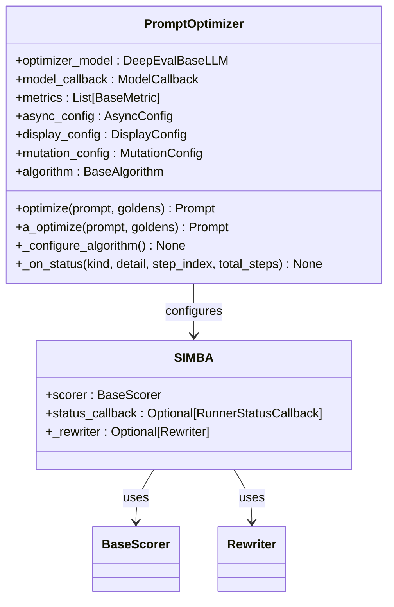

# SIMBA Algorithm

<cite>
**Referenced Files in This Document**   
- [simba.py](file://deepeval/optimizer/algorithms/simba/simba.py)
- [types.py](file://deepeval/optimizer/algorithms/simba/types.py)
- [prompt_optimizer.py](file://deepeval/optimizer/prompt_optimizer.py)
- [rewriter.py](file://deepeval/optimizer/rewriter/rewriter.py)
- [scorer.py](file://deepeval/optimizer/scorer/scorer.py)
- [configs.py](file://deepeval/optimizer/algorithms/configs.py)
- [types.py](file://deepeval/optimizer/types.py)
</cite>

## Table of Contents
1. [Introduction](#introduction)
2. [Core Components](#core-components)
3. [Mutation-Selection Cycle](#mutation-selection-cycle)
4. [SIMBA Class Interface](#simba-class-interface)
5. [Mutation Strategies](#mutation-strategies)
6. [Pareto Optimization](#pareto-optimization)
7. [Common Issues and Solutions](#common-issues-and-solutions)
8. [Performance Considerations](#performance-considerations)
9. [Integration with Optimization Framework](#integration-with-optimization-framework)
10. [Best Practices](#best-practices)

## Introduction
The SIMBA (Simple Iterative Mutational-Based Algorithm) is a lightweight, iterative prompt optimization approach that applies targeted mutations based on performance feedback. It operates by maintaining a bounded population of candidate prompts and iteratively improving them through a mutation-selection cycle. The algorithm uses performance feedback to guide the mutation process, accepting only those mutations that show significant improvement over the parent prompt.

**Section sources**
- [simba.py](file://deepeval/optimizer/algorithms/simba/simba.py#L1-L1000)

## Core Components
The SIMBA algorithm consists of several core components that work together to optimize prompts. The main class, SIMBA, inherits from BaseAlgorithm and implements both synchronous and asynchronous execution methods. It maintains a population of candidate prompts and uses a scorer to evaluate their performance. The algorithm also employs a rewriter to generate mutated prompts based on feedback.

The SIMBA class initializes with various parameters including the number of iterations, minibatch size, exploration probability, and population size. It uses these parameters to control the optimization process, balancing exploration and exploitation to find high-performing prompts.

**Diagram sources**
- [simba.py](file://deepeval/optimizer/algorithms/simba/simba.py#L63-L1000)

**Section sources**
- [simba.py](file://deepeval/optimizer/algorithms/simba/simba.py#L63-L1000)

## Mutation-Selection Cycle
The SIMBA algorithm follows a mutation-selection cycle to iteratively improve prompts. In each iteration, it selects a parent prompt from the current population using an epsilon-greedy strategy. It then generates multiple child prompts by applying different mutation strategies to the parent. Each child prompt is evaluated on a minibatch of examples, and only those that show significant improvement over the parent are accepted into the population.

The mutation process is guided by performance feedback, which is generated by the scorer based on the parent prompt's performance. This feedback is used to construct strategy-specific instructions that guide the rewriter in generating improved prompts. The selection process ensures that only high-impact mutations are retained, maintaining a diverse population of high-performing prompts.

**Diagram sources**
- [simba.py](file://deepeval/optimizer/algorithms/simba/simba.py#L202-L289)

## SIMBA Class Interface
The SIMBA class provides a clean interface for prompt optimization with both synchronous and asynchronous execution methods. The primary methods are `execute()` for synchronous operation and `a_execute()` for asynchronous operation. Both methods take a prompt and a set of goldens as input and return the optimized prompt along with an optimization report.

The class is configured with various parameters that control the optimization process:
- `iterations`: Total number of optimization trials
- `minibatch_size`: Number of examples drawn per iteration
- `exploration_probability`: Epsilon-greedy exploration rate
- `full_eval_every`: Frequency of full evaluations of the best candidate
- `population_size`: Maximum number of candidates in the pool
- `proposals_per_step`: Number of child prompts proposed per iteration
- `max_demos_per_proposal`: Maximum demos from minibatch for APPEND_DEMO strategy

These parameters allow users to fine-tune the optimization process based on their specific requirements and computational constraints.

**Section sources**
- [simba.py](file://deepeval/optimizer/algorithms/simba/simba.py#L94-L134)

## Mutation Strategies
SIMBA employs two primary mutation strategies defined in the SIMBAStrategy enum: APPEND_DEMO and APPEND_RULE. These strategies guide the rewriter in generating improved prompts based on performance feedback.

The APPEND_DEMO strategy focuses on adding concrete input/output demonstrations to the prompt. It extracts examples from the current minibatch and formats them as demonstrations that illustrate correct responses. This strategy is particularly effective when the model needs to learn specific patterns or formats for its responses.

The APPEND_RULE strategy focuses on adding concise natural-language rules to the prompt. It extracts key insights from the performance feedback and formulates them as rules or guidelines that address specific issues. This strategy is effective for correcting systematic errors or improving the quality of responses in specific dimensions.

**Diagram sources**
- [types.py](file://deepeval/optimizer/algorithms/simba/types.py#L4-L15)
- [simba.py](file://deepeval/optimizer/algorithms/simba/simba.py#L136-L141)

**Section sources**
- [types.py](file://deepeval/optimizer/algorithms/simba/types.py#L4-L15)
- [simba.py](file://deepeval/optimizer/algorithms/simba/simba.py#L136-L141)

## Pareto Optimization
SIMBA maintains a pareto-optimal set of prompt variants through its population management strategy. The algorithm keeps a bounded population of candidate prompts, with the population size controlled by the `population_size` parameter. When the population exceeds this limit, the algorithm prunes the worst-performing candidates while preserving the best ones.

The selection of candidates for pruning is based on their mean minibatch scores, with the algorithm using an epsilon-greedy approach to balance exploration and exploitation. This ensures that the population maintains diversity while gradually improving overall performance. The algorithm also periodically performs full evaluations of the best candidate on the complete golden set, providing a more comprehensive assessment of performance.

The pareto optimization approach allows SIMBA to maintain a diverse set of high-performing prompts, increasing the likelihood of finding optimal solutions while avoiding premature convergence to suboptimal local maxima.

**Section sources**
- [simba.py](file://deepeval/optimizer/algorithms/simba/simba.py#L514-L544)

## Common Issues and Solutions
One common issue with iterative optimization algorithms like SIMBA is premature convergence, where the algorithm gets stuck in a local optimum and fails to explore potentially better solutions. SIMBA addresses this through several mechanisms:

1. **Epsilon-greedy selection**: The algorithm uses an epsilon-greedy strategy to select parent prompts, with the exploration probability controlled by the `exploration_probability` parameter. This ensures that the algorithm continues to explore new areas of the search space even as it converges toward better solutions.

2. **Multiple mutation strategies**: By employing multiple mutation strategies (APPEND_DEMO and APPEND_RULE), SIMBA can explore different types of improvements, reducing the risk of getting stuck in a narrow region of the search space.

3. **Population diversity**: The bounded population size and pruning strategy help maintain diversity in the candidate pool, preventing the algorithm from focusing too narrowly on a small set of similar prompts.

To further address premature convergence, users can:
- Increase the `exploration_probability` to encourage more exploration
- Increase the `population_size` to maintain greater diversity
- Adjust the `min_delta` threshold to be more lenient in accepting improvements
- Use a larger `minibatch_size` to get more reliable performance estimates

**Section sources**
- [simba.py](file://deepeval/optimizer/algorithms/simba/simba.py#L623-L647)

## Performance Considerations
SIMBA is designed with performance and memory efficiency in mind. The algorithm uses minibatch evaluation to reduce computational overhead, evaluating prompts on a subset of examples rather than the complete dataset in each iteration. This approach significantly reduces the computational cost while still providing reliable performance estimates.

Memory usage is controlled through the bounded population size, with the `population_size` parameter limiting the number of candidate prompts stored in memory. The algorithm also uses efficient data structures to track performance metrics, storing only the necessary summary statistics rather than complete evaluation histories.

For large-scale optimization tasks, users can adjust several parameters to balance performance and quality:
- Reduce `iterations` for faster optimization at the cost of thoroughness
- Adjust `minibatch_size` to balance evaluation accuracy and speed
- Modify `proposals_per_step` to control the exploration rate
- Set `full_eval_every` to control the frequency of comprehensive evaluations

The algorithm also supports asynchronous execution through the `a_execute()` method, allowing for non-blocking optimization that can be integrated into larger workflows.

**Section sources**
- [simba.py](file://deepeval/optimizer/algorithms/simba/simba.py#L450-L453)

## Integration with Optimization Framework
SIMBA integrates seamlessly with the broader DeepEval optimization framework through the PromptOptimizer class. The PromptOptimizer serves as a high-level interface that configures and executes optimization algorithms, including SIMBA.

The integration works by setting the SIMBA instance as the algorithm in the PromptOptimizer configuration. The PromptOptimizer then handles the setup of necessary components such as the scorer and rewriter, passing them to the SIMBA instance. This modular design allows for easy swapping of optimization algorithms while maintaining a consistent interface.

The integration also handles asynchronous execution, progress reporting, and error handling, providing a complete optimization solution. The PromptOptimizer can be configured with various parameters that are passed through to the SIMBA algorithm, allowing for fine-grained control over the optimization process.

**Diagram sources**
- [prompt_optimizer.py](file://deepeval/optimizer/prompt_optimizer.py#L53-L264)
- [simba.py](file://deepeval/optimizer/algorithms/simba/simba.py#L154-L161)

**Section sources**
- [prompt_optimizer.py](file://deepeval/optimizer/prompt_optimizer.py#L53-L264)

## Best Practices
When using the SIMBA algorithm for prompt optimization, several best practices can help achieve optimal results:

1. **Configure mutation operators appropriately**: The choice and configuration of mutation operators significantly impact optimization effectiveness. For tasks requiring specific response formats, emphasize the APPEND_DEMO strategy. For tasks requiring improved reasoning or quality, focus on the APPEND_RULE strategy.

2. **Balance exploration and exploitation**: The `exploration_probability` parameter controls the balance between exploring new prompt variations and exploiting known good ones. Start with the default value (0.2) and adjust based on results - increase for more exploration, decrease for faster convergence.

3. **Set appropriate population size**: The `population_size` parameter should be large enough to maintain diversity but small enough to be computationally efficient. A value between 4-8 is typically effective, but this may vary based on the complexity of the task.

4. **Monitor convergence**: Regularly check the optimization progress to identify premature convergence. If performance plateaus early, consider increasing exploration or population diversity.

5. **Use representative goldens**: The quality of optimization depends heavily on the representativeness of the golden examples. Ensure the goldens cover the full range of expected inputs and desired outputs.

6. **Adjust minibatch size**: The `minibatch_size` should be large enough to provide reliable performance estimates but small enough to maintain efficiency. The default value of 8 is a good starting point.

7. **Leverage full evaluations**: The `full_eval_every` parameter controls how often the best candidate is evaluated on the complete dataset. Setting this appropriately ensures that the final selection is based on comprehensive performance assessment.

**Section sources**
- [simba.py](file://deepeval/optimizer/algorithms/simba/simba.py#L96-L134)
- [configs.py](file://deepeval/optimizer/algorithms/configs.py#L17-L19)