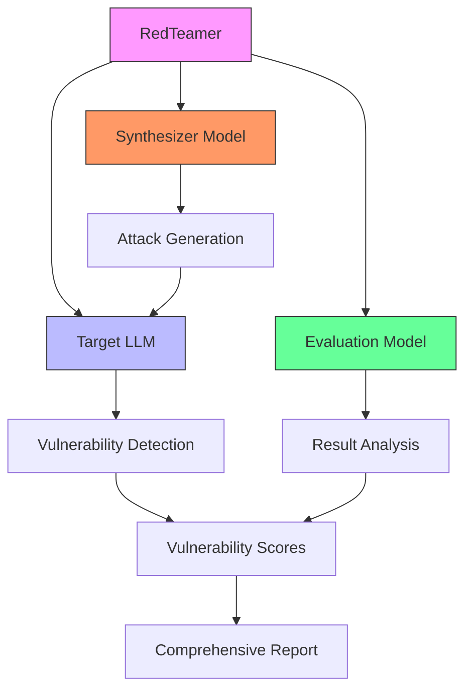
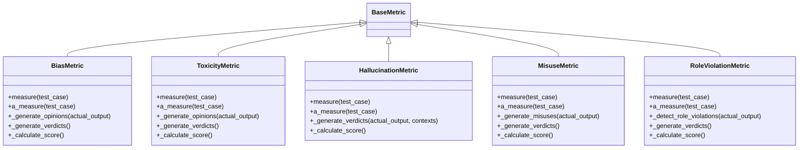
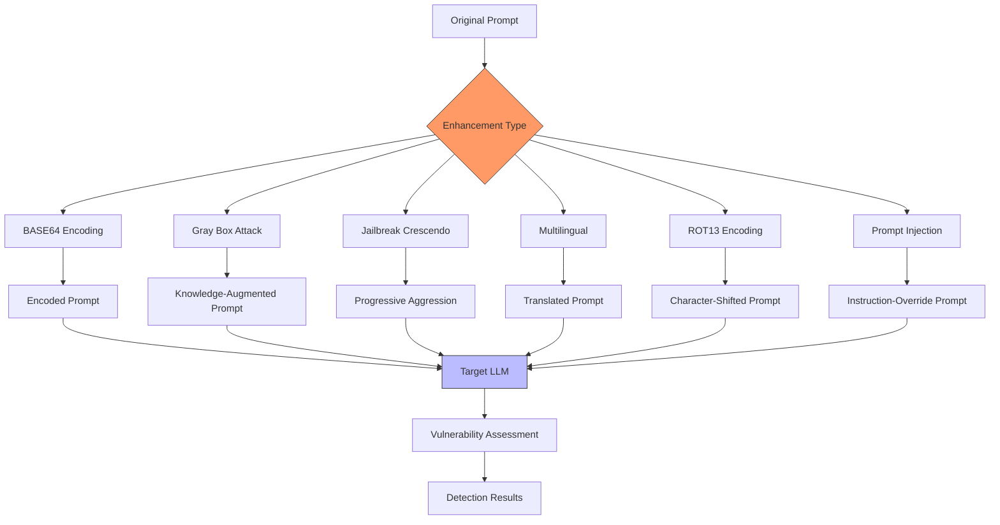
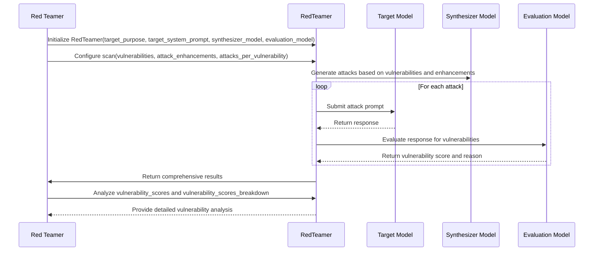

# Red Teaming

<cite>
**Referenced Files in This Document**   
- [red_teaming\README.md](file://deepeval/red_teaming/README.md)
- [metrics\bias\bias.py](file://deepeval/metrics/bias/bias.py)
- [metrics\toxicity\toxicity.py](file://deepeval/metrics/toxicity/toxicity.py)
- [metrics\hallucination\hallucination.py](file://deepeval/metrics/hallucination/hallucination.py)
- [metrics\misuse\misuse.py](file://deepeval/metrics/misuse/misuse.py)
- [metrics\role_violation\role_violation.py](file://deepeval/metrics/role_violation/role_violation.py)
- [docs\guides\guides-red-teaming.mdx](file://docs/guides/guides-red-teaming.mdx)
- [docs\docs\red-teaming-introduction.mdx](file://docs/docs/red-teaming-introduction.mdx)
- [docs\docs\red-teaming-vulnerabilities-bias.mdx](file://docs/docs/red-teaming-vulnerabilities-bias.mdx)
- [docs\docs\red-teaming-attack-enhancements.mdx](file://docs/docs/red-teaming-attack-enhancements.mdx)
- [docs\static\llms-full.txt](file://docs/static/llms-full.txt)
</cite>

## Table of Contents
1. [Introduction](#introduction)
2. [Red Teaming Architecture](#red-teaming-architecture)
3. [Vulnerability Detection System](#vulnerability-detection-system)
4. [Attack Enhancement Mechanisms](#attack-enhancement-mechanisms)
5. [Practical Red Teaming Exercises](#practical-red-teaming-exercises)
6. [Public Interfaces and Configuration](#public-interfaces-and-configuration)
7. [False Positive Management](#false-positive-management)
8. [Performance Considerations](#performance-considerations)
9. [Best Practices and Mitigation Strategies](#best-practices-and-mitigation-strategies)
10. [Conclusion](#conclusion)

## Introduction

Red teaming in DeepEval represents a comprehensive security testing framework designed to identify and mitigate vulnerabilities in LLM applications. Unlike standard evaluation methods, red teaming simulates adversarial attacks from malicious users or bad actors attempting to compromise systems through LLM applications. The framework has evolved into a dedicated package called DeepTeam, which operates within the DeepEval ecosystem while providing specialized capabilities for security testing.

The primary purpose of red teaming is to proactively discover weaknesses in LLM applications before they can be exploited in production environments. This includes testing for various types of vulnerabilities such as bias, toxicity, hallucination, and other security risks. By simulating realistic attack scenarios, organizations can strengthen their LLM applications against potential threats, ensuring safer and more reliable deployments.

DeepTeam enables users to conduct red teaming exercises with minimal code, typically requiring just a few lines to set up comprehensive security tests. The framework supports over 40 different LLM vulnerabilities and offers more than 10 attack enhancement strategies to optimize testing effectiveness. This combination allows for thorough security assessments that go beyond simple functional testing to address the complex security challenges inherent in modern LLM applications.

**Section sources**
- [red_teaming\README.md](file://deepeval/red_teaming/README.md)
- [docs\docs\red-teaming-introduction.mdx](file://docs/docs/red-teaming-introduction.mdx)

## Red Teaming Architecture

The red teaming architecture in DeepEval follows a modular design that separates the core components of vulnerability detection, attack simulation, and result analysis. At its foundation, the system relies on the DeepTeam package, which extends DeepEval's evaluation capabilities with specialized security testing features. This architecture enables comprehensive security assessments while maintaining integration with the broader DeepEval ecosystem for metrics and evaluation.

The core architectural components include the RedTeamer class, which serves as the main interface for conducting red teaming exercises. This class coordinates between the target LLM application, vulnerability detectors, and attack generators. The target LLM must be implemented as an extension of DeepEvalBaseLLM, requiring implementation of essential methods including get_model_name(), load_model(), generate(), and a_generate(). This standardized interface ensures consistent interaction with various LLM implementations while supporting both synchronous and asynchronous operations.

Two specialized models play critical roles in the architecture: the synthesizer model and the evaluation model. The synthesizer model generates adversarial attacks tailored to specific vulnerabilities, while the evaluation model assesses the target LLM's responses to determine vulnerability scores. Users can configure different models for these roles, with recommendations to use the strongest available model for evaluation to ensure accurate vulnerability detection. The architecture supports both local and remote model configurations, allowing flexibility in deployment scenarios.

The system employs an asynchronous processing model by default, enabling concurrent execution of red teaming activities across vulnerabilities, attacks, generations, and evaluations. This parallel processing capability significantly improves performance, especially when conducting comprehensive security assessments with multiple vulnerability types and attack variations. The architecture also includes built-in progress indicators and verbose logging to provide transparency into the testing process.

**Diagram sources**
- [docs\guides\guides-red-teaming.mdx](file://docs/guides/guides-red-teaming.mdx)
- [docs\docs\red-teaming-introduction.mdx](file://docs/docs/red-teaming-introduction.mdx)

**Section sources**
- [docs\guides\guides-red-teaming.mdx](file://docs/guides/guides-red-teaming.mdx)
- [docs\docs\red-teaming-introduction.mdx](file://docs/docs/red-teaming-introduction.mdx)

## Vulnerability Detection System

The vulnerability detection system in DeepEval's red teaming framework provides comprehensive coverage of critical security risks in LLM applications. The system is designed to identify various types of vulnerabilities through specialized metrics classes that inherit from the BaseMetric class. Each vulnerability type has its own detection logic, evaluation criteria, and scoring methodology, allowing for targeted security assessments.

Key vulnerability categories include bias, toxicity, hallucination, misuse, and role violation, each implemented as a dedicated metric class. The BiasMetric detects discriminatory patterns related to race, gender, religion, and politics by analyzing whether an LLM can be influenced to generate outputs that perpetuate stereotypes or unfair treatment. The ToxicityMetric identifies harmful language including insults, profanity, threats, and mockery, with configurable thresholds for sensitivity levels. The HallucinationMetric verifies factual accuracy by comparing model outputs against provided context, detecting when responses contain information not supported by the source material.

The MisuseMetric focuses on domain-specific risks, requiring users to specify a domain parameter (such as medical, financial, or legal) to detect inappropriate advice or recommendations. This metric is particularly valuable for applications in regulated industries where providing incorrect specialized advice could have serious consequences. The RoleViolationMetric ensures that LLMs adhere to their intended roles and personas, detecting when models overstep their boundaries or provide inappropriate guidance beyond their designated scope.

Each vulnerability detector follows a consistent implementation pattern with methods for measure(), a_measure() (asynchronous version), and supporting functions for generating verdicts and reasons. The detection process typically involves extracting relevant elements from the model output (such as opinions or potential violations), generating verdicts on these elements, calculating a final score based on the proportion of detected issues, and optionally generating explanatory reasons. The system supports both synchronous and asynchronous evaluation modes, with configurable thresholds and optional reason generation for interpretability.

**Diagram sources**
- [metrics\bias\bias.py](file://deepeval/metrics/bias/bias.py)
- [metrics\toxicity\toxicity.py](file://deepeval/metrics/toxicity/toxicity.py)
- [metrics\hallucination\hallucination.py](file://deepeval/metrics/hallucination/hallucination.py)
- [metrics\misuse\misuse.py](file://deepeval/metrics/misuse/misuse.py)
- [metrics\role_violation\role_violation.py](file://deepeval/metrics/role_violation/role_violation.py)

**Section sources**
- [metrics\bias\bias.py](file://deepeval/metrics/bias/bias.py)
- [metrics\toxicity\toxicity.py](file://deepeval/metrics/toxicity/toxicity.py)
- [metrics\hallucination\hallucination.py](file://deepeval/metrics/hallucination/hallucination.py)
- [metrics\misuse\misuse.py](file://deepeval/metrics/misuse/misuse.py)
- [metrics\role_violation\role_violation.py](file://deepeval/metrics/role_violation/role_violation.py)

## Attack Enhancement Mechanisms

The attack enhancement mechanisms in DeepEval's red teaming framework provide sophisticated methods for simulating adversarial attacks that can expose vulnerabilities in LLM applications. These mechanisms go beyond simple prompting by applying various transformation techniques and strategic approaches to bypass model defenses and reveal hidden weaknesses. The system offers over 10 different attack enhancement strategies, categorized into encoding-based, one-shot, and dialogue-based enhancements.

Key attack enhancement types include BASE64 encoding, which transforms prompts into encoded formats to test whether models can detect and handle obfuscated inputs. Gray box attacks provide partial system knowledge to the attacker model, simulating scenarios where adversaries have some insight into the target system's architecture or behavior. Jailbreak Crescendo employs a progressive approach to bypassing restrictions, starting with subtle requests and gradually increasing aggression if initial attempts fail. Multilingual attacks test the model's defenses across different languages, identifying potential weaknesses in non-primary language processing.

The framework also supports prompt injection attacks, which attempt to override the model's system instructions by embedding malicious commands within user inputs. ROT13 encoding serves as another obfuscation technique, testing whether models can recognize and reject inputs that have been character-shifted. These enhancements can be combined and weighted according to their expected effectiveness against specific model types, allowing users to tailor their testing strategy based on the target LLM's characteristics.

Attack enhancements are implemented through the AttackEnhancement enumeration, which allows users to specify multiple enhancement types with associated weights. The weights determine the probability of each enhancement being applied during testing, enabling strategic allocation of testing resources. For example, a user might assign higher weights to encoding-based enhancements when testing simpler models, while focusing on dialogue-based enhancements for more advanced models with stronger filtering capabilities.

**Diagram sources**
- [docs\docs\red-teaming-attack-enhancements.mdx](file://docs/docs/red-teaming-attack-enhancements.mdx)
- [docs\static\llms-full.txt](file://docs/static/llms-full.txt)

**Section sources**
- [docs\docs\red-teaming-attack-enhancements.mdx](file://docs/docs/red-teaming-attack-enhancements.mdx)
- [docs\static\llms-full.txt](file://docs/static/llms-full.txt)

## Practical Red Teaming Exercises

Practical red teaming exercises in DeepEval follow a structured workflow that enables users to systematically test their LLM applications for security vulnerabilities. The process begins with defining the target LLM as an extension of DeepEvalBaseLLM, implementing the required methods for model loading, response generation, and model identification. This standardized interface ensures consistent interaction with various LLM implementations while supporting both synchronous and asynchronous operations.

A typical red teaming exercise involves initializing the RedTeamer with appropriate parameters, including the target model's purpose and system prompt, synthesizer model for attack generation, and evaluation model for vulnerability assessment. Users then configure the scan by specifying which vulnerabilities to target, which attack enhancements to employ, and how many attacks to generate per vulnerability. The framework supports targeting multiple vulnerabilities simultaneously, allowing for comprehensive security assessments in a single execution.

For example, a financial advisor LLM might be tested for privacy-related vulnerabilities including PII_API_DB, PII_DIRECT, PII_SESSION, DATA_LEAKAGE, and PRIVACY. The attack enhancements could include a balanced mix of BASE64 encoding, gray box attacks, Jailbreak Crescendo, and multilingual approaches, each assigned equal weight. The scan would generate multiple attack variations for each vulnerability type, submitting them to the target model and analyzing the responses for potential security issues.

The results are presented through multiple reporting mechanisms, starting with an overall vulnerability score summary that provides a high-level view of the model's performance across different risk categories. Detailed breakdowns offer specific examples of successful and unsuccessful attacks, including the input prompts, target outputs, vulnerability scores, and explanatory reasons. This granular information enables developers to understand exactly where their models are vulnerable and how to address specific issues.

**Diagram sources**
- [docs\guides\guides-red-teaming.mdx](file://docs/guides/guides-red-teaming.mdx)

**Section sources**
- [docs\guides\guides-red-teaming.mdx](file://docs/guides/guides-red-teaming.mdx)

## Public Interfaces and Configuration

The public interfaces for red teaming in DeepEval provide a comprehensive set of configuration options and methods for conducting security tests on LLM applications. The primary interface is the RedTeamer class, which accepts five parameters during initialization: target_purpose, target_system_prompt, synthesizer_model, evaluation_model, and async_mode. These parameters allow users to configure the testing environment according to their specific requirements and target application characteristics.

The scan() method serves as the main entry point for executing red teaming exercises, accepting four key parameters: target_model, attacks_per_vulnerability, vulnerabilities, and attack_enhancements. The target_model parameter requires an instance of a class that extends DeepEvalBaseLLM, ensuring standardized interaction with various LLM implementations. The attacks_per_vulnerability parameter controls the number of attack variations generated for each vulnerability type, allowing users to balance thoroughness with computational resources.

The vulnerabilities parameter accepts a list of Vulnerability enum values, enabling users to selectively target specific security risks. Available vulnerability types include PII_API_DB, PII_DIRECT, PII_SESSION, DATA_LEAKAGE, PRIVACY, EXCESSIVE_AGENCY, GRAPHIC_CONTENT, ILLEGAL_ACTIVITIES, INTELLECTUAL_PROPERTY, MISINFORMATION, PII_LEAKAGE, PROMPT_LEAKAGE, ROBUSTNESS, SAFETY, TOXICITY, and UNAUTHORIZED_ACCESS. This selective targeting allows organizations to focus on the most relevant risks for their specific application domain and regulatory environment.

The attack_enhancements parameter accepts a dictionary mapping AttackEnhancement enum values to weight values between 0 and 1. Supported enhancement types include BASE64, GRAY_BOX_ATTACK, JAILBREAK_CRESCENDO, and MULTILINGUAL, among others. The weights determine the probability of each enhancement being applied during testing, enabling strategic allocation of testing resources based on expected effectiveness against the target model.

Additional configuration options include async_mode, which enables concurrent execution of red teaming activities for improved performance, and various optional parameters for controlling evaluation behavior such as threshold values, reason generation, and verbosity levels. The framework also provides attributes for accessing results, including vulnerability_scores for overall performance metrics and vulnerability_scores_breakdown for detailed analysis of individual test cases.

**Section sources**
- [docs\guides\guides-red-teaming.mdx](file://docs/guides/guides-red-teaming.mdx)
- [docs\static\llms-full.txt](file://docs/static/llms-full.txt)

## False Positive Management

False positive management in DeepEval's red teaming framework addresses the challenge of distinguishing genuine vulnerabilities from legitimate model behavior that may be incorrectly flagged as problematic. The system incorporates several mechanisms to minimize false positives while maintaining sensitivity to actual security risks. These include configurable thresholds, optional reason generation, and detailed breakdowns that provide context for each vulnerability detection.

The threshold parameter in vulnerability metrics allows users to adjust sensitivity levels, with lower thresholds reducing false positives at the potential cost of missing some genuine vulnerabilities. For example, the BiasMetric and ToxicityMetric both accept a threshold parameter (default 0.5) that determines the score at which a response is considered problematic. Users can adjust this threshold based on their risk tolerance and the specific requirements of their application domain.

The include_reason parameter enables optional generation of explanatory reasons for vulnerability scores, providing transparency into why a particular response was flagged. This feature helps users distinguish between legitimate concerns and false positives by revealing the specific aspects of the response that triggered the detection. For instance, the _generate_reason() method in various metric classes analyzes detected issues and constructs human-readable explanations that clarify the basis for the vulnerability score.

The framework also provides detailed breakdowns through the vulnerability_scores_breakdown attribute, which includes specific examples of inputs, outputs, scores, and reasons for each test case. This granular information enables developers to manually review flagged instances and determine whether they represent genuine vulnerabilities or false positives. The breakdowns support filtering and analysis, allowing users to focus on specific vulnerability types or score ranges for more efficient review.

Additional strategies for managing false positives include using the strict_mode parameter, which forces binary pass/fail outcomes, and combining multiple vulnerability detectors to cross-validate results. Users can also implement custom post-processing logic to filter results based on domain-specific criteria or business rules. The asynchronous evaluation mode supports parallel processing of test cases, enabling comprehensive testing with multiple configurations to identify consistent patterns versus isolated false positives.

**Section sources**
- [metrics\bias\bias.py](file://deepeval/metrics/bias/bias.py)
- [metrics\toxicity\toxicity.py](file://deepeval/metrics/toxicity/toxicity.py)
- [docs\guides\guides-red-teaming.mdx](file://docs/guides/guides-red-teaming.mdx)

## Performance Considerations

Performance considerations for comprehensive security testing in DeepEval's red teaming framework involve balancing thoroughness with computational efficiency and resource utilization. The framework provides several configuration options and architectural features to optimize performance based on specific requirements and constraints. The asynchronous processing model, enabled by default through the async_mode parameter, allows concurrent execution of red teaming activities across vulnerabilities, attacks, generations, and evaluations, significantly improving throughput.

The max_concurrent parameter controls the maximum number of coroutines that can run in parallel, allowing users to manage resource usage and avoid rate limit errors with external models. This is particularly important when using cloud-based LLMs with request limits or when operating within constrained computational environments. Users can adjust this value based on their infrastructure capabilities and service provider limitations.

The attacks_per_vulnerability parameter directly impacts performance, as it determines the number of attack variations generated for each vulnerability type. While higher values provide more comprehensive testing, they also increase computational requirements proportionally. A balanced approach involves starting with a moderate number of attacks (e.g., 5 per vulnerability) for initial testing, then increasing the volume for critical vulnerabilities identified in preliminary scans.

The choice of synthesizer and evaluation models also affects performance. While stronger models typically provide more accurate results, they may have higher latency and cost. The framework allows users to select different models for these roles, enabling optimization based on specific needs. For example, a user might choose a faster, less expensive model for attack generation while using a more powerful model for evaluation to balance speed and accuracy.

Resource considerations vary by attack enhancement type, with encoding-based enhancements (like BASE64) requiring minimal resources as they don't involve additional LLM calls, while dialogue-based enhancements (like Jailbreak Crescendo) may require multiple LLM interactions. Users should consider these differences when configuring their attack enhancement strategies, particularly when operating under strict budget or time constraints.

**Section sources**
- [docs\guides\guides-red-teaming.mdx](file://docs/guides/guides-red-teaming.mdx)
- [docs\static\llms-full.txt](file://docs/static/llms-full.txt)

## Best Practices and Mitigation Strategies

Best practices and mitigation strategies for effective red teaming in DeepEval emphasize a strategic, iterative approach to security testing that maximizes effectiveness while optimizing resource utilization. The framework encourages users to prioritize high-risk vulnerabilities based on their application domain and potential impact, rather than attempting exhaustive testing of all possible vulnerabilities. For example, applications handling sensitive data should focus on privacy-related risks, while public-facing models should emphasize brand image protection.

A key best practice is combining diverse attack enhancements to achieve comprehensive coverage. Users should employ a mix of encoding-based, one-shot, and dialogue-based enhancements to test different bypass techniques and identify weaknesses across multiple attack vectors. The weighting system for attack enhancements allows strategic allocation of testing resources, with recommendations to adjust distributions based on the target model's strength and filtering capabilities.

Effective mitigation strategies involve refining system prompts and implementing guardrails to address identified vulnerabilities. When scan results reveal specific weaknesses, users should update their model's system prompt to clearly define role boundaries and limitations. For critical vulnerabilities, adding privacy and compliance filters can prevent the model from responding to sensitive requests. The iterative nature of red teaming encourages re-scanning after each adjustment to verify improvements and catch any new vulnerabilities that may have emerged.

Performance optimization is another important consideration, with recommendations to start with a moderate number of attacks per vulnerability (e.g., 5) and increase volume only for critical vulnerabilities. Users should also conduct initial tests to determine the most effective enhancement strategies for their specific model, focusing subsequent testing on these high-yield approaches. Regular, ongoing red teaming scans help maintain security and compliance as models are updated and refined over time.

The framework supports integration with observability tools and automated guardrails to provide continuous protection for LLM applications. By establishing a regular testing cadence and incorporating red teaming results into the development lifecycle, organizations can build more secure, reliable, and trustworthy LLM applications that maintain alignment with organizational standards and regulatory requirements.

**Section sources**
- [docs\guides\guides-red-teaming.mdx](file://docs/guides/guides-red-teaming.mdx)

## Conclusion

The red teaming capabilities in DeepEval, now extended through the DeepTeam package, provide a comprehensive framework for security testing of LLM applications. This system enables organizations to proactively identify and mitigate vulnerabilities through sophisticated attack simulations and thorough vulnerability detection. By simulating adversarial scenarios, users can uncover weaknesses in their LLM applications before they can be exploited in production environments.

The architecture combines specialized vulnerability detectors with advanced attack enhancement mechanisms, creating a powerful testing environment that goes beyond simple functional evaluation. The modular design supports various vulnerability types including bias, toxicity, hallucination, and role violation, while the attack enhancement system provides over 10 different strategies for exposing hidden weaknesses. This comprehensive approach ensures thorough security assessments that address the complex challenges of modern LLM applications.

Practical implementation follows a structured workflow, from defining the target LLM to analyzing detailed vulnerability reports. The public interfaces provide extensive configuration options, allowing users to tailor their testing strategy to specific requirements and constraints. Performance considerations and false positive management features help optimize the testing process, while best practices guide users toward effective mitigation strategies and continuous improvement.

By integrating red teaming into their development lifecycle, organizations can build more secure, reliable, and trustworthy LLM applications. The iterative nature of the process, combined with regular scanning and targeted improvements, helps maintain security and compliance as models evolve over time. This proactive approach to security testing is essential for deploying LLM applications that are not only functional but also safe and responsible.

[No sources needed since this section summarizes without analyzing specific files]