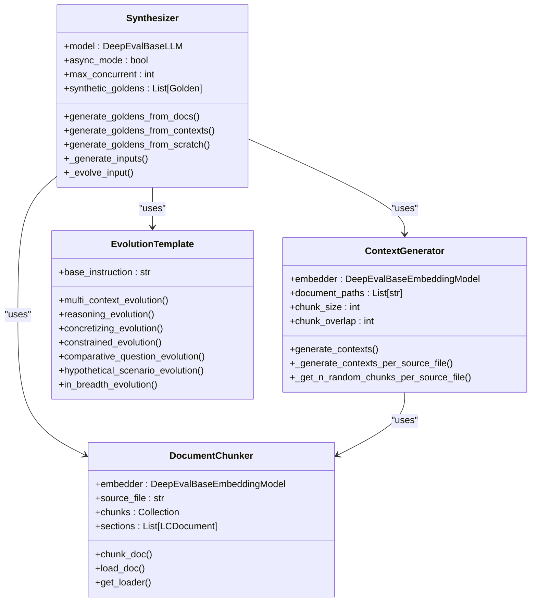
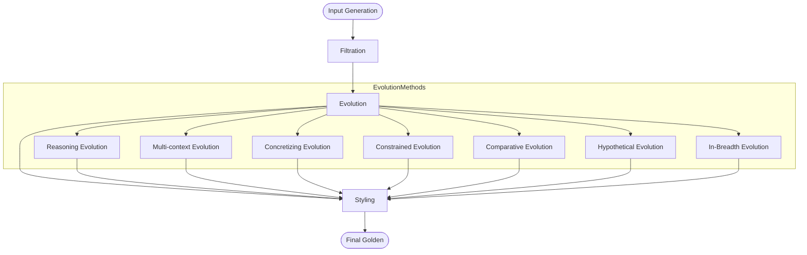
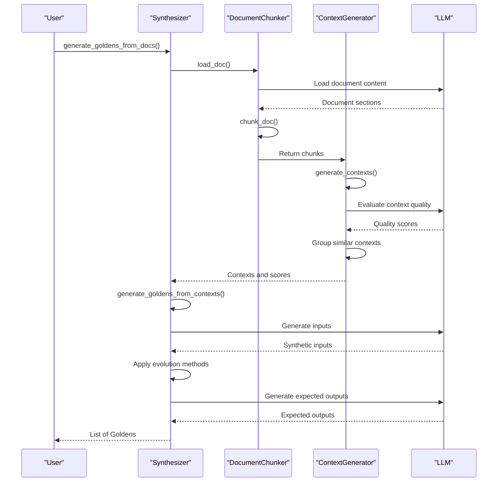
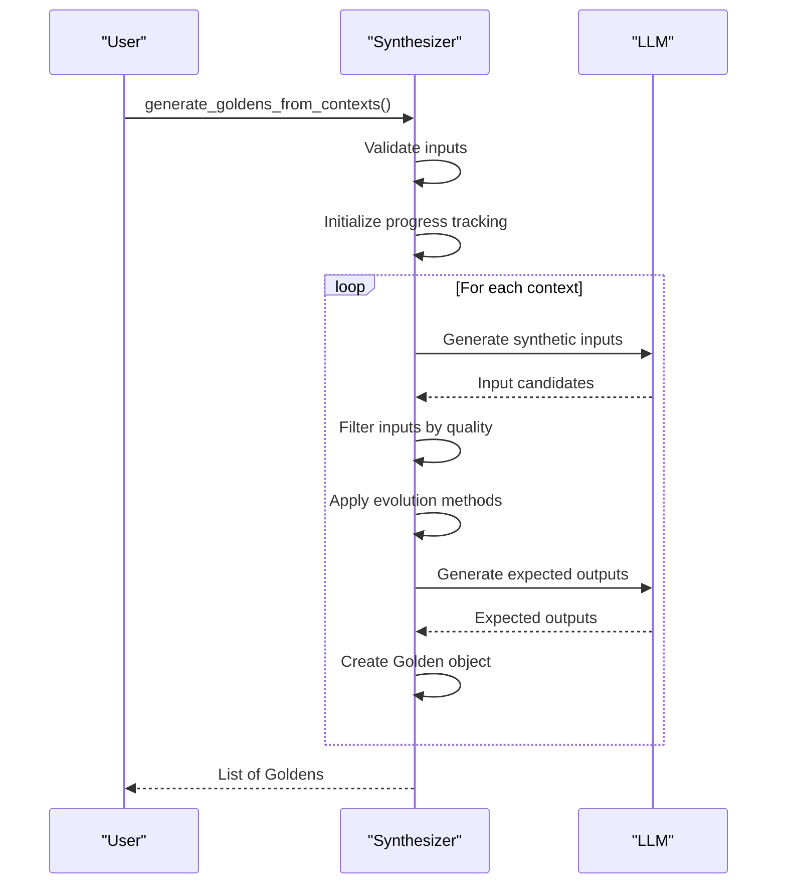
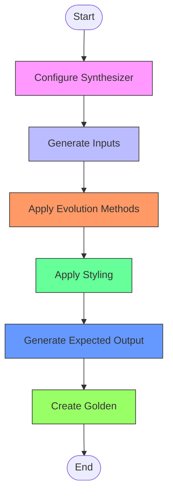
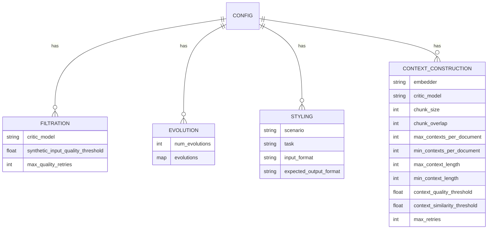
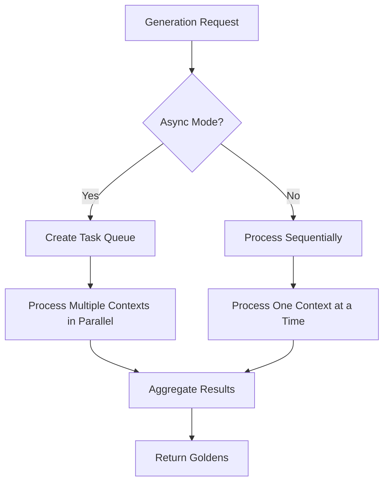
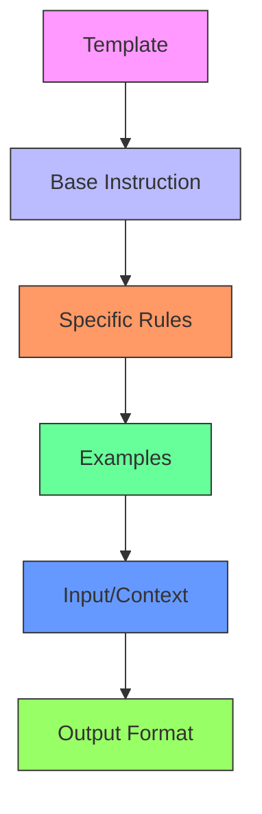

# Synthetic Data Generation

<cite>
**Referenced Files in This Document**   
- [synthesizer.py](file://deepeval/synthesizer/synthesizer.py#L1-L2644)
- [config.py](file://deepeval/synthesizer/config.py#L1-L71)
- [types.py](file://deepeval/synthesizer/types.py#L1-L21)
- [doc_chunker.py](file://deepeval/synthesizer/chunking/doc_chunker.py#L1-L275)
- [context_generator.py](file://deepeval/synthesizer/chunking/context_generator.py#L1-L1000)
- [template.py](file://deepeval/synthesizer/templates/template.py#L1-L1282)
- [schema.py](file://deepeval/synthesizer/schema.py#L1-L84)
- [utils.py](file://deepeval/synthesizer/utils.py#L1-L37)
- [test_synthesizer.py](file://tests/test_core/test_synthesizer/test_synthesizer.py#L1-L463)
</cite>

## Table of Contents
1. [Introduction](#introduction)
2. [Synthesizer Architecture](#synthesizer-architecture)
3. [Data Evolution Methods](#data-evolution-methods)
4. [Generating Goldens from Documents](#generating-goldens-from-documents)
5. [Generating Goldens from Contexts](#generating-goldens-from-contexts)
6. [Generating Goldens from Scratch](#generating-goldens-from-scratch)
7. [Public Interfaces and Configuration](#public-interfaces-and-configuration)
8. [Common Issues and Solutions](#common-issues-and-solutions)
9. [Performance Considerations](#performance-considerations)
10. [Best Practices for Prompt Design](#best-practices-for-prompt-design)

## Introduction

The DeepEval Synthesizer is a comprehensive system for generating high-quality synthetic test data for LLM evaluation. It leverages data evolution methods to create realistic test cases that can be used to evaluate the performance of language models across various scenarios. The synthesizer system is designed to generate data from multiple sources including documents, contexts, and scratch, providing flexibility for different evaluation needs.

The core concept revolves around creating "goldens" - high-quality test cases that serve as ground truth for evaluating LLM responses. These goldens are generated through a multi-step process that includes input generation, filtration, evolution, and styling. The system supports both single-turn and multi-turn evaluations, making it suitable for testing various types of LLM applications.

**Section sources**
- [synthesizer.py](file://deepeval/synthesizer/synthesizer.py#L1-L2644)
- [test_synthesizer.py](file://tests/test_core/test_synthesizer/test_synthesizer.py#L1-L463)

## Synthesizer Architecture

The Synthesizer system follows a modular architecture with distinct components handling different aspects of the data generation process. The core components include the Synthesizer class, context generation utilities, document chunking mechanisms, and template-based prompt engineering.



**Diagram sources**
- [synthesizer.py](file://deepeval/synthesizer/synthesizer.py#L110-L2644)
- [context_generator.py](file://deepeval/synthesizer/chunking/context_generator.py#L91-L1000)
- [doc_chunker.py](file://deepeval/synthesizer/chunking/doc_chunker.py#L73-L275)
- [template.py](file://deepeval/synthesizer/templates/template.py#L652-L1282)

The architecture follows a pipeline pattern where data flows through multiple stages of processing. The Synthesizer class acts as the orchestrator, coordinating between the context generation, input generation, evolution, and styling components. The ContextGenerator handles document processing and context extraction, while the EvolutionTemplate provides the prompt engineering for data evolution.

**Section sources**
- [synthesizer.py](file://deepeval/synthesizer/synthesizer.py#L110-L2644)
- [context_generator.py](file://deepeval/synthesizer/chunking/context_generator.py#L91-L1000)
- [doc_chunker.py](file://deepeval/synthesizer/chunking/doc_chunker.py#L73-L275)

## Data Evolution Methods

The Synthesizer employs several data evolution methods to enhance the complexity and realism of generated test cases. These methods are based on the Evol-Instruct and WizardLM approaches, which iteratively transform simple inputs into more sophisticated ones through various evolution strategies.



**Diagram sources**
- [types.py](file://deepeval/synthesizer/types.py#L4-L11)
- [template.py](file://deepeval/synthesizer/templates/template.py#L652-L1282)

The evolution methods include:

- **Reasoning Evolution**: Transforms inputs to require multi-step logical connections and inferences
- **Multi-context Evolution**: Rewrites inputs to require information from multiple context elements
- **Concretizing Evolution**: Replaces general concepts with more specific ones
- **Constrained Evolution**: Adds constraints to make inputs more challenging
- **Comparative Evolution**: Requires comparison between different concepts or entities
- **Hypothetical Evolution**: Creates hypothetical scenarios that test reasoning abilities
- **In-Breadth Evolution**: Expands the scope of inputs to cover broader topics

Each evolution method is implemented as a template-based prompt that guides the LLM to transform the input according to specific rules. The evolution process can be applied multiple times (controlled by the num_evolutions parameter) to create increasingly complex test cases.

**Section sources**
- [types.py](file://deepeval/synthesizer/types.py#L4-L11)
- [template.py](file://deepeval/synthesizer/templates/template.py#L652-L1282)

## Generating Goldens from Documents

The Synthesizer can generate goldens directly from documents, automatically handling the context extraction process. This is particularly useful for RAG (Retrieval-Augmented Generation) systems where test cases need to be grounded in specific knowledge bases.



**Diagram sources**
- [synthesizer.py](file://deepeval/synthesizer/synthesizer.py#L158-L263)
- [context_generator.py](file://deepeval/synthesizer/chunking/context_generator.py#L141-L291)
- [doc_chunker.py](file://deepeval/synthesizer/chunking/doc_chunker.py#L229-L275)

The document-based generation process involves several steps:

1. **Document Loading**: The system supports various document formats including .txt, .pdf, .docx, .md, .markdown, and .mdx files
2. **Document Chunking**: Documents are split into manageable chunks using a token-based text splitter
3. **Context Generation**: Chunks are embedded and grouped based on semantic similarity to create meaningful contexts
4. **Golden Generation**: Test cases are generated from the extracted contexts

The process includes quality filtering at multiple stages to ensure the generated goldens are meaningful and relevant. Context quality is evaluated based on clarity, depth, structure, and relevance, with low-quality contexts being filtered out.

**Section sources**
- [synthesizer.py](file://deepeval/synthesizer/synthesizer.py#L158-L263)
- [context_generator.py](file://deepeval/synthesizer/chunking/context_generator.py#L141-L291)
- [doc_chunker.py](file://deepeval/synthesizer/chunking/doc_chunker.py#L229-L275)

## Generating Goldens from Contexts

When contexts are already available, the Synthesizer can generate goldens directly from these contexts without the need for document processing. This approach is useful when you have an existing knowledge base or when you want more control over the context selection process.



**Diagram sources**
- [synthesizer.py](file://deepeval/synthesizer/synthesizer.py#L358-L554)
- [template.py](file://deepeval/synthesizer/templates/template.py#L108-L208)

The context-based generation process offers more direct control over the input data and is typically faster than document-based generation since it skips the document parsing and context extraction steps. Key parameters include:

- **contexts**: A list of contexts, where each context is a list of strings sharing a common theme
- **include_expected_output**: Whether to generate expected outputs for each golden
- **max_goldens_per_context**: Maximum number of goldens to generate per context
- **source_files**: Optional source file information for each context

This method is particularly useful when working with existing vector databases or when you want to test specific knowledge domains.

**Section sources**
- [synthesizer.py](file://deepeval/synthesizer/synthesizer.py#L358-L554)
- [template.py](file://deepeval/synthesizer/templates/template.py#L108-L208)

## Generating Goldens from Scratch

For scenarios where no specific knowledge base is available, the Synthesizer can generate goldens from scratch. This approach is useful for creating test cases that don't need to be grounded in specific documents or contexts.



**Diagram sources**
- [synthesizer.py](file://deepeval/synthesizer/synthesizer.py#L771-L800)
- [template.py](file://deepeval/synthesizer/templates/template.py#L7-L51)

The scratch generation process relies heavily on the configuration parameters to guide the generation process:

- **StylingConfig**: Controls the scenario, task, input format, and expected output format
- **EvolutionConfig**: Determines the complexity and types of evolutions applied
- **FiltrationConfig**: Sets quality thresholds for filtering generated inputs

This approach is particularly useful for generating test cases for general-purpose LLMs or when testing specific capabilities like reasoning, creativity, or domain-specific knowledge.

**Section sources**
- [synthesizer.py](file://deepeval/synthesizer/synthesizer.py#L771-L800)
- [config.py](file://deepeval/synthesizer/config.py#L10-L71)

## Public Interfaces and Configuration

The Synthesizer provides a comprehensive set of public interfaces and configuration options to customize the data generation process according to specific needs.

### Public Interfaces

```python
# Initialize Synthesizer with custom configuration
synthesizer = Synthesizer(
    model="gpt-4.1",
    async_mode=True,
    max_concurrent=100,
    filtration_config=filtration_config,
    evolution_config=evolution_config,
    styling_config=styling_config,
    cost_tracking=True
)

# Generate goldens from different sources
goldens_from_docs = synthesizer.generate_goldens_from_docs(
    document_paths=['example.txt'],
    include_expected_output=True,
    max_goldens_per_context=2
)

goldens_from_contexts = synthesizer.generate_goldens_from_contexts(
    contexts=[["context1", "context2"]],
    include_expected_output=True,
    max_goldens_per_context=2
)

goldens_from_scratch = synthesizer.generate_goldens_from_scratch(
    max_goldens=10,
    include_expected_output=True
)
```

### Configuration Options



**Diagram sources**
- [config.py](file://deepeval/synthesizer/config.py#L10-L71)
- [synthesizer.py](file://deepeval/synthesizer/synthesizer.py#L110-L153)

The configuration system allows fine-grained control over the generation process:

- **FiltrationConfig**: Controls input quality filtering with parameters for quality threshold and retry limits
- **EvolutionConfig**: Determines the complexity of generated test cases through evolution types and depth
- **StylingConfig**: Specifies the format and style of inputs and expected outputs
- **ContextConstructionConfig**: Configures document parsing and context extraction parameters

These configurations can be combined to create tailored generation pipelines for specific evaluation scenarios.

**Section sources**
- [config.py](file://deepeval/synthesizer/config.py#L10-L71)
- [synthesizer.py](file://deepeval/synthesizer/synthesizer.py#L110-L153)

## Common Issues and Solutions

When using the Synthesizer for synthetic data generation, several common issues may arise. Understanding these issues and their solutions can help ensure high-quality test data generation.

### Quality-Related Issues

**Issue**: Generated inputs lack clarity or are not self-contained
- **Solution**: Adjust the `synthetic_input_quality_threshold` in FiltrationConfig and increase `max_quality_retries` to ensure higher quality inputs

**Issue**: Contexts extracted from documents are of poor quality
- **Solution**: Fine-tune the `context_quality_threshold` and `context_similarity_threshold` in ContextConstructionConfig, and consider using a more capable critic_model

**Issue**: Evolved inputs deviate from the original context
- **Solution**: Focus on evolution methods that stick to the context (MULTICONTEXT, CONCRETIZING, CONSTRAINED, COMPARATIVE) and reduce the num_evolutions parameter

### Performance Issues

**Issue**: Generation process is too slow
- **Solution**: Reduce max_concurrent value to avoid rate limiting, or switch to synchronous mode for better resource management

**Issue**: High API costs
- **Solution**: Enable cost_tracking to monitor expenses, and consider using smaller models for less critical generation tasks

**Issue**: Memory issues with large documents
- **Solution**: Adjust chunk_size and chunk_overlap parameters in ContextConstructionConfig to create smaller, more manageable chunks

### Configuration Issues

**Issue**: Generated outputs don't match expected format
- **Solution**: Ensure proper configuration of input_format and expected_output_format in StylingConfig

**Issue**: Insufficient variety in generated test cases
- **Solution**: Adjust the evolutions distribution in EvolutionConfig to include a wider variety of evolution types

These issues can typically be resolved through careful configuration of the Synthesizer parameters and monitoring of the generation process.

**Section sources**
- [config.py](file://deepeval/synthesizer/config.py#L10-L71)
- [synthesizer.py](file://deepeval/synthesizer/synthesizer.py#L110-L2644)
- [test_synthesizer.py](file://tests/test_core/test_synthesizer/test_synthesizer.py#L1-L463)

## Performance Considerations

When generating synthetic data at scale, several performance considerations should be taken into account to ensure efficient and cost-effective operation.

### Parallel Processing

The Synthesizer supports both synchronous and asynchronous modes of operation:



**Diagram sources**
- [synthesizer.py](file://deepeval/synthesizer/synthesizer.py#L114-L115)
- [synthesizer.py](file://deepeval/synthesizer/synthesizer.py#L263-L352)

The asynchronous mode allows for concurrent processing of multiple contexts, significantly improving throughput for large-scale generation tasks. The max_concurrent parameter controls the degree of parallelism.

### Resource Management

Key performance parameters include:

- **max_concurrent**: Limits the number of concurrent operations to prevent resource exhaustion
- **chunk_size**: Affects memory usage and processing speed during document parsing
- **num_evolutions**: Impacts computational cost as each evolution step requires additional LLM calls

For large-scale generation, it's recommended to:
- Use asynchronous mode with appropriate max_concurrent settings
- Monitor API rate limits and adjust generation speed accordingly
- Implement proper error handling and retry mechanisms
- Consider batch processing for very large datasets

**Section sources**
- [synthesizer.py](file://deepeval/synthesizer/synthesizer.py#L114-L115)
- [synthesizer.py](file://deepeval/synthesizer/synthesizer.py#L263-L352)

## Best Practices for Prompt Design

Effective prompt design is crucial for generating high-quality synthetic data. The Synthesizer's template system provides a structured approach to prompt engineering.

### Template Structure

The template system follows a consistent pattern:



**Diagram sources**
- [template.py](file://deepeval/synthesizer/templates/template.py#L4-L1282)

Key elements of effective templates include:
- Clear base instructions that define the task
- Specific rules that constrain the output
- Relevant examples that illustrate the desired format
- Well-defined input/context sections
- Explicit output format requirements

### Prompt Engineering Guidelines

1. **Be Specific**: Clearly define the expected input and output formats
2. **Provide Examples**: Include multiple examples that cover different scenarios
3. **Set Constraints**: Use word limits and format requirements to guide the LLM
4. **Avoid Ambiguity**: Eliminate vague terms and ensure instructions are unambiguous
5. **Iterate and Test**: Continuously refine prompts based on generation results

The evolution templates in the Synthesizer demonstrate these principles effectively, using a combination of clear instructions, specific rules, and illustrative examples to guide the LLM in transforming inputs.

**Section sources**
- [template.py](file://deepeval/synthesizer/templates/template.py#L4-L1282)
- [synthesizer.py](file://deepeval/synthesizer/synthesizer.py#L110-L2644)