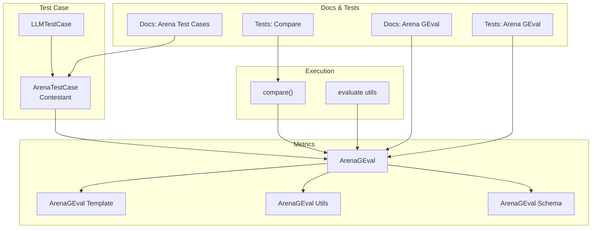
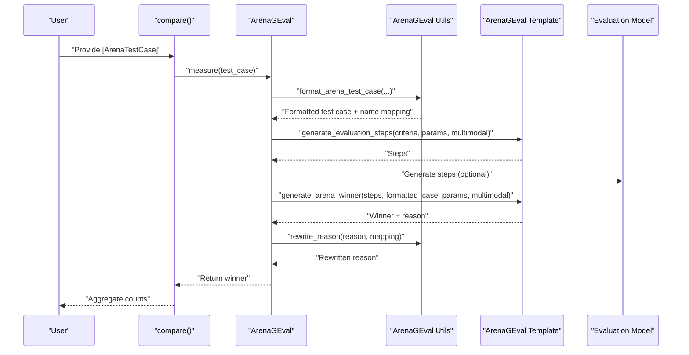
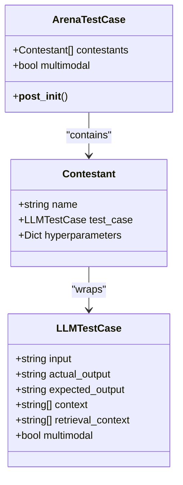
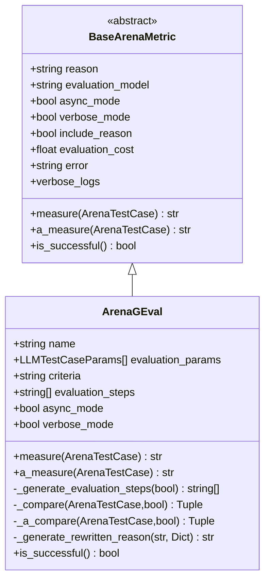
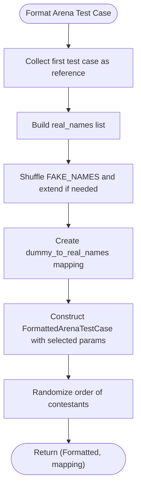
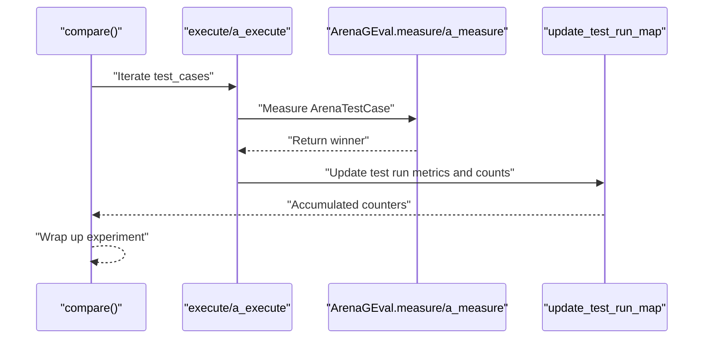
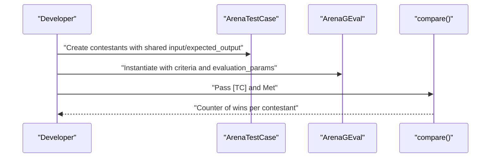
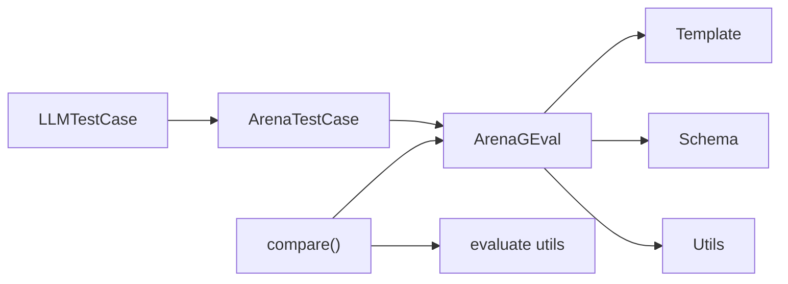

# Arena Test Cases

<cite>
**Referenced Files in This Document**
- [arena_test_case.py](file://deepeval/test_case/arena_test_case.py)
- [llm_test_case.py](file://deepeval/test_case/llm_test_case.py)
- [arena_g_eval.py](file://deepeval/metrics/arena_g_eval/arena_g_eval.py)
- [utils.py](file://deepeval/metrics/arena_g_eval/utils.py)
- [schema.py](file://deepeval/metrics/arena_g_eval/schema.py)
- [template.py](file://deepeval/metrics/arena_g_eval/template.py)
- [compare.py](file://deepeval/evaluate/compare.py)
- [utils.py](file://deepeval/evaluate/utils.py)
- [base_metric.py](file://deepeval/metrics/base_metric.py)
- [evaluation-arena-test-cases.mdx](file://docs/docs/evaluation-arena-test-cases.mdx)
- [metrics-arena-g-eval.mdx](file://docs/docs/metrics-arena-g-eval.mdx)
- [test_arena_geval_metric.py](file://tests/test_metrics/test_arena_geval_metric.py)
- [test_compare.py](file://tests/test_confident/test_compare.py)
</cite>

## Table of Contents
1. [Introduction](#introduction)
2. [Project Structure](#project-structure)
3. [Core Components](#core-components)
4. [Architecture Overview](#architecture-overview)
5. [Detailed Component Analysis](#detailed-component-analysis)
6. [Dependency Analysis](#dependency-analysis)
7. [Performance Considerations](#performance-considerations)
8. [Troubleshooting Guide](#troubleshooting-guide)
9. [Conclusion](#conclusion)
10. [Appendices](#appendices)

## Introduction
This document explains the arena test case system in DeepEval, focusing on the ArenaTestCase class and the ArenaGEval metric used to compare multiple LLMs or prompts under identical conditions. It covers how multiple model responses to the same input are managed, how the comparison methodology works, and how to integrate evaluation metrics to produce ranking reports. It also provides best practices for structuring arena tests to achieve fair and statistically meaningful results.

## Project Structure
Arena evaluation spans several modules:
- Test case definitions: ArenaTestCase, Contestant, and LLMTestCase
- Arena metric: ArenaGEval
- Formatting and templating utilities for arena comparisons
- Execution orchestration: compare() and related utilities
- Documentation and examples

**Diagram sources**
- [arena_test_case.py](file://deepeval/test_case/arena_test_case.py#L1-L49)
- [llm_test_case.py](file://deepeval/test_case/llm_test_case.py#L301-L374)
- [arena_g_eval.py](file://deepeval/metrics/arena_g_eval/arena_g_eval.py#L36-L317)
- [template.py](file://deepeval/metrics/arena_g_eval/template.py#L1-L134)
- [utils.py](file://deepeval/metrics/arena_g_eval/utils.py#L1-L162)
- [schema.py](file://deepeval/metrics/arena_g_eval/schema.py#L1-L21)
- [compare.py](file://deepeval/evaluate/compare.py#L43-L123)
- [utils.py](file://deepeval/evaluate/utils.py#L86-L112)
- [evaluation-arena-test-cases.mdx](file://docs/docs/evaluation-arena-test-cases.mdx#L1-L231)
- [metrics-arena-g-eval.mdx](file://docs/docs/metrics-arena-g-eval.mdx#L31-L70)
- [test_arena_geval_metric.py](file://tests/test_metrics/test_arena_geval_metric.py#L47-L114)
- [test_compare.py](file://tests/test_confident/test_compare.py#L42-L120)

**Section sources**
- [arena_test_case.py](file://deepeval/test_case/arena_test_case.py#L1-L49)
- [llm_test_case.py](file://deepeval/test_case/llm_test_case.py#L301-L374)
- [arena_g_eval.py](file://deepeval/metrics/arena_g_eval/arena_g_eval.py#L36-L317)
- [compare.py](file://deepeval/evaluate/compare.py#L43-L123)

## Core Components
- ArenaTestCase: Holds a list of Contestant entries, validates shared input and expected_output across contestants, and tracks multimodal status.
- Contestant: Encapsulates a single LLM interaction (LLMTestCase) plus optional hyperparameters and a unique name.
- LLMTestCase: Represents a single turn with input, actual_output, expected_output, and optional context/tool metadata; supports multimodal detection.
- ArenaGEval: A BaseArenaMetric implementation that generates evaluation steps, compares contestants, and returns a winner with a reason.
- compare(): Orchestrates arena evaluation across multiple test cases, aggregates wins, and updates test run metrics.

Key behaviors:
- Shared inputs: ArenaTestCase enforces identical input and expected_output across all contestants.
- Multimodal: ArenaTestCase sets multimodal=True if any contestant’s LLMTestCase is multimodal.
- Masking and randomization: ArenaGEval utilities mask real names and shuffle contestant order to reduce bias.
- Evaluation pipeline: ArenaGEval generates evaluation steps, compares contestants, and rewrites reasons to real names.

**Section sources**
- [arena_test_case.py](file://deepeval/test_case/arena_test_case.py#L19-L46)
- [llm_test_case.py](file://deepeval/test_case/llm_test_case.py#L301-L374)
- [arena_g_eval.py](file://deepeval/metrics/arena_g_eval/arena_g_eval.py#L36-L166)
- [utils.py](file://deepeval/metrics/arena_g_eval/utils.py#L89-L162)
- [compare.py](file://deepeval/evaluate/compare.py#L43-L123)

## Architecture Overview
The arena evaluation architecture centers around ArenaTestCase and ArenaGEval. The flow:
1. Build ArenaTestCase with multiple Contestant entries.
2. Instantiate ArenaGEval with criteria and evaluation_params.
3. Run compare() to iterate test cases, measure with ArenaGEval, and collect winners.
4. ArenaGEval internally formats the test case, generates evaluation steps, compares contestants, and rewrites reasons.

**Diagram sources**
- [compare.py](file://deepeval/evaluate/compare.py#L43-L123)
- [arena_g_eval.py](file://deepeval/metrics/arena_g_eval/arena_g_eval.py#L118-L166)
- [utils.py](file://deepeval/metrics/arena_g_eval/utils.py#L89-L162)
- [template.py](file://deepeval/metrics/arena_g_eval/template.py#L1-L134)

## Detailed Component Analysis

### ArenaTestCase and Contestant
ArenaTestCase ensures fairness by requiring identical input and expected_output across all contestants and by validating unique names. It also detects multimodal test cases and propagates the multimodal flag.

Implementation highlights:
- Unique names validation prevents duplicates.
- Shared input/expected_output enforcement ensures apples-to-apples comparisons.
- Multimodal propagation from LLMTestCase to ArenaTestCase.

**Diagram sources**
- [arena_test_case.py](file://deepeval/test_case/arena_test_case.py#L11-L46)
- [llm_test_case.py](file://deepeval/test_case/llm_test_case.py#L301-L374)

**Section sources**
- [arena_test_case.py](file://deepeval/test_case/arena_test_case.py#L19-L46)
- [llm_test_case.py](file://deepeval/test_case/llm_test_case.py#L301-L374)

### ArenaGEval Metric
ArenaGEval implements BaseArenaMetric and orchestrates the arena comparison:
- Initialization validates criteria and evaluation steps.
- measure() and a_measure() coordinate evaluation steps generation, comparison, and reason rewriting.
- Internally uses templates and schemas to structure prompts and extract structured outputs.

Key processing logic:
- Validation of evaluation parameters and multimodal flags.
- Generation of evaluation steps (either from provided steps or generated).
- Comparison of contestants using a structured prompt and schema extraction.
- Reason rewriting to replace dummy names with real names.

**Diagram sources**
- [base_metric.py](file://deepeval/metrics/base_metric.py#L101-L133)
- [arena_g_eval.py](file://deepeval/metrics/arena_g_eval/arena_g_eval.py#L36-L317)

**Section sources**
- [arena_g_eval.py](file://deepeval/metrics/arena_g_eval/arena_g_eval.py#L36-L166)
- [schema.py](file://deepeval/metrics/arena_g_eval/schema.py#L1-L21)

### Formatting and Masking Utilities
ArenaGEval utilities format test cases and mask contestant identities to prevent bias:
- FormattedArenaTestCase and FormattedLLMTestCase include only selected evaluation parameters.
- Dummy-to-real name mapping is created and shuffled to randomize presentation order.
- The formatted test case is serialized for the comparison prompt.

**Diagram sources**
- [utils.py](file://deepeval/metrics/arena_g_eval/utils.py#L89-L162)

**Section sources**
- [utils.py](file://deepeval/metrics/arena_g_eval/utils.py#L1-L162)

### Comparison Orchestration
The compare() function coordinates arena evaluation:
- Aggregates unique contestant names and initializes test run maps.
- Executes test cases synchronously or asynchronously with throttling and concurrency limits.
- Updates test runs with metric data and durations, and produces a Counter of wins per contestant.

**Diagram sources**
- [compare.py](file://deepeval/evaluate/compare.py#L43-L123)
- [compare.py](file://deepeval/evaluate/compare.py#L125-L200)
- [compare.py](file://deepeval/evaluate/compare.py#L315-L405)
- [utils.py](file://deepeval/evaluate/utils.py#L86-L112)

**Section sources**
- [compare.py](file://deepeval/evaluate/compare.py#L43-L123)
- [compare.py](file://deepeval/evaluate/compare.py#L125-L200)
- [compare.py](file://deepeval/evaluate/compare.py#L315-L405)
- [utils.py](file://deepeval/evaluate/utils.py#L86-L112)

### Practical Setup and Execution
Examples from documentation and tests demonstrate:
- Creating ArenaTestCase with multiple Contestant entries sharing identical input and expected_output.
- Instantiating ArenaGEval with criteria and evaluation_params.
- Running compare() to obtain a Counter of wins per contestant.

**Diagram sources**
- [evaluation-arena-test-cases.mdx](file://docs/docs/evaluation-arena-test-cases.mdx#L1-L231)
- [metrics-arena-g-eval.mdx](file://docs/docs/metrics-arena-g-eval.mdx#L31-L70)
- [test_arena_geval_metric.py](file://tests/test_metrics/test_arena_geval_metric.py#L47-L114)
- [test_compare.py](file://tests/test_confident/test_compare.py#L42-L120)

**Section sources**
- [evaluation-arena-test-cases.mdx](file://docs/docs/evaluation-arena-test-cases.mdx#L1-L231)
- [metrics-arena-g-eval.mdx](file://docs/docs/metrics-arena-g-eval.mdx#L31-L70)
- [test_arena_geval_metric.py](file://tests/test_metrics/test_arena_geval_metric.py#L47-L114)
- [test_compare.py](file://tests/test_confident/test_compare.py#L42-L120)

## Dependency Analysis
ArenaTestCase depends on LLMTestCase for each contestant and on multimodal detection. ArenaGEval depends on:
- ArenaGEval utils for formatting and masking
- ArenaGEval template for prompt construction
- ArenaGEval schema for structured extraction
- compare() and evaluate utils for orchestration and reporting

**Diagram sources**
- [arena_test_case.py](file://deepeval/test_case/arena_test_case.py#L19-L46)
- [llm_test_case.py](file://deepeval/test_case/llm_test_case.py#L301-L374)
- [arena_g_eval.py](file://deepeval/metrics/arena_g_eval/arena_g_eval.py#L36-L166)
- [utils.py](file://deepeval/metrics/arena_g_eval/utils.py#L89-L162)
- [template.py](file://deepeval/metrics/arena_g_eval/template.py#L1-L134)
- [schema.py](file://deepeval/metrics/arena_g_eval/schema.py#L1-L21)
- [compare.py](file://deepeval/evaluate/compare.py#L43-L123)
- [utils.py](file://deepeval/evaluate/utils.py#L86-L112)

**Section sources**
- [arena_test_case.py](file://deepeval/test_case/arena_test_case.py#L19-L46)
- [arena_g_eval.py](file://deepeval/metrics/arena_g_eval/arena_g_eval.py#L36-L166)
- [compare.py](file://deepeval/evaluate/compare.py#L43-L123)

## Performance Considerations
- Asynchronous execution: compare() supports async execution with throttling and concurrency limits to improve throughput while respecting provider rate limits.
- Cost tracking: ArenaGEval tracks evaluation cost when using external models; native model usage sets cost tracking to None.
- Multimodal overhead: Multimodal inputs increase prompt length and token usage; consider limiting evaluation_params to essential fields to reduce cost and latency.
- Structured extraction: Using schema-based extraction reduces parsing overhead and improves reliability.

[No sources needed since this section provides general guidance]

## Troubleshooting Guide
Common issues and resolutions:
- Non-unique contestant names: ArenaTestCase raises an error if names are not unique.
- Mismatched input or expected_output: ArenaTestCase enforces identical values across contestants; mismatches cause errors.
- Missing evaluation parameters: compare() can handle missing parameters depending on configuration; errors can be ignored or raised based on settings.
- Asynchronous limitations: ArenaGEval’s a_measure signature differs slightly from measure; ensure correct invocation paths.

Actionable checks:
- Verify all contestants share the same input and expected_output.
- Confirm unique names for each contestant.
- Review evaluation_params to include only relevant fields.
- Configure async_config and error_config appropriately for your environment.

**Section sources**
- [arena_test_case.py](file://deepeval/test_case/arena_test_case.py#L24-L41)
- [compare.py](file://deepeval/evaluate/compare.py#L315-L405)

## Conclusion
ArenaTestCase and ArenaGEval provide a robust framework for A/B testing multiple LLMs or prompts under identical conditions. By enforcing shared inputs and expected outputs, masking identities, and generating structured evaluation steps, the system supports fair and reproducible comparisons. The compare() function aggregates results into actionable rankings, enabling model selection and prompt optimization.

[No sources needed since this section summarizes without analyzing specific files]

## Appendices

### Best Practices for Structuring Arena Tests
- Use identical input and expected_output across all contestants to ensure fair comparison.
- Limit evaluation_params to the minimal set required for your criteria to reduce cost and improve speed.
- Include multimodal images via MLLMImage; ArenaTestCase and LLMTestCase handle multimodal detection automatically.
- Use descriptive criteria and evaluation_steps to guide the judge consistently.
- Run multiple test cases to increase statistical significance; aggregate results with compare().
- Manage concurrency and throttling to balance speed and provider quotas.

**Section sources**
- [evaluation-arena-test-cases.mdx](file://docs/docs/evaluation-arena-test-cases.mdx#L1-L231)
- [metrics-arena-g-eval.mdx](file://docs/docs/metrics-arena-g-eval.mdx#L31-L70)
- [compare.py](file://deepeval/evaluate/compare.py#L43-L123)