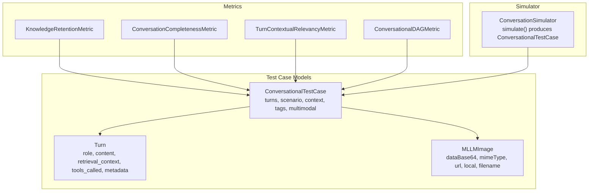
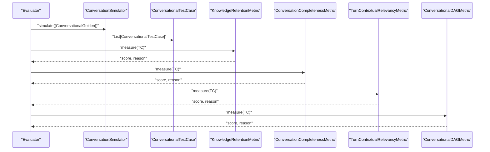
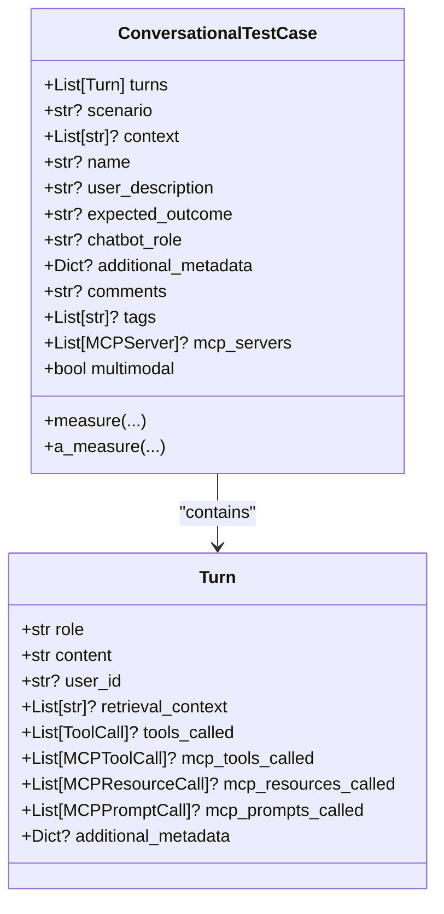
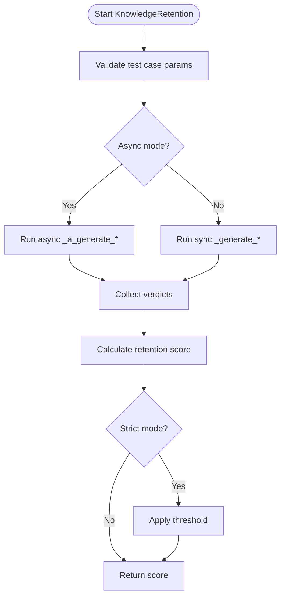
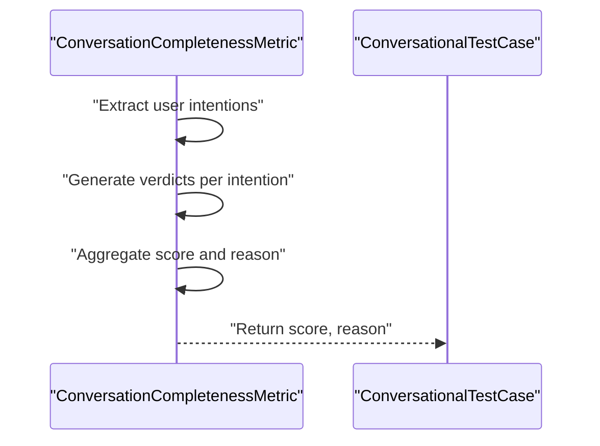
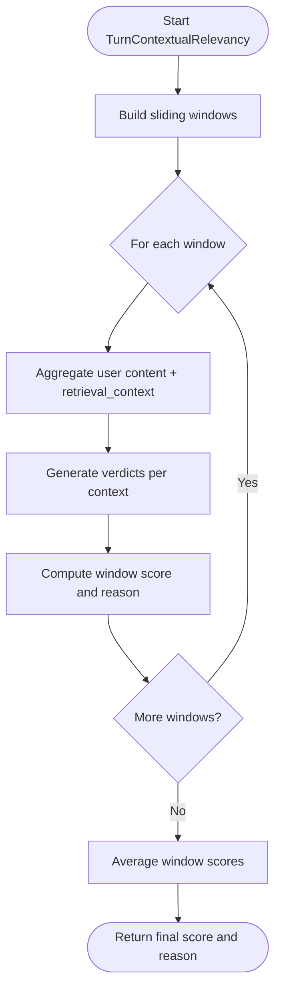
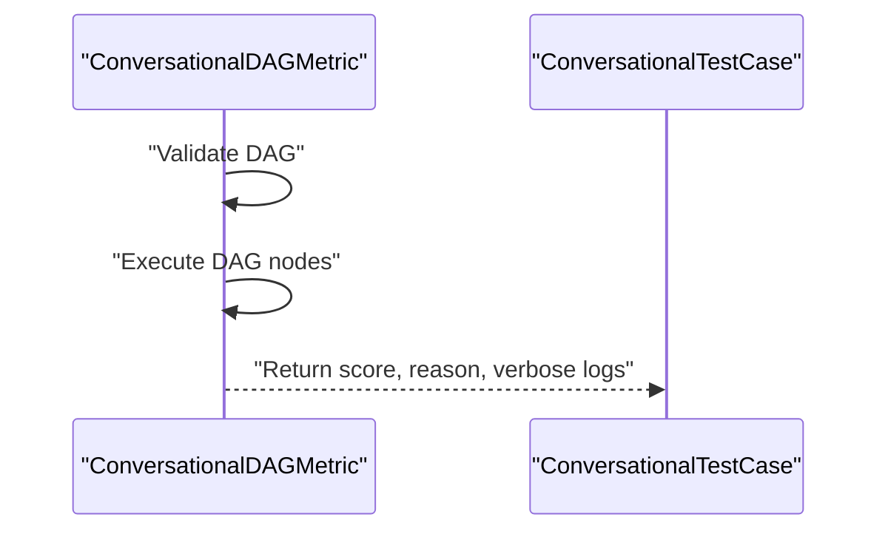
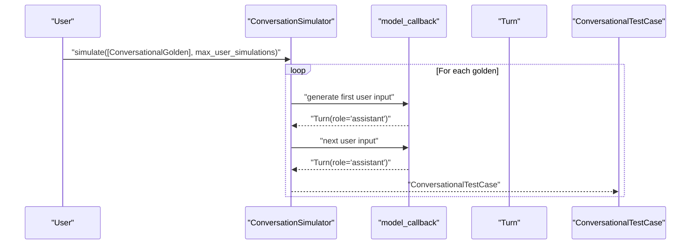
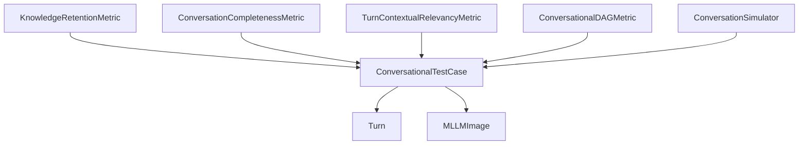

# Conversational Test Cases

<cite>
**Referenced Files in This Document**
- [conversational_test_case.py](file://deepeval/test_case/conversational_test_case.py)
- [llm_test_case.py](file://deepeval/test_case/llm_test_case.py)
- [utils.py](file://deepeval/test_case/utils.py)
- [knowledge_retention.py](file://deepeval/metrics/knowledge_retention/knowledge_retention.py)
- [conversation_completeness.py](file://deepeval/metrics/conversation_completeness/conversation_completeness.py)
- [turn_contextual_relevancy.py](file://deepeval/metrics/turn_contextual_relevancy/turn_contextual_relevancy.py)
- [conversational_dag.py](file://deepeval/metrics/conversational_dag/conversational_dag.py)
- [conversation_simulator.py](file://deepeval/simulator/conversation_simulator.py)
- [evaluation-multiturn-test-cases.mdx](file://docs/docs/evaluation-multiturn-test-cases.mdx)
- [conversation-simulator.mdx](file://docs/docs/conversation-simulator.mdx)
- [test_conversational_test_case.py](file://tests/test_core/test_test_case/test_multi_turn/test_conversational_test_case.py)
</cite>

## Table of Contents
1. [Introduction](#introduction)
2. [Project Structure](#project-structure)
3. [Core Components](#core-components)
4. [Architecture Overview](#architecture-overview)
5. [Detailed Component Analysis](#detailed-component-analysis)
6. [Dependency Analysis](#dependency-analysis)
7. [Performance Considerations](#performance-considerations)
8. [Troubleshooting Guide](#troubleshooting-guide)
9. [Conclusion](#conclusion)
10. [Appendices](#appendices)

## Introduction
This document explains how to build and evaluate multi-turn conversational test cases in DeepEval. It focuses on the ConversationalTestCase class and Turn model, detailing how to represent chatbot dialogues, propagate context across turns, and integrate with conversational metrics such as KnowledgeRetention, ConversationCompleteness, and TurnContextualRelevancy. It also covers best practices for constructing realistic conversation flows, managing test case complexity, and handling long-running dialogues.

## Project Structure
The conversational evaluation stack centers around:
- Test case models: ConversationalTestCase and Turn
- Multimodal image support via MLLMImage
- Conversational metrics that consume these test cases
- Conversation simulator that generates test cases from golden prompts

**Diagram sources**
- [conversational_test_case.py](file://deepeval/test_case/conversational_test_case.py#L131-L267)
- [llm_test_case.py](file://deepeval/test_case/llm_test_case.py#L31-L165)
- [knowledge_retention.py](file://deepeval/metrics/knowledge_retention/knowledge_retention.py#L27-L147)
- [conversation_completeness.py](file://deepeval/metrics/conversation_completeness/conversation_completeness.py#L30-L171)
- [turn_contextual_relevancy.py](file://deepeval/metrics/turn_contextual_relevancy/turn_contextual_relevancy.py#L32-L190)
- [conversational_dag.py](file://deepeval/metrics/conversational_dag/conversational_dag.py#L23-L156)
- [conversation_simulator.py](file://deepeval/simulator/conversation_simulator.py#L66-L136)

**Section sources**
- [conversational_test_case.py](file://deepeval/test_case/conversational_test_case.py#L131-L267)
- [llm_test_case.py](file://deepeval/test_case/llm_test_case.py#L31-L165)
- [knowledge_retention.py](file://deepeval/metrics/knowledge_retention/knowledge_retention.py#L27-L147)
- [conversation_completeness.py](file://deepeval/metrics/conversation_completeness/conversation_completeness.py#L30-L171)
- [turn_contextual_relevancy.py](file://deepeval/metrics/turn_contextual_relevancy/turn_contextual_relevancy.py#L32-L190)
- [conversational_dag.py](file://deepeval/metrics/conversational_dag/conversational_dag.py#L23-L156)
- [conversation_simulator.py](file://deepeval/simulator/conversation_simulator.py#L66-L136)

## Core Components
- ConversationalTestCase: Encapsulates a multi-turn conversation with optional scenario, expected outcome, user description, chatbot role, context, tags, and multimodal flag. It validates that turns is non-empty and that each turn is a Turn or a valid dict representation.
- Turn: Represents a single exchange with role ("user" or "assistant"), content, optional user_id, retrieval_context, tools_called, and additional_metadata. It supports MCP tool/resource/prompt calls for tool-centric agents.
- MLLMImage: A multimodal image abstraction used to embed images into text content and detect multimodal test cases automatically.

Key behaviors:
- Validation ensures turns is a non-empty list of Turn or dict, and that context is a list of strings if present.
- Multimodal detection scans scenario, expected_outcome, user_description, turns content, and retrieval_context for image placeholders.
- Turn validator enforces MCP-related fields when MCP interactions are present.

**Section sources**
- [conversational_test_case.py](file://deepeval/test_case/conversational_test_case.py#L131-L267)
- [llm_test_case.py](file://deepeval/test_case/llm_test_case.py#L31-L165)
- [test_conversational_test_case.py](file://tests/test_core/test_test_case/test_multi_turn/test_conversational_test_case.py#L128-L227)

## Architecture Overview
The evaluation pipeline connects test cases to metrics and optionally to a simulator that generates new test cases.

**Diagram sources**
- [conversation_simulator.py](file://deepeval/simulator/conversation_simulator.py#L66-L136)
- [knowledge_retention.py](file://deepeval/metrics/knowledge_retention/knowledge_retention.py#L47-L147)
- [conversation_completeness.py](file://deepeval/metrics/conversation_completeness/conversation_completeness.py#L52-L171)
- [turn_contextual_relevancy.py](file://deepeval/metrics/turn_contextual_relevancy/turn_contextual_relevancy.py#L62-L190)
- [conversational_dag.py](file://deepeval/metrics/conversational_dag/conversational_dag.py#L54-L156)

## Detailed Component Analysis

### ConversationalTestCase and Turn
- ConversationalTestCase fields:
  - turns: List[Turn] (validated non-empty)
  - scenario, expected_outcome, user_description, chatbot_role: optional descriptors
  - context: optional static list of strings
  - tags, comments, additional_metadata: optional categorization and notes
  - mcp_servers: optional list of servers for tool-centric flows
  - multimodal: auto-detected from content/images
- Turn fields:
  - role: "user" or "assistant"
  - content: str
  - user_id: optional
  - retrieval_context: optional list[str] (only for assistant turns)
  - tools_called: optional list[ToolCall]
  - mcp_tools_called, mcp_resources_called, mcp_prompts_called: optional lists for MCP interactions
  - additional_metadata: optional dict
- Validation:
  - Validates turns list and context type
  - Validates MCP fields when present
  - Auto-detects multimodal by scanning for image placeholders

**Diagram sources**
- [conversational_test_case.py](file://deepeval/test_case/conversational_test_case.py#L36-L160)
- [conversational_test_case.py](file://deepeval/test_case/conversational_test_case.py#L131-L267)

**Section sources**
- [conversational_test_case.py](file://deepeval/test_case/conversational_test_case.py#L36-L160)
- [conversational_test_case.py](file://deepeval/test_case/conversational_test_case.py#L167-L267)
- [test_conversational_test_case.py](file://tests/test_core/test_test_case/test_multi_turn/test_conversational_test_case.py#L128-L227)

### KnowledgeRetentionMetric
Purpose: Evaluates whether the assistant retains and builds upon previously stated knowledge across turns.

Processing logic:
- Extracts knowledge from user turns and verdicts from assistant turns using templates and LLMs.
- Aggregates retention score based on whether knowledge is retained across turns.
- Supports async and sync modes, strict mode thresholds, and reason generation.

**Diagram sources**
- [knowledge_retention.py](file://deepeval/metrics/knowledge_retention/knowledge_retention.py#L47-L147)
- [knowledge_retention.py](file://deepeval/metrics/knowledge_retention/knowledge_retention.py#L190-L331)

**Section sources**
- [knowledge_retention.py](file://deepeval/metrics/knowledge_retention/knowledge_retention.py#L27-L147)
- [knowledge_retention.py](file://deepeval/metrics/knowledge_retention/knowledge_retention.py#L190-L331)

### ConversationCompletenessMetric
Purpose: Ensures the conversation fulfills user intentions across a sliding window of turns.

Processing logic:
- Extracts user intentions from the conversation.
- Generates per-intention verdicts across turns.
- Computes completeness score and reason, with configurable window size.

**Diagram sources**
- [conversation_completeness.py](file://deepeval/metrics/conversation_completeness/conversation_completeness.py#L52-L171)
- [conversation_completeness.py](file://deepeval/metrics/conversation_completeness/conversation_completeness.py#L215-L301)

**Section sources**
- [conversation_completeness.py](file://deepeval/metrics/conversation_completeness/conversation_completeness.py#L30-L171)
- [conversation_completeness.py](file://deepeval/metrics/conversation_completeness/conversation_completeness.py#L215-L301)

### TurnContextualRelevancyMetric
Purpose: Measures contextual relevancy of assistant responses to provided retrieval_context across sliding windows.

Processing logic:
- Builds sliding windows of turns.
- Aggregates user content and retrieval_context within each window.
- Generates verdicts per context and computes a window-level score and reason.
- Final score is the average across windows.

**Diagram sources**
- [turn_contextual_relevancy.py](file://deepeval/metrics/turn_contextual_relevancy/turn_contextual_relevancy.py#L62-L190)
- [turn_contextual_relevancy.py](file://deepeval/metrics/turn_contextual_relevancy/turn_contextual_relevancy.py#L222-L391)
- [turn_contextual_relevancy.py](file://deepeval/metrics/turn_contextual_relevancy/turn_contextual_relevancy.py#L553-L577)

**Section sources**
- [turn_contextual_relevancy.py](file://deepeval/metrics/turn_contextual_relevancy/turn_contextual_relevancy.py#L32-L190)
- [turn_contextual_relevancy.py](file://deepeval/metrics/turn_contextual_relevancy/turn_contextual_relevancy.py#L222-L391)
- [turn_contextual_relevancy.py](file://deepeval/metrics/turn_contextual_relevancy/turn_contextual_relevancy.py#L553-L577)

### ConversationalDAGMetric
Purpose: Executes a directed acyclic graph of conversational metrics against a test case, validating DAG roots and multiturn parameters.

Processing logic:
- Validates DAG structure and roots.
- Runs measure/a_measure with async or sync execution.
- Produces verbose logs and success status.

**Diagram sources**
- [conversational_dag.py](file://deepeval/metrics/conversational_dag/conversational_dag.py#L23-L156)

**Section sources**
- [conversational_dag.py](file://deepeval/metrics/conversational_dag/conversational_dag.py#L23-L156)

### Conversation Simulator
Purpose: Generates ConversationalTestCase instances by simulating user-agent interactions using a model callback.

Key capabilities:
- Accepts a model_callback that returns Turn objects.
- Supports async mode and concurrency limits.
- Can accept existing turns to seed conversations.
- Emits lifecycle hooks on completion.

**Diagram sources**
- [conversation_simulator.py](file://deepeval/simulator/conversation_simulator.py#L66-L136)
- [conversation_simulator.py](file://deepeval/simulator/conversation_simulator.py#L196-L300)

**Section sources**
- [conversation_simulator.py](file://deepeval/simulator/conversation_simulator.py#L66-L136)
- [conversation_simulator.py](file://deepeval/simulator/conversation_simulator.py#L196-L300)
- [conversation-simulator.mdx](file://docs/docs/conversation-simulator.mdx#L1-L162)

## Dependency Analysis
- ConversationalTestCase depends on Turn and optionally MLLMImage for multimodal detection.
- Metrics depend on ConversationalTestCase and use shared utilities for parameter checks and async execution.
- ConversationSimulator produces ConversationalTestCase instances consumed by metrics.

**Diagram sources**
- [conversational_test_case.py](file://deepeval/test_case/conversational_test_case.py#L131-L267)
- [llm_test_case.py](file://deepeval/test_case/llm_test_case.py#L31-L165)
- [knowledge_retention.py](file://deepeval/metrics/knowledge_retention/knowledge_retention.py#L27-L147)
- [conversation_completeness.py](file://deepeval/metrics/conversation_completeness/conversation_completeness.py#L30-L171)
- [turn_contextual_relevancy.py](file://deepeval/metrics/turn_contextual_relevancy/turn_contextual_relevancy.py#L32-L190)
- [conversational_dag.py](file://deepeval/metrics/conversational_dag/conversational_dag.py#L23-L156)
- [conversation_simulator.py](file://deepeval/simulator/conversation_simulator.py#L66-L136)

**Section sources**
- [utils.py](file://deepeval/test_case/utils.py#L1-L21)
- [conversational_test_case.py](file://deepeval/test_case/conversational_test_case.py#L131-L267)
- [knowledge_retention.py](file://deepeval/metrics/knowledge_retention/knowledge_retention.py#L27-L147)
- [conversation_completeness.py](file://deepeval/metrics/conversation_completeness/conversation_completeness.py#L30-L171)
- [turn_contextual_relevancy.py](file://deepeval/metrics/turn_contextual_relevancy/turn_contextual_relevancy.py#L32-L190)
- [conversational_dag.py](file://deepeval/metrics/conversational_dag/conversational_dag.py#L23-L156)
- [conversation_simulator.py](file://deepeval/simulator/conversation_simulator.py#L66-L136)

## Performance Considerations
- Asynchronous execution: Metrics support async mode to parallelize LLM calls and improve throughput.
- Sliding windows: TurnContextualRelevancyMetric uses sliding windows to reduce prompt sizes and improve scalability.
- Multimodal costs: When using native models, evaluation cost accumulates; consider batching and limiting concurrent simulations.
- Validation overhead: ConversationalTestCase validators perform regex scans for images and type checks; keep test case sizes reasonable.

[No sources needed since this section provides general guidance]

## Troubleshooting Guide
Common issues and resolutions:
- Empty turns list: ConversationalTestCase raises an error if turns is empty. Ensure at least one Turn is provided.
- Invalid turn types: ConversationalTestCase expects a list of Turn or dict; invalid entries trigger a TypeError.
- MCP fields validation: When MCP tool/resource/prompt calls are present, ensure they conform to expected types; otherwise a TypeError is raised.
- Retrieval context placement: retrieval_context should be associated with assistant turns; otherwise, metrics may not apply.
- Multimodal mismatches: If MLLMImage placeholders are not resolved, ensure images are registered and multimodal models are supported.

**Section sources**
- [conversational_test_case.py](file://deepeval/test_case/conversational_test_case.py#L200-L235)
- [conversational_test_case.py](file://deepeval/test_case/conversational_test_case.py#L80-L128)
- [llm_test_case.py](file://deepeval/test_case/llm_test_case.py#L31-L165)

## Conclusion
ConversationalTestCase and Turn provide a robust foundation for modeling multi-turn dialogues in DeepEval. By combining these models with conversational metrics—KnowledgeRetention, ConversationCompleteness, TurnContextualRelevancy, and ConversationalDAG—you can comprehensively evaluate chatbot behavior across long-running, context-rich conversations. The Conversation Simulator offers a practical way to generate synthetic test cases from golden prompts, enabling scalable evaluation and regression testing.

[No sources needed since this section summarizes without analyzing specific files]

## Appendices

### Best Practices for Designing Realistic Conversations
- Keep scenario and expected outcome aligned with user goals; use user_description to reflect persona and context.
- Use retrieval_context sparingly and only for assistant turns to ground responses.
- Include tools_called when evaluating tool-centric agents; ensure MCP fields are validated.
- Manage conversation history by structuring turns to reflect natural back-and-forth; avoid unrealistic role alternations.
- For long-running dialogues, leverage sliding windows and window_size to balance coverage and cost.
- Use tags and comments to organize test cases for iterative benchmarking.

**Section sources**
- [evaluation-multiturn-test-cases.mdx](file://docs/docs/evaluation-multiturn-test-cases.mdx#L1-L274)
- [conversation-simulator.mdx](file://docs/docs/conversation-simulator.mdx#L1-L162)

### Concrete Examples from the Codebase
- Constructing a basic multi-turn test case with scenario, expected outcome, and turns:
  - See [evaluation-multiturn-test-cases.mdx](file://docs/docs/evaluation-multiturn-test-cases.mdx#L22-L35)
- Including images in turns and scenarios:
  - See [evaluation-multiturn-test-cases.mdx](file://docs/docs/evaluation-multiturn-test-cases.mdx#L149-L173)
- Simulating conversations from goldens:
  - See [conversation-simulator.mdx](file://docs/docs/conversation-simulator.mdx#L17-L36)
- Validating test case composition and edge cases:
  - See [test_conversational_test_case.py](file://tests/test_core/test_test_case/test_multi_turn/test_conversational_test_case.py#L128-L227)

**Section sources**
- [evaluation-multiturn-test-cases.mdx](file://docs/docs/evaluation-multiturn-test-cases.mdx#L22-L35)
- [evaluation-multiturn-test-cases.mdx](file://docs/docs/evaluation-multiturn-test-cases.mdx#L149-L173)
- [conversation-simulator.mdx](file://docs/docs/conversation-simulator.mdx#L17-L36)
- [test_conversational_test_case.py](file://tests/test_core/test_test_case/test_multi_turn/test_conversational_test_case.py#L128-L227)