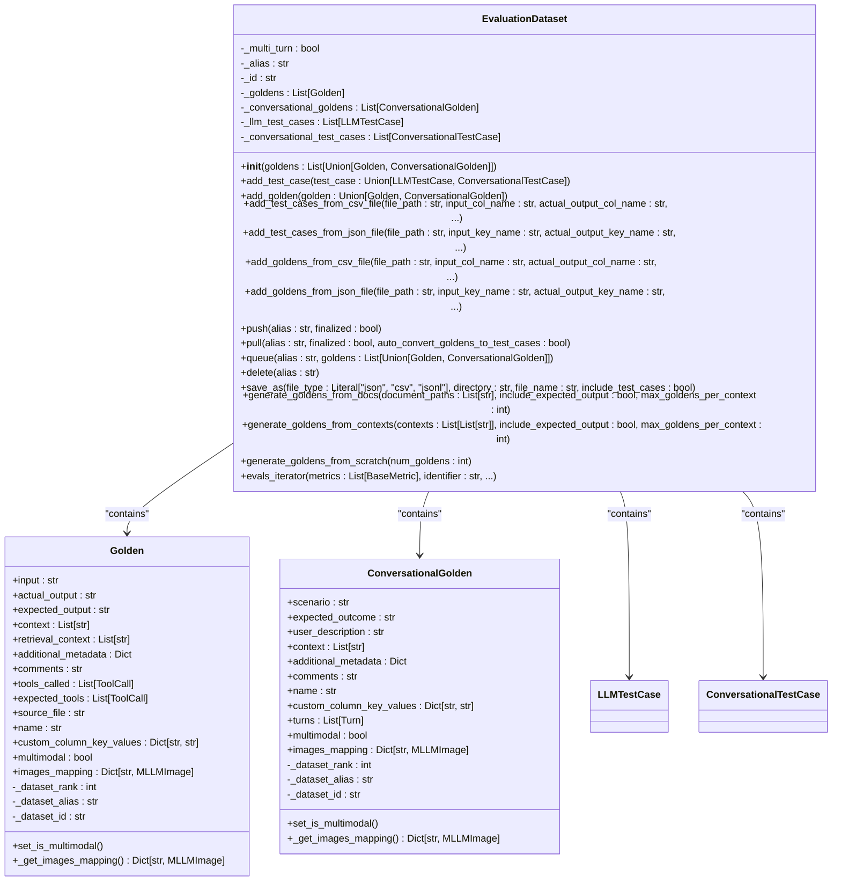
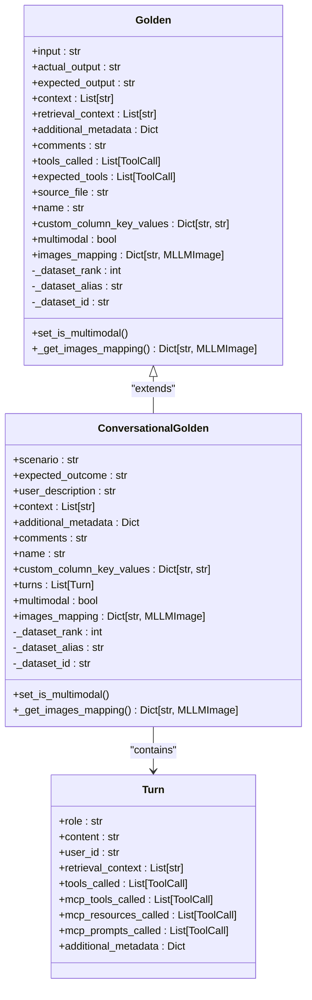
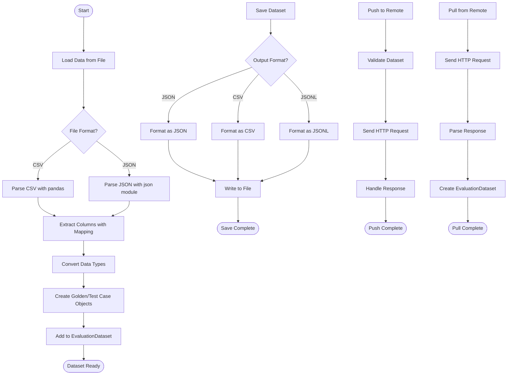
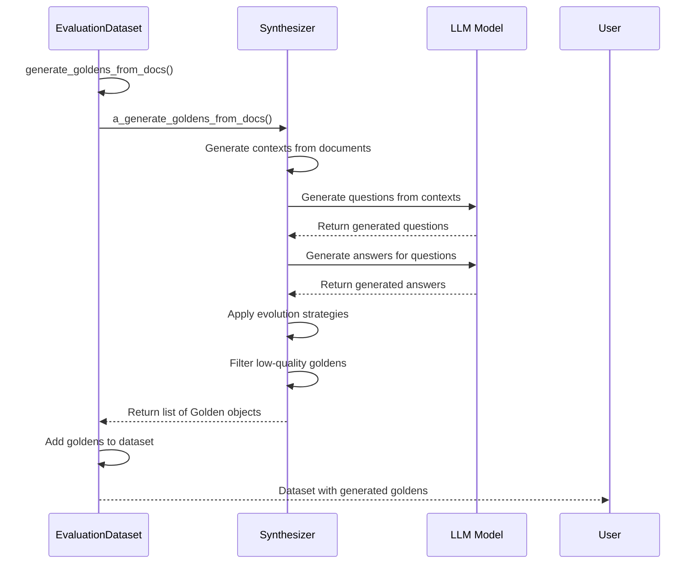
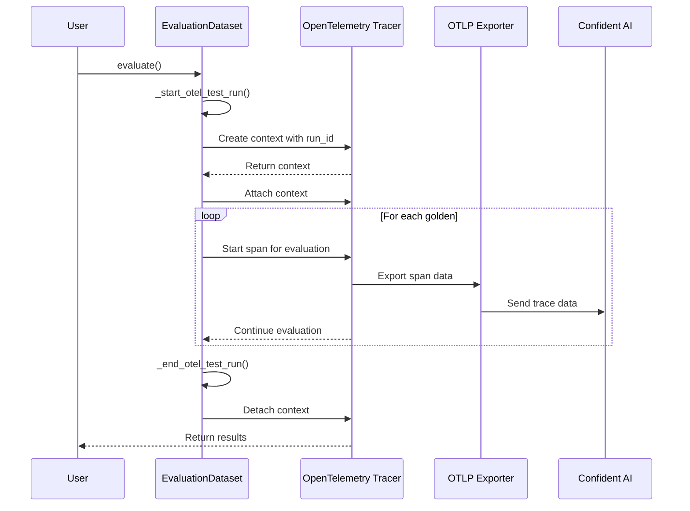

# Dataset Management

<cite>
**Referenced Files in This Document**   
- [dataset.py](file://deepeval/dataset/dataset.py)
- [golden.py](file://deepeval/dataset/golden.py)
- [api.py](file://deepeval/dataset/api.py)
- [utils.py](file://deepeval/dataset/utils.py)
- [test_run_tracer.py](file://deepeval/dataset/test_run_tracer.py)
- [synthesizer.py](file://deepeval/synthesizer/synthesizer.py)
- [goldens.json](file://tests/test_confident/goldens.json)
- [goldens_multi_turn.json](file://tests/test_confident/goldens_multi_turn.json)
- [dataset.json](file://tests/data/dataset.json)
</cite>

## Table of Contents
1. [Introduction](#introduction)
2. [Dataset Class Implementation](#dataset-class-implementation)
3. [Golden Class Structure](#golden-class-structure)
4. [Loading and Serialization](#loading-and-serialization)
5. [Integration with Synthesizer Module](#integration-with-synthesizer-module)
6. [Tracing System Integration](#tracing-system-integration)
7. [Best Practices for Dataset Organization](#best-practices-for-dataset-organization)
8. [Performance Optimization](#performance-optimization)
9. [Data Privacy and Security](#data-privacy-and-security)
10. [Conclusion](#conclusion)

## Introduction
DeepEval provides a comprehensive dataset management system for organizing and managing collections of test cases used in evaluation workflows. The system centers around the `EvaluationDataset` class, which serves as a container for test cases and their associated metadata. This document details the implementation of the dataset management system, focusing on the `Dataset` class for organizing test cases, the `Golden` class for input-expected output pairs, and their integration with other components like the synthesizer module and tracing system. The system supports various data formats including JSON, CSV, and JSONL, and provides functionality for batch operations, data persistence, and integration with external systems.

**Section sources**
- [dataset.py](file://deepeval/dataset/dataset.py#L68-L1453)
- [golden.py](file://deepeval/dataset/golden.py#L8-L198)

## Dataset Class Implementation
The `EvaluationDataset` class is the core component for managing collections of test cases in DeepEval. It provides a structured way to organize, manipulate, and persist test data for evaluation workflows. The class supports both single-turn and multi-turn (conversational) test cases through its internal state management.

The dataset implementation uses a dataclass-based approach with private fields for storing different types of test cases:
- `_goldens` and `_conversational_goldens` for golden test cases
- `_llm_test_cases` and `_conversational_test_cases` for test cases

The class automatically detects the type of dataset (single-turn vs multi-turn) based on the first golden added, ensuring consistency across the dataset. It provides methods for adding individual test cases and goldens, as well as batch operations for loading from various sources.

Key features of the dataset implementation include:
- Type safety through Python typing annotations
- Automatic conversion between goldens and test cases
- Support for both single-turn and multi-turn evaluation scenarios
- Integration with external storage systems through push/pull operations
- Comprehensive error handling for data validation

The dataset class also manages metadata such as aliases, IDs, and ranks, which are used for tracking and organization purposes. This metadata is automatically propagated to individual test cases and goldens when they are added to the dataset.



**Diagram sources**
- [dataset.py](file://deepeval/dataset/dataset.py#L68-L1453)
- [golden.py](file://deepeval/dataset/golden.py#L8-L198)

**Section sources**
- [dataset.py](file://deepeval/dataset/dataset.py#L68-L1453)

## Golden Class Structure
The `Golden` class represents the fundamental unit of test data in DeepEval, serving as a container for input-expected output pairs along with associated metadata. There are two primary variants: `Golden` for single-turn interactions and `ConversationalGolden` for multi-turn conversations.

The `Golden` class structure includes the following key attributes:
- **input**: The input prompt or query
- **actual_output**: The actual output generated by the system under test
- **expected_output**: The expected or ideal output
- **context**: Contextual information used in retrieval-augmented generation
- **retrieval_context**: Specific context retrieved for the test case
- **additional_metadata**: Custom metadata for the test case
- **comments**: Human-readable comments about the test case
- **tools_called**: Tools called by the system during execution
- **expected_tools**: Tools expected to be called
- **source_file**: Source file from which the golden was derived
- **name**: Name identifier for the golden
- **custom_column_key_values**: Custom key-value pairs for additional columns

For conversational scenarios, the `ConversationalGolden` class extends this structure with:
- **scenario**: Description of the conversation scenario
- **expected_outcome**: Expected outcome of the entire conversation
- **user_description**: Description of the user's role or characteristics
- **turns**: List of conversation turns, each containing role, content, and metadata

Both classes include private attributes for dataset management:
- **_dataset_rank**: Position of the golden within its dataset
- **_dataset_alias**: Alias of the dataset containing the golden
- **_dataset_id**: ID of the dataset containing the golden

The golden classes also include methods for automatic detection of multimodal content through the `set_is_multimodal` validator, which scans input, output, and context fields for image references in the format `[DEEPEVAL:IMAGE:ID]`. This enables support for multimodal evaluation scenarios.



**Diagram sources**
- [golden.py](file://deepeval/dataset/golden.py#L8-L198)

**Section sources**
- [golden.py](file://deepeval/dataset/golden.py#L8-L198)

## Loading and Serialization
DeepEval provides comprehensive support for loading and serializing datasets in multiple formats, including JSON, CSV, and JSONL. The system offers both file-based and API-based operations for data persistence and exchange.

### File-Based Operations
The dataset class provides methods for loading test cases and goldens from CSV and JSON files:

**CSV Loading:**
- `add_test_cases_from_csv_file()`: Loads test cases from CSV with configurable column mappings
- `add_goldens_from_csv_file()`: Loads goldens from CSV with support for complex data types

**JSON Loading:**
- `add_test_cases_from_json_file()`: Loads test cases from JSON with configurable key mappings
- `add_goldens_from_json_file()`: Loads goldens from JSON with support for nested structures

The CSV loading methods handle data type conversion for complex fields:
- Context and retrieval context fields are split using configurable delimiters
- Tools called and expected tools are parsed from JSON strings
- Additional metadata is evaluated from string representations

**Example CSV Structure:**
```csv
input,actual_output,expected_output,context,retrieval_context,tools_called,expected_tools,additional_metadata
"What is the capital of France?","Paris","Paris","France is a country in Western Europe","Paris population statistics from INSEE","[{\"name\": \"search\", \"input\": \"capital of France\"}]","[{\"name\": \"search\", \"input\": \"capital of France\"}]","{\"topic\": \"geography\", \"difficulty\": \"easy\"}"
```

### Serialization
The `save_as()` method supports exporting datasets to multiple formats:
- **JSON**: Creates a structured JSON file with proper formatting and indentation
- **CSV**: Creates a CSV file with pipe-delimited context fields and JSON-encoded complex data
- **JSONL**: Creates a JSON Lines file with one record per line

The serialization process handles complex data types by:
- Converting ToolCall objects to dictionaries
- Joining context lists with pipe delimiters for CSV
- Serializing metadata dictionaries to JSON strings
- Properly formatting conversation turns for multi-turn scenarios

### API Integration
The dataset system integrates with external storage through push/pull operations:
- `push()`: Uploads the dataset to a remote server with a specified alias
- `pull()`: Downloads a dataset from a remote server by alias
- `queue()`: Queues goldens for annotation without finalizing
- `delete()`: Removes a dataset from the remote server

These operations use HTTP requests to communicate with the Confident AI API, providing a seamless workflow for collaborative dataset management and annotation.



**Diagram sources**
- [dataset.py](file://deepeval/dataset/dataset.py#L240-L714)
- [dataset.py](file://deepeval/dataset/dataset.py#L956-L1296)

**Section sources**
- [dataset.py](file://deepeval/dataset/dataset.py#L240-L714)
- [dataset.py](file://deepeval/dataset/dataset.py#L956-L1296)
- [dataset.json](file://tests/data/dataset.json#L1-L31)

## Integration with Synthesizer Module
The dataset management system integrates closely with the synthesizer module to enable automated generation of test data. This integration allows for the creation of high-quality test cases from various sources, including documents, contexts, and scratch.

### Document-Based Generation
The `generate_goldens_from_docs()` method enables the creation of test cases from document collections:
- Accepts a list of document file paths
- Uses context generation to extract relevant passages
- Generates multiple goldens per context (configurable)
- Supports inclusion of expected outputs
- Integrates with the synthesizer's evolution strategies

This functionality is particularly useful for creating test cases from documentation, knowledge bases, or research papers, automatically generating input-output pairs that reflect the content of the source material.

### Context-Based Generation
The `generate_goldens_from_contexts()` method allows for test case generation from pre-extracted contexts:
- Accepts a list of context lists (one per document)
- Generates goldens based on the provided contexts
- Supports customization of the number of goldens per context
- Can include expected outputs in the generated data

This approach is valuable when contexts have been extracted through custom preprocessing or when working with specific sections of documents.

### Scratch Generation
The `generate_goldens_from_scratch()` method creates test cases without any source material:
- Generates a specified number of goldens
- Uses the synthesizer's internal knowledge and creativity
- Useful for creating diverse test cases covering various scenarios

### Synthesizer Configuration
The integration supports custom synthesizer instances and configurations:
- Can use a custom synthesizer object
- Supports configuration of filtration, evolution, and styling parameters
- Allows for cost tracking during generation

The dataset methods automatically handle the integration details, making it easy to generate test data programmatically as part of the evaluation workflow.



**Diagram sources**
- [dataset.py](file://deepeval/dataset/dataset.py#L883-L955)
- [synthesizer.py](file://deepeval/synthesizer/synthesizer.py#L1-L200)

**Section sources**
- [dataset.py](file://deepeval/dataset/dataset.py#L883-L955)
- [synthesizer.py](file://deepeval/synthesizer/synthesizer.py#L1-L200)

## Tracing System Integration
The dataset management system integrates with DeepEval's tracing system to provide persistence and monitoring of test runs. This integration enables detailed tracking of evaluation workflows and facilitates debugging and analysis.

### OpenTelemetry Integration
The system uses OpenTelemetry for distributed tracing:
- Initializes a global tracer provider and tracer
- Creates spans for test run operations
- Propagates context through the evaluation pipeline
- Exports traces to external systems

The `test_run_tracer.py` module implements the tracing infrastructure:
- `init_global_test_run_tracer()`: Initializes the tracer with API key
- `RunIdSpanProcessor`: Custom span processor that adds test run IDs
- Global variables for tracer provider and tracer instances

### Test Run Management
The dataset class provides methods for managing test runs:
- `_start_otel_test_run()`: Begins a new test run with a unique ID
- `_end_otel_test_run()`: Ends the current test run
- `evals_iterator()`: Executes evaluations with tracing enabled

The tracing system captures important metadata:
- Test run ID for correlation
- Duration of test runs
- Evaluation metrics and results
- Error information

### Context Propagation
The system uses baggage to propagate context:
- Stores test run ID in baggage
- Attaches context to spans
- Ensures consistent tracing across asynchronous operations

This integration enables comprehensive monitoring of evaluation workflows, allowing users to track the performance and behavior of their models over time. The traces can be exported to external observability platforms for further analysis and visualization.



**Diagram sources**
- [dataset.py](file://deepeval/dataset/dataset.py#L1429-L1453)
- [test_run_tracer.py](file://deepeval/dataset/test_run_tracer.py#L1-L83)

**Section sources**
- [dataset.py](file://deepeval/dataset/dataset.py#L1429-L1453)
- [test_run_tracer.py](file://deepeval/dataset/test_run_tracer.py#L1-L83)

## Best Practices for Dataset Organization
Effective dataset organization is crucial for successful evaluation workflows. The following best practices are recommended when using DeepEval's dataset management system.

### Dataset Structure
Organize datasets with a clear structure:
- Use meaningful aliases for datasets
- Group related test cases together
- Separate single-turn and multi-turn scenarios
- Include descriptive metadata for each golden

### Data Versioning
Implement a robust versioning strategy:
- Use unique aliases for different dataset versions
- Include version information in metadata
- Maintain a changelog for dataset modifications
- Use the `push()` and `pull()` methods to synchronize versions

### Splitting Strategies
Use appropriate splitting strategies for training and evaluation:
- **Random Split**: For general evaluation scenarios
- **Stratified Split**: When maintaining class balance is important
- **Time-based Split**: For temporal data or sequential scenarios
- **Domain-based Split**: When evaluating across different domains

The dataset system supports these strategies through manual organization and filtering:
```python
# Example: Creating training and evaluation splits
all_goldens = load_goldens()  # Load all goldens
random.shuffle(all_goldens)

train_size = int(0.8 * len(all_goldens))
train_goldens = all_goldens[:train_size]
eval_goldens = all_goldens[train_size:]

train_dataset = EvaluationDataset(train_goldens)
eval_dataset = EvaluationDataset(eval_goldens)
```

### Metadata Management
Use metadata effectively:
- Include domain-specific information
- Track difficulty levels
- Record source information
- Add timestamps for versioning
- Include custom key-value pairs for filtering

### Naming Conventions
Adopt consistent naming conventions:
- Use descriptive names for datasets and goldens
- Follow a consistent pattern for aliases
- Include project and version information
- Use lowercase with underscores for file names

### Example Dataset Organization
A well-organized dataset structure might look like:
```
datasets/
├── customer_service/
│   ├── returns/
│   │   ├── v1/
│   │   │   ├── train.json
│   │   │   └── eval.json
│   │   └── v2/
│   │       ├── train.json
│   │       └── eval.json
│   └── complaints/
│       └── v1/
│           ├── train.json
│           └── eval.json
├── technical_support/
│   ├── internet_issues/
│   │   └── v1/
│   │       ├── train.json
│   │       └── eval.json
│   └── hardware_problems/
│       └── v1/
│           ├── train.json
│           └── eval.json
└── cooking_instructions/
    └── pasta_making/
        └── v1/
            ├── train.json
            └── eval.json
```

This structure enables easy navigation, version control, and domain-specific evaluation.

**Section sources**
- [goldens.json](file://tests/test_confident/goldens.json#L1-L136)
- [goldens_multi_turn.json](file://tests/test_confident/goldens_multi_turn.json#L1-L236)

## Performance Optimization
Optimizing dataset operations is essential for efficient evaluation workflows, especially when working with large datasets. The following strategies can improve performance:

### Batch Operations
Use batch operations instead of individual additions:
- Load multiple test cases at once from files
- Use `add_test_cases_from_csv_file()` instead of adding cases individually
- Generate multiple goldens in a single operation

### Asynchronous Processing
Leverage asynchronous capabilities:
- Use the async mode in the synthesizer for parallel generation
- Process large datasets in chunks
- Implement concurrent loading from multiple sources

### Memory Management
Optimize memory usage:
- Process large datasets in batches
- Use generators for memory-efficient iteration
- Clear unused datasets from memory
- Use appropriate data types to minimize memory footprint

### Caching Strategies
Implement caching to avoid redundant operations:
- Cache loaded datasets when possible
- Use persistent storage for frequently accessed data
- Implement LRU (Least Recently Used) caching for large datasets

### Efficient Data Formats
Choose appropriate data formats:
- Use JSONL for large datasets to enable streaming
- Use binary formats for very large datasets
- Compress files when storage is a concern
- Use efficient serialization methods

### Parallel Processing
Utilize parallel processing:
- Process multiple files concurrently
- Distribute generation tasks across multiple workers
- Use multiprocessing for CPU-intensive operations

### Example: Optimized Dataset Loading
```python
# Efficient loading of large datasets
def load_large_dataset(file_paths):
    dataset = EvaluationDataset()
    
    # Process files in parallel
    with ThreadPoolExecutor() as executor:
        futures = [
            executor.submit(load_and_add_file, dataset, path) 
            for path in file_paths
        ]
        
        # Wait for all operations to complete
        for future in futures:
            future.result()
    
    return dataset

def load_and_add_file(dataset, file_path):
    # Use appropriate method based on file type
    if file_path.endswith('.csv'):
        dataset.add_goldens_from_csv_file(
            file_path=file_path,
            input_col_name="input",
            expected_output_col_name="expected_output"
        )
    elif file_path.endswith('.json'):
        dataset.add_goldens_from_json_file(
            file_path=file_path,
            input_key_name="input",
            expected_output_key_name="expected_output"
        )
```

These optimization strategies can significantly improve the performance of dataset operations, enabling faster evaluation cycles and more efficient resource utilization.

**Section sources**
- [dataset.py](file://deepeval/dataset/dataset.py#L240-L714)
- [dataset.py](file://deepeval/dataset/dataset.py#L883-L955)

## Data Privacy and Security
Data privacy and security are critical considerations when managing evaluation datasets. DeepEval provides several features and best practices to ensure the protection of sensitive information.

### Data Encryption
The system supports data encryption through:
- Secure API communication with HTTPS
- API key authentication for remote operations
- Encrypted storage of sensitive data

### Privacy Features
Implement privacy-preserving practices:
- Anonymize personally identifiable information (PII)
- Use synthetic data generation to avoid real user data
- Implement data minimization principles
- Regularly audit datasets for sensitive information

### Secure Storage
Use secure storage practices:
- Store datasets in protected directories
- Use access controls for dataset files
- Implement backup and recovery procedures
- Use encrypted storage for sensitive datasets

### Compliance
Ensure compliance with relevant regulations:
- GDPR for European data
- CCPA for California data
- HIPAA for healthcare data
- Other industry-specific regulations

### Best Practices
Follow these data privacy best practices:
- Regularly review and clean datasets
- Implement data retention policies
- Use pseudonymization techniques
- Conduct privacy impact assessments
- Train team members on data privacy principles

The dataset system's integration with the tracing system also provides audit capabilities, allowing organizations to track data access and usage patterns for compliance purposes.

**Section sources**
- [dataset.py](file://deepeval/dataset/dataset.py#L715-L831)
- [test_run_tracer.py](file://deepeval/dataset/test_run_tracer.py#L1-L83)

## Conclusion
DeepEval's dataset management system provides a comprehensive solution for organizing and managing test cases in evaluation workflows. The `EvaluationDataset` class serves as a powerful container for test data, supporting both single-turn and multi-turn scenarios with robust functionality for loading, serialization, and persistence.

The `Golden` class structure enables the creation of rich test cases with comprehensive metadata, while the integration with the synthesizer module allows for automated generation of high-quality test data from various sources. The tracing system integration provides valuable insights into evaluation workflows, enabling monitoring and analysis of model performance over time.

By following the best practices outlined in this document, users can effectively organize their datasets, optimize performance, and ensure data privacy and security. The system's support for multiple data formats, versioning, and collaboration features makes it well-suited for both individual and team-based evaluation workflows.

The comprehensive dataset management capabilities in DeepEval empower organizations to build robust evaluation pipelines, ensuring the quality and reliability of their AI systems through systematic testing and continuous improvement.

**Section sources**
- [dataset.py](file://deepeval/dataset/dataset.py#L68-L1453)
- [golden.py](file://deepeval/dataset/golden.py#L8-L198)
- [api.py](file://deepeval/dataset/api.py#L1-L51)
- [utils.py](file://deepeval/dataset/utils.py#L1-L235)
- [test_run_tracer.py](file://deepeval/dataset/test_run_tracer.py#L1-L83)
- [synthesizer.py](file://deepeval/synthesizer/synthesizer.py#L1-L200)