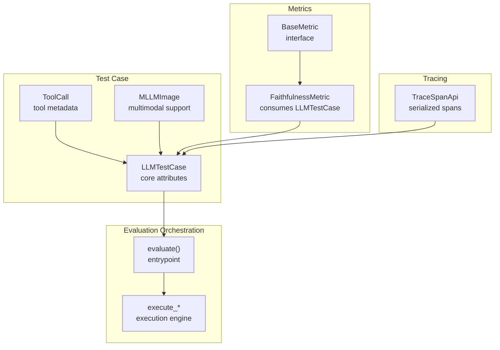
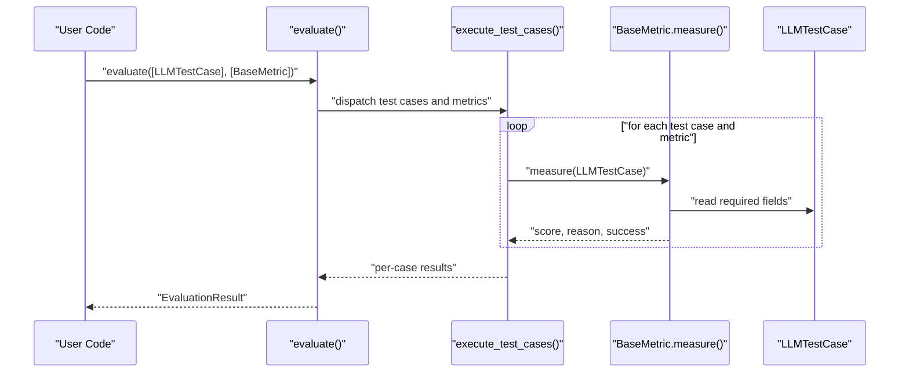
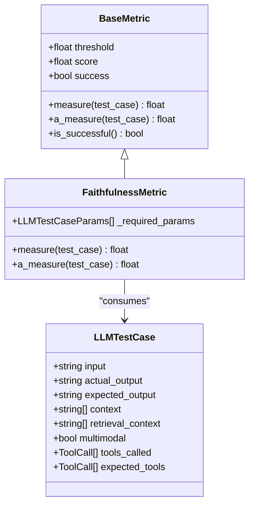
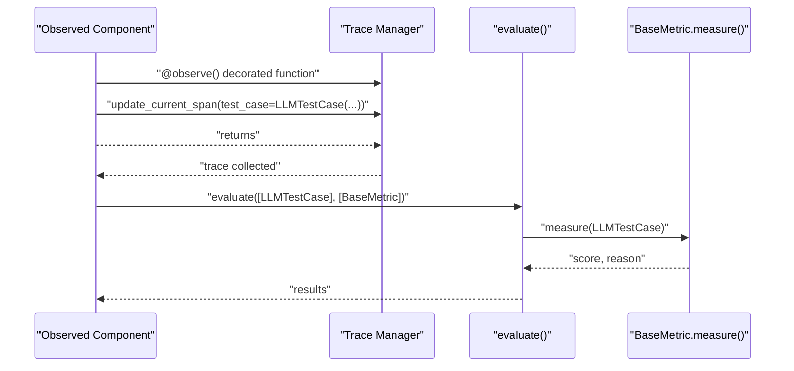
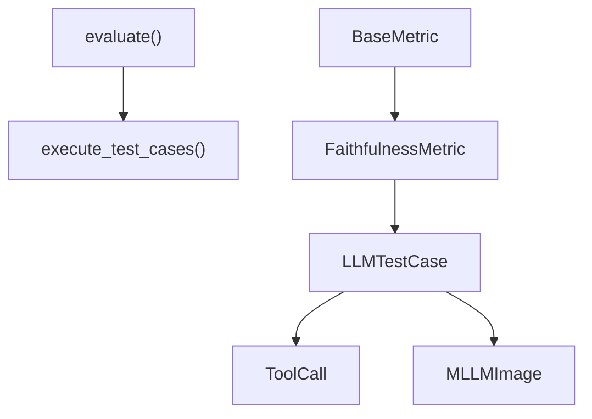

# LLM Test Cases

<cite>
**Referenced Files in This Document**
- [llm_test_case.py](file://deepeval/test_case/llm_test_case.py)
- [__init__.py](file://deepeval/test_case/__init__.py)
- [api.py](file://deepeval/test_case/api.py)
- [evaluate.py](file://deepeval/evaluate/evaluate.py)
- [base_metric.py](file://deepeval/metrics/base_metric.py)
- [faithfulness.py](file://deepeval/metrics/faithfulness/faithfulness.py)
- [utils.py](file://deepeval/test_case/utils.py)
- [api.py](file://deepeval/tracing/api.py)
- [utils.py](file://deepeval/tracing/otel/utils.py)
- [test_example.py](file://examples/getting_started/test_example.py)
- [test_single_turn.py](file://tests/test_core/test_test_case/test_single_turn.py)
- [test_pattern_match_metric.py](file://tests/test_metrics/test_pattern_match_metric.py)
- [test_configs.py](file://tests/test_core/test_evaluation/test_end_to_end/test_configs.py)
</cite>

## Table of Contents
1. [Introduction](#introduction)
2. [Project Structure](#project-structure)
3. [Core Components](#core-components)
4. [Architecture Overview](#architecture-overview)
5. [Detailed Component Analysis](#detailed-component-analysis)
6. [Dependency Analysis](#dependency-analysis)
7. [Performance Considerations](#performance-considerations)
8. [Troubleshooting Guide](#troubleshooting-guide)
9. [Conclusion](#conclusion)
10. [Appendices](#appendices)

## Introduction
This document explains how to develop and use LLM test cases in DeepEval for evaluating single-turn LLM responses. It focuses on the LLMTestCase class, its core attributes, instantiation patterns, and how metrics consume these test cases during scoring. It also covers integration with the evaluate() function, component-level tracing via @observe, and best practices for robust, reproducible evaluations.

## Project Structure
The LLM test case functionality lives primarily under deepeval/test_case and integrates with evaluation orchestration in deepeval/evaluate and metric implementations in deepeval/metrics.

**Diagram sources**
- [llm_test_case.py](file://deepeval/test_case/llm_test_case.py#L301-L543)
- [evaluate.py](file://deepeval/evaluate/evaluate.py#L185-L323)
- [base_metric.py](file://deepeval/metrics/base_metric.py#L1-L134)
- [faithfulness.py](file://deepeval/metrics/faithfulness/faithfulness.py#L1-L200)
- [api.py](file://deepeval/tracing/api.py#L1-L147)

**Section sources**
- [llm_test_case.py](file://deepeval/test_case/llm_test_case.py#L1-L543)
- [evaluate.py](file://deepeval/evaluate/evaluate.py#L1-L323)

## Core Components
- LLMTestCase: Pydantic-based model representing a single-turn evaluation case with input, actual_output, expected_output, context, retrieval_context, and optional tooling metadata.
- ToolCall: Structured metadata for tool invocations used by LLMTestCase.
- MLLMImage: Multimodal image abstraction integrated into LLMTestCase for image-aware evaluation.
- evaluate(): Top-level function orchestrating evaluation runs, validating inputs, and invoking metric measures.
- BaseMetric: Abstract interface that metrics implement; metrics consume LLMTestCase instances.

Key responsibilities:
- LLMTestCase validates and normalizes inputs, supports camelCase/snake_case aliases, and auto-detects multimodal content.
- evaluate() validates test case types, manages async/sync execution, and aggregates results.
- Metrics declare required LLMTestCaseParams and implement measure()/a_measure() to compute scores.

**Section sources**
- [llm_test_case.py](file://deepeval/test_case/llm_test_case.py#L301-L543)
- [base_metric.py](file://deepeval/metrics/base_metric.py#L1-L134)
- [evaluate.py](file://deepeval/evaluate/evaluate.py#L185-L323)

## Architecture Overview
The evaluation pipeline flows from test case creation to metric scoring and result aggregation.

**Diagram sources**
- [evaluate.py](file://deepeval/evaluate/evaluate.py#L185-L323)
- [base_metric.py](file://deepeval/metrics/base_metric.py#L1-L134)
- [faithfulness.py](file://deepeval/metrics/faithfulness/faithfulness.py#L1-L200)

## Detailed Component Analysis

### LLMTestCase: Attributes, Validation, and Multimodal Support
- Core attributes:
  - input: string prompt/query
  - actual_output: string produced by the model
  - expected_output: string reference/golden answer
  - context: optional list of strings representing static supporting facts
  - retrieval_context: optional list of strings representing dynamic retrieval results
  - additional_metadata, comments, tags, name: optional enrichment fields
  - tools_called, expected_tools: optional list of ToolCall entries
  - token_cost, completion_time: optional runtime metrics
  - mcp_* fields: optional integration with Model Communication Protocol
  - multimodal: boolean flag; auto-detected if image placeholders are present
- Validation:
  - Strict typing enforced for input, actual_output, context, retrieval_context, tools_called, expected_tools, and MCP-related fields.
  - Auto-detection of multimodal content via image placeholder markers.
- Aliasing:
  - Serialization and validation aliases support both camelCase and snake_case field names.
- Multimodal:
  - MLLMImage supports local files, remote URLs, and base64 encoding; placeholders embedded in strings are recognized and mapped.

Usage patterns:
- Minimal initialization with only input.
- Full initialization including context and retrieval_context for RAG-style evaluations.
- Tooling metadata for tool-use metrics.
- Optional metadata for grouping and reporting.

Concrete examples from the codebase:
- Single-turn evaluation with expected_output and retrieval_context/context:
  - [RAG integration example](file://tests/test_core/test_test_case/test_single_turn.py#L695-L705)
- Tool-call metadata and evaluation with evaluate():
  - [Tool call usage](file://tests/test_metrics/test_pattern_match_metric.py#L36-L66)

Best practices:
- Keep input concise and deterministic; actual_output and expected_output should reflect realistic LLM outputs.
- Use retrieval_context for RAG scenarios; keep context static and representative.
- Use additional_metadata/tags for grouping and filtering later.
- For multimodal, embed image placeholders consistently and ensure MLLMImage registry is populated.

**Section sources**
- [llm_test_case.py](file://deepeval/test_case/llm_test_case.py#L301-L543)
- [test_single_turn.py](file://tests/test_core/test_test_case/test_single_turn.py#L1-L200)
- [test_pattern_match_metric.py](file://tests/test_metrics/test_pattern_match_metric.py#L36-L66)

### ToolCall: Structured Tool Metadata
- Fields include name, description, reasoning, output, and input_parameters.
- Supports hashing and equality checks for deterministic comparisons.
- Used by LLMTestCase to track tool invocations and expected tool invocations.

**Section sources**
- [llm_test_case.py](file://deepeval/test_case/llm_test_case.py#L214-L300)

### MLLMImage: Multimodal Image Handling
- Validates and loads images from local paths, remote URLs, or base64 data.
- Provides placeholder markers for embedding images in prompts/outputs.
- Ensures images are loaded lazily and cached in a registry.

**Section sources**
- [llm_test_case.py](file://deepeval/test_case/llm_test_case.py#L31-L165)

### evaluate(): Orchestration and Execution
- Validates inputs and ensures all test cases are LLMTestCase instances.
- Supports synchronous and asynchronous execution.
- Aggregates results, prints summaries, and writes artifacts.
- Integrates with external services when metric_collection is provided.

Integration points:
- check_valid_test_cases_type() prevents mixing LLMTestCase and ConversationalTestCase.
- Uses global_test_run_manager to collect metrics and hyperparameters.

**Section sources**
- [evaluate.py](file://deepeval/evaluate/evaluate.py#L185-L323)
- [utils.py](file://deepeval/test_case/utils.py#L1-L21)

### Metrics Consumption of LLMTestCase
- BaseMetric defines measure() and a_measure() signatures that accept LLMTestCase.
- Metrics declare _required_params indicating which LLMTestCase fields they need.
- Example: FaithfulnessMetric requires INPUT, ACTUAL_OUTPUT, RETRIEVAL_CONTEXT.

**Diagram sources**
- [base_metric.py](file://deepeval/metrics/base_metric.py#L1-L134)
- [faithfulness.py](file://deepeval/metrics/faithfulness/faithfulness.py#L1-L200)
- [llm_test_case.py](file://deepeval/test_case/llm_test_case.py#L301-L543)

**Section sources**
- [base_metric.py](file://deepeval/metrics/base_metric.py#L1-L134)
- [faithfulness.py](file://deepeval/metrics/faithfulness/faithfulness.py#L1-L200)

### Relationship Between LLMTestCase and Evaluation Metrics
- Metrics declare required fields via LLMTestCaseParams.
- check_llm_test_case_params() enforces presence of required fields before scoring.
- Metrics can opt-in to multimodal handling based on test_case.multimodal.

Examples:
- FaithfulnessMetric requires INPUT, ACTUAL_OUTPUT, RETRIEVAL_CONTEXT.
- PatternMatchMetric consumes test_case and can be evaluated via evaluate().

**Section sources**
- [faithfulness.py](file://deepeval/metrics/faithfulness/faithfulness.py#L1-L200)
- [test_pattern_match_metric.py](file://tests/test_metrics/test_pattern_match_metric.py#L36-L66)

### Integration with evaluate() and Component Tracing via @observe
- evaluate() is the main entrypoint for batch evaluation.
- @observe enables component-level tracing; within observed spans, you can attach LLMTestCase via update_current_span/update_current_trace.
- TraceApi mirrors LLMTestCase fields for serialized traces, enabling downstream evaluation.

**Diagram sources**
- [evaluate.py](file://deepeval/evaluate/evaluate.py#L185-L323)
- [api.py](file://deepeval/tracing/api.py#L1-L147)

**Section sources**
- [evaluate.py](file://deepeval/evaluate/evaluate.py#L185-L323)
- [api.py](file://deepeval/tracing/api.py#L1-L147)

## Dependency Analysis
- LLMTestCase depends on:
  - Pydantic for validation and serialization.
  - ToolCall for tool metadata.
  - MLLMImage for multimodal support.
- evaluate() depends on:
  - check_valid_test_cases_type() to enforce homogeneous test case types.
  - execute_test_cases()/a_execute_test_cases() for execution.
- Metrics depend on:
  - BaseMetric interface and LLMTestCaseParams to declare requirements.

**Diagram sources**
- [llm_test_case.py](file://deepeval/test_case/llm_test_case.py#L301-L543)
- [evaluate.py](file://deepeval/evaluate/evaluate.py#L185-L323)
- [base_metric.py](file://deepeval/metrics/base_metric.py#L1-L134)
- [faithfulness.py](file://deepeval/metrics/faithfulness/faithfulness.py#L1-L200)

**Section sources**
- [llm_test_case.py](file://deepeval/test_case/llm_test_case.py#L301-L543)
- [evaluate.py](file://deepeval/evaluate/evaluate.py#L185-L323)
- [base_metric.py](file://deepeval/metrics/base_metric.py#L1-L134)
- [faithfulness.py](file://deepeval/metrics/faithfulness/faithfulness.py#L1-L200)

## Performance Considerations
- Prefer minimal context and retrieval_context sizes to reduce token costs and latency.
- Use async_mode in metrics when available to overlap I/O-bound operations.
- Avoid extremely large inputs/outputs; truncate or summarize when necessary.
- Cache repeated computations (e.g., embeddings) at the application layer to minimize redundant metric calls.

[No sources needed since this section provides general guidance]

## Troubleshooting Guide
Common issues and resolutions:
- Malformed outputs:
  - Metrics may raise ValueError when encountering invalid JSON or missing required fields. Ensure actual_output and expected_output are strings and that required fields are present.
  - Example: Missing required fields raises MissingTestCaseParamsError during evaluate().
  - Reference: [Missing params test](file://tests/test_core/test_evaluation/test_end_to_end/test_configs.py#L63-L80)
- Type errors:
  - LLMTestCase enforces strict typing for input, actual_output, context, retrieval_context, tools_called, expected_tools, and MCP-related fields.
  - References:
    - [Type validation tests](file://tests/test_core/test_test_case/test_single_turn.py#L251-L284)
    - [LLMTestCase validation](file://deepeval/test_case/llm_test_case.py#L408-L514)
- Context length:
  - Keep context and retrieval_context concise; long contexts increase token usage and cost. Trim or summarize as needed.
  - Reference: [Context guidance](file://docs/static/llms-full.txt#L20951-L20979)
- Multimodal handling:
  - Ensure image placeholders are consistent and MLLMImage is properly initialized. Validate image URLs/local paths.
  - Reference: [Multimodal image handling](file://deepeval/test_case/llm_test_case.py#L31-L165)
- Tracing conflicts:
  - When using @observe, expected_output passed via update_current_trace/update_current_span can override test_case expected_output. Confirm precedence in your trace collection.
  - Reference: [Trace override tests](file://tests/test_core/test_tracing/test_execute_integration.py#L115-L155)

**Section sources**
- [test_configs.py](file://tests/test_core/test_evaluation/test_end_to_end/test_configs.py#L63-L80)
- [test_single_turn.py](file://tests/test_core/test_test_case/test_single_turn.py#L251-L284)
- [llm_test_case.py](file://deepeval/test_case/llm_test_case.py#L408-L514)
- [utils.py](file://deepeval/tracing/otel/utils.py#L42-L83)

## Conclusion
LLMTestCase is the central data structure for single-turn LLM evaluations in DeepEval. By structuring inputs and outputs carefully, leveraging context and retrieval_context appropriately, and integrating with metrics that declare required fields, you can build robust, reproducible evaluations. The evaluate() function orchestrates execution, while @observe enables component-level tracing for dynamic test case generation and targeted metric application.

[No sources needed since this section summarizes without analyzing specific files]

## Appendices

### Best Practices for Structuring Inputs and Expected Outputs
- Inputs: Clear, deterministic prompts; avoid randomness.
- Actual outputs: Reflect real LLM behavior; include minor variations for robustness.
- Expected outputs: Grounded, concise; align with tone and style when applicable.
- Context vs retrieval_context:
  - context: static, curated knowledge.
  - retrieval_context: dynamic, model-generated or retrieved segments.
- Tooling metadata: Include only what is relevant for the metric under test.
- Multimodal: Use consistent placeholder patterns and ensure images are loadable.

**Section sources**
- [test_example.py](file://examples/getting_started/test_example.py#L1-L40)
- [test_single_turn.py](file://tests/test_core/test_test_case/test_single_turn.py#L1-L200)