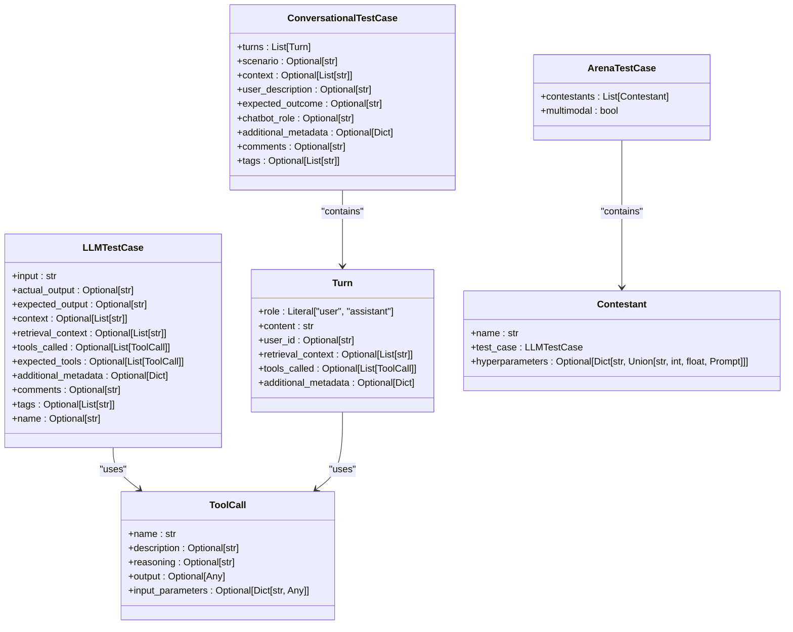
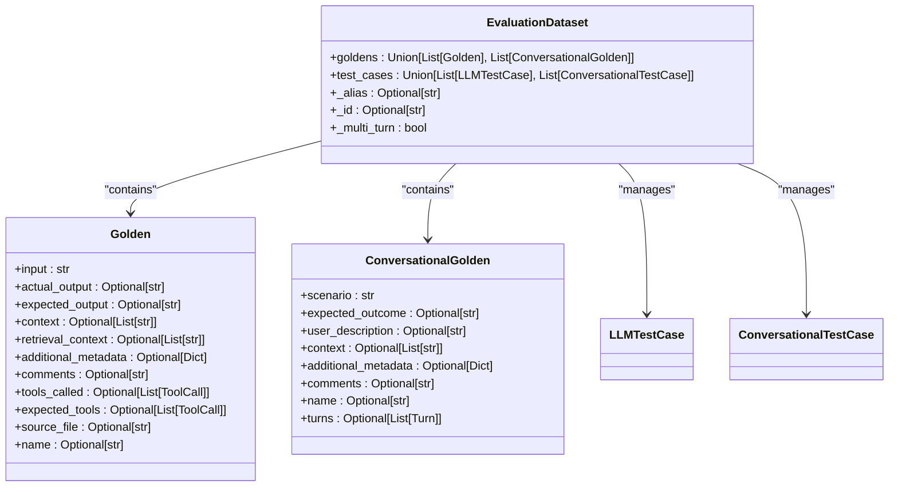
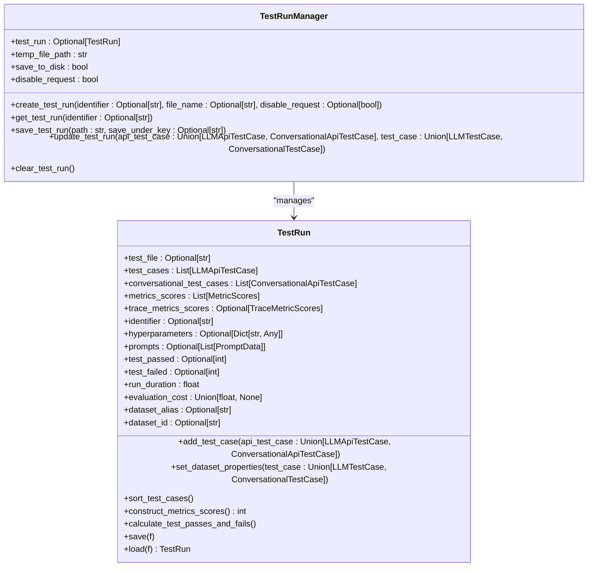

# Test Case Management

<cite>
**Referenced Files in This Document**   
- [llm_test_case.py](file://deepeval/test_case/llm_test_case.py)
- [conversational_test_case.py](file://deepeval/test_case/conversational_test_case.py)
- [arena_test_case.py](file://deepeval/test_case/arena_test_case.py)
- [golden.py](file://deepeval/dataset/golden.py)
- [dataset.py](file://deepeval/dataset/dataset.py)
- [test_run.py](file://deepeval/test_run/test_run.py)
- [api.py](file://deepeval/test_case/api.py)
</cite>

## Table of Contents
1. [Introduction](#introduction)
2. [Test Case Architecture](#test-case-architecture)
3. [Core Test Case Types](#core-test-case-types)
4. [Dataset Integration](#dataset-integration)
5. [Test Case Creation and Management](#test-case-creation-and-management)
6. [Batch Execution and Evaluation](#batch-execution-and-evaluation)
7. [Common Issues and Solutions](#common-issues-and-solutions)
8. [Performance Considerations](#performance-considerations)
9. [Best Practices](#best-practices)

## Introduction

Test case management in DeepEval provides a structured framework for organizing and evaluating LLM applications through comprehensive test scenarios. The system enables developers to create, manage, and execute various types of test cases that capture different aspects of LLM behavior and performance. At its core, DeepEval's test case system revolves around three primary test case types: LLMTestCase for single-turn evaluations, ConversationalTestCase for multi-turn dialogues, and ArenaTestCase for comparative evaluations between multiple models or configurations.

The architecture is designed to support both simple and complex evaluation scenarios, from basic input-output validation to sophisticated multimodal and conversational assessments. Test cases serve as containers for evaluation data, capturing essential elements such as input prompts, actual and expected outputs, context information, and metadata. This structured approach enables systematic evaluation of LLM applications, ensuring consistent and reproducible results across different testing scenarios.

**Section sources**
- [llm_test_case.py](file://deepeval/test_case/llm_test_case.py#L1-L543)
- [conversational_test_case.py](file://deepeval/test_case/conversational_test_case.py#L1-L267)
- [arena_test_case.py](file://deepeval/test_case/arena_test_case.py#L1-L49)

## Test Case Architecture

The test case architecture in DeepEval follows a hierarchical design with specialized classes for different evaluation scenarios. The system is built around a core set of data models that capture the essential components of LLM evaluation, with extensibility for specialized use cases.



**Diagram sources**
- [llm_test_case.py](file://deepeval/test_case/llm_test_case.py#L301-L543)
- [conversational_test_case.py](file://deepeval/test_case/conversational_test_case.py#L131-L267)
- [arena_test_case.py](file://deepeval/test_case/arena_test_case.py#L19-L49)

## Core Test Case Types

DeepEval provides three primary test case types to accommodate different evaluation scenarios in LLM applications.

### LLMTestCase

LLMTestCase represents the fundamental unit for single-turn LLM evaluations. It captures the essential components of an LLM interaction, including the input prompt, actual output from the model, and the expected output for comparison. The test case also supports additional evaluation dimensions such as context information, retrieval context, and tool usage.

Key attributes of LLMTestCase include:
- **input**: The prompt or query provided to the LLM
- **actual_output**: The response generated by the LLM
- **expected_output**: The anticipated or "golden" response for comparison
- **context**: Supporting information or background context for the evaluation
- **retrieval_context**: Retrieved documents or information used in RAG scenarios
- **tools_called**: Tools invoked by the LLM during execution
- **expected_tools**: Tools expected to be called for the given input

LLMTestCase is designed for evaluating individual LLM responses and is particularly useful for unit testing specific model behaviors or validating output quality against predefined criteria.

### ConversationalTestCase

ConversationalTestCase extends the evaluation framework to multi-turn dialogues, enabling the assessment of conversational agents and chatbots. Unlike LLMTestCase, which focuses on single interactions, ConversationalTestCase captures an entire conversation as a sequence of turns.

Each turn in a conversation represents a single exchange between user and assistant, with properties including:
- **role**: Specifies whether the turn is from the user or assistant
- **content**: The message content for that turn
- **user_id**: Identifier for the user in multi-user scenarios
- **retrieval_context**: Context specific to that turn in the conversation
- **tools_called**: Tools invoked during that particular turn

The ConversationalTestCase structure allows for evaluating conversation flow, context preservation across turns, and the overall coherence of multi-turn interactions. This test case type is essential for assessing chatbot performance, dialogue management, and conversational AI systems.

### ArenaTestCase

ArenaTestCase enables comparative evaluation of multiple models or configurations through head-to-head testing. This test case type is designed for scenarios where different LLMs, prompts, or hyperparameter settings need to be evaluated against the same inputs to determine relative performance.

The ArenaTestCase structure consists of:
- **contestants**: A list of participants in the evaluation, each with their own LLMTestCase
- **multimodal**: Flag indicating whether the test involves multimodal inputs

Each contestant represents a different model or configuration being evaluated, allowing for direct comparison of their responses to identical inputs. This approach is particularly valuable for A/B testing, model selection, and optimization of LLM parameters.

**Section sources**
- [llm_test_case.py](file://deepeval/test_case/llm_test_case.py#L301-L543)
- [conversational_test_case.py](file://deepeval/test_case/conversational_test_case.py#L131-L267)
- [arena_test_case.py](file://deepeval/test_case/arena_test_case.py#L19-L49)

## Dataset Integration

Test cases in DeepEval are closely integrated with datasets, enabling systematic organization and management of evaluation data. The dataset system provides a structured approach to storing, retrieving, and managing test cases and their associated golden data.



**Diagram sources**
- [dataset.py](file://deepeval/dataset/dataset.py#L87-L130)
- [golden.py](file://deepeval/dataset/golden.py#L8-L198)

The dataset integration enables several key capabilities:
- Centralized management of test cases and golden data
- Support for both single-turn and multi-turn evaluation scenarios
- Association of metadata and contextual information with test cases
- Versioning and tracking of test data through dataset aliases and IDs

When loading test cases from a dataset, the system automatically handles the conversion between golden data and executable test cases, preserving all relevant information for evaluation. This integration ensures consistency between the expected outcomes (golden data) and the actual test execution, providing a reliable foundation for LLM evaluation.

## Test Case Creation and Management

Creating and managing test cases in DeepEval follows a structured approach that emphasizes clarity, reusability, and comprehensive coverage of evaluation scenarios.

### Creating LLM Test Cases

LLM test cases are created by instantiating the LLMTestCase class with the required parameters:

```python
from deepeval.test_case import LLMTestCase

test_case = LLMTestCase(
    input="What is the capital of France?",
    actual_output="The capital of France is Paris.",
    expected_output="Paris",
    context=["France is a country in Europe", "Paris is a major European city"],
    retrieval_context=["Paris is the capital and most populous city of France"],
    tools_called=[],
    expected_tools=[],
    additional_metadata={"category": "geography", "difficulty": "easy"},
    comments="Basic geography question",
    tags=["geography", "basic"],
    name="capital_of_france_test"
)
```

### Creating Conversational Test Cases

Conversational test cases require defining a sequence of turns that represent a complete dialogue:

```python
from deepeval.test_case import ConversationalTestCase, Turn

conversational_test_case = ConversationalTestCase(
    turns=[
        Turn(role="user", content="Hello, how are you?"),
        Turn(role="assistant", content="I'm doing well, thank you! How can I help you today?"),
        Turn(role="user", content="Can you tell me about Python programming?"),
        Turn(role="assistant", content="Python is a high-level, interpreted programming language...")
    ],
    scenario="User greeting and information request",
    context=["Python is a popular programming language"],
    user_description="User seeking information about programming languages",
    expected_outcome="Assistant provides accurate information about Python",
    chatbot_role="knowledgeable assistant",
    additional_metadata={"domain": "programming", "topic": "Python"},
    comments="Test conversation about Python programming",
    tags=["python", "programming", "conversation"],
    name="python_information_conversation"
)
```

### Creating Arena Test Cases

Arena test cases are created by defining contestants that represent different models or configurations:

```python
from deepeval.test_case import ArenaTestCase, Contestant, LLMTestCase

# Create test cases for each contestant
gpt4_test_case = LLMTestCase(
    input="Explain quantum computing in simple terms",
    actual_output="Quantum computing uses quantum bits or qubits...",
    expected_output="Explanation of quantum computing concepts"
)

claude_test_case = LLMTestCase(
    input="Explain quantum computing in simple terms",
    actual_output="Quantum computers leverage quantum mechanics...",
    expected_output="Explanation of quantum computing concepts"
)

# Create contestants
gpt4_contestant = Contestant(
    name="GPT-4",
    test_case=gpt4_test_case,
    hyperparameters={"temperature": 0.7, "max_tokens": 500}
)

claude_contestant = Contestant(
    name="Claude",
    test_case=claude_test_case,
    hyperparameters={"temperature": 0.8, "max_tokens": 600}
)

# Create arena test case
arena_test_case = ArenaTestCase(
    contestants=[gpt4_contestant, claude_contestant]
)
```

The test case management system enforces several important constraints:
- All contestants in an ArenaTestCase must have the same input and expected output
- Contestant names must be unique within an arena
- Test cases cannot mix LLMTestCase and ConversationalTestCase types in the same evaluation batch

**Section sources**
- [llm_test_case.py](file://deepeval/test_case/llm_test_case.py#L301-L543)
- [conversational_test_case.py](file://deepeval/test_case/conversational_test_case.py#L131-L267)
- [arena_test_case.py](file://deepeval/test_case/arena_test_case.py#L19-L49)
- [utils.py](file://deepeval/test_case/utils.py#L6-L21)

## Batch Execution and Evaluation

DeepEval provides robust support for batch execution of test cases, enabling efficient evaluation of large datasets and comprehensive testing scenarios.

### Public Interfaces for Test Execution

The system exposes several public interfaces for managing test case execution:



**Diagram sources**
- [test_run.py](file://deepeval/test_run/test_run.py#L142-L800)
- [api.py](file://deepeval/test_case/api.py#L9-L158)

### Dataset Loading and Batch Processing

The dataset system provides methods for loading and processing test cases in batches:

```python
from deepeval.dataset import EvaluationDataset

# Load dataset from file or create programmatically
dataset = EvaluationDataset()

# Add test cases to dataset
dataset.test_cases = [test_case1, test_case2, test_case3]

# Execute all test cases in the dataset
results = evaluate(dataset.test_cases, metrics=[metric1, metric2])
```

The batch execution system handles several important aspects:
- Automatic sorting and ordering of test cases
- Aggregation of metrics across multiple test cases
- Calculation of overall pass/fail statistics
- Tracking of evaluation costs and execution duration
- Preservation of dataset context and metadata

For large datasets, the system supports incremental processing and checkpointing, allowing evaluations to be resumed if interrupted. This is particularly valuable for comprehensive testing scenarios that may take significant time to complete.

## Common Issues and Solutions

Several common issues arise when working with test cases in DeepEval, along with established solutions for addressing them.

### Mixed Test Case Types

One common issue is attempting to mix different test case types in a single evaluation batch:

```python
# ❌ This will raise an error
test_cases = [
    LLMTestCase(input="Hello", actual_output="Hi", expected_output="Hello"),
    ConversationalTestCase(turns=[Turn(role="user", content="Hello")])
]
evaluate(test_cases, metrics=[metric])  # ValueError!
```

**Solution**: Keep test case types separate and evaluate them in distinct batches:

```python
# ✅ Correct approach
llm_test_cases = [LLMTestCase(input="Hello", actual_output="Hi", expected_output="Hello")]
conversational_test_cases = [ConversationalTestCase(turns=[Turn(role="user", content="Hello")])]

evaluate(llm_test_cases, metrics=[metric])
evaluate(conversational_test_cases, metrics=[metric])
```

### Missing Required Fields

Another common issue is omitting required fields in test case creation:

```python
# ❌ This may cause validation errors
test_case = LLMTestCase(
    input=None,  # Invalid - input cannot be None
    actual_output="Response",
    # expected_output missing
)
```

**Solution**: Ensure all required fields are properly populated and validate test cases before execution:

```python
# ✅ Correct approach
test_case = LLMTestCase(
    input="What is AI?",
    actual_output="Artificial Intelligence is...",
    expected_output="Definition of Artificial Intelligence"
)
```

### Dataset Management Issues

Problems can arise when managing datasets with mixed multi-turn and single-turn test cases:

```python
# ❌ This creates confusion in dataset handling
dataset = EvaluationDataset()
dataset.goldens = [
    Golden(input="Question 1", expected_output="Answer 1"),
    ConversationalGolden(scenario="Conversation 1", expected_outcome="Outcome 1")
]
```

**Solution**: Maintain separate datasets for different test case types or ensure consistent typing:

```python
# ✅ Correct approach
single_turn_dataset = EvaluationDataset()
single_turn_dataset.goldens = [
    Golden(input="Question 1", expected_output="Answer 1"),
    Golden(input="Question 2", expected_output="Answer 2")
]

multi_turn_dataset = EvaluationDataset()
multi_turn_dataset.goldens = [
    ConversationalGolden(scenario="Conversation 1", expected_outcome="Outcome 1"),
    ConversationalGolden(scenario="Conversation 2", expected_outcome="Outcome 2")
]
```

**Section sources**
- [utils.py](file://deepeval/test_case/utils.py#L6-L21)
- [llm_test_case.py](file://deepeval/test_case/llm_test_case.py#L408-L514)
- [conversational_test_case.py](file://deepeval/test_case/conversational_test_case.py#L200-L236)

## Performance Considerations

Handling large test datasets efficiently requires attention to several performance considerations.

### Memory Management

For large datasets, memory usage can become a concern. The system provides several mechanisms to manage memory effectively:

- **Incremental processing**: Process test cases in batches rather than loading all at once
- **Checkpointing**: Save intermediate results to disk to prevent data loss
- **Lazy loading**: Load test cases only when needed for evaluation

### Execution Optimization

The batch execution system includes optimizations for handling large numbers of test cases:

- **Parallel evaluation**: When possible, evaluate independent test cases concurrently
- **Result caching**: Cache evaluation results to avoid redundant computations
- **Efficient serialization**: Use optimized formats for storing and transmitting test data

### Scalability Patterns

For very large test suites, consider these scalability patterns:

- **Distributed execution**: Split test cases across multiple machines or processes
- **Prioritization**: Execute high-priority test cases first
- **Sampling**: Use statistical sampling for initial validation before full evaluation

The system is designed to handle datasets of varying sizes, from small unit test suites to comprehensive evaluation benchmarks with thousands of test cases.

**Section sources**
- [test_run.py](file://deepeval/test_run/test_run.py#L435-L800)
- [dataset.py](file://deepeval/dataset/dataset.py#L87-L130)

## Best Practices

Adhering to best practices ensures effective and maintainable test case management in DeepEval.

### Organizational Structure

Organize test cases systematically:
- Group related test cases by functionality or domain
- Use descriptive names and tags for easy identification
- Maintain separate datasets for different testing phases (unit, integration, regression)

### Data Quality

Ensure high-quality test data:
- Use realistic inputs that reflect actual usage patterns
- Provide clear and unambiguous expected outputs
- Include comprehensive context information
- Regularly review and update golden data

### Maintenance and Versioning

Implement proper maintenance practices:
- Version control for test datasets
- Regular review of test cases for relevance
- Documentation of test case purpose and expected behavior
- Automated validation of test case integrity

### Performance Monitoring

Monitor evaluation performance:
- Track execution time and resource usage
- Set up alerts for significant performance changes
- Regularly analyze evaluation metrics for trends
- Optimize test case execution order based on dependencies

Following these best practices ensures that test case management remains effective, scalable, and valuable throughout the LLM development lifecycle.

**Section sources**
- [llm_test_case.py](file://deepeval/test_case/llm_test_case.py#L301-L543)
- [conversational_test_case.py](file://deepeval/test_case/conversational_test_case.py#L131-L267)
- [test_run.py](file://deepeval/test_run/test_run.py#L142-L800)