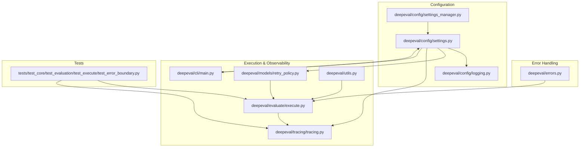
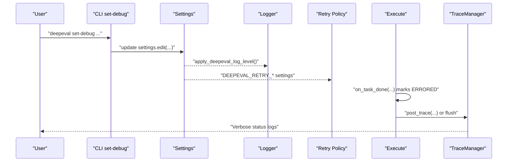
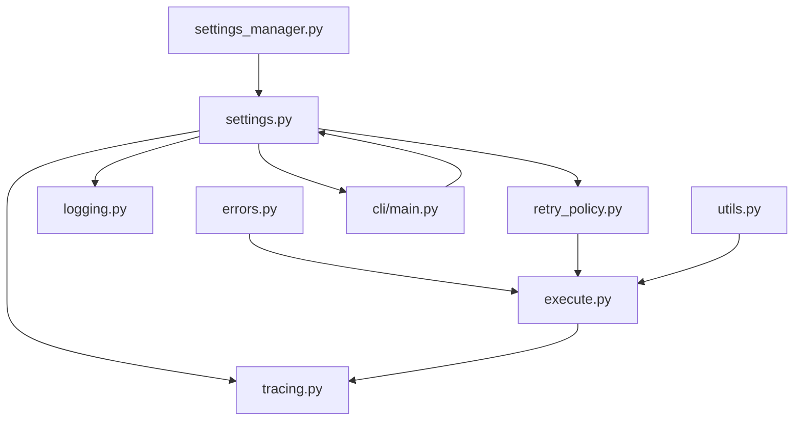

# Troubleshooting

<cite>
**Referenced Files in This Document**
- [errors.py](file://deepeval/errors.py)
- [settings.py](file://deepeval/config/settings.py)
- [logging.py](file://deepeval/config/logging.py)
- [settings_manager.py](file://deepeval/config/settings_manager.py)
- [tracing.py](file://deepeval/tracing/tracing.py)
- [retry_policy.py](file://deepeval/models/retry_policy.py)
- [execute.py](file://deepeval/evaluate/execute.py)
- [main.py](file://deepeval/cli/main.py)
- [utils.py](file://deepeval/utils.py)
- [test_error_boundary.py](file://tests/test_core/test_evaluation/test_execute/test_error_boundary.py)
- [troubleshooting.mdx](file://docs/docs/troubleshooting.mdx)
</cite>

## Table of Contents
1. [Introduction](#introduction)
2. [Project Structure](#project-structure)
3. [Core Components](#core-components)
4. [Architecture Overview](#architecture-overview)
5. [Detailed Component Analysis](#detailed-component-analysis)
6. [Dependency Analysis](#dependency-analysis)
7. [Performance Considerations](#performance-considerations)
8. [Troubleshooting Guide](#troubleshooting-guide)
9. [Conclusion](#conclusion)

## Introduction
This section provides a comprehensive troubleshooting guide for DeepEval. It explains how to diagnose and resolve common issues, focusing on the error handling system, logging mechanisms, and debugging tools. It covers error types, configuration pitfalls, API failures, authentication problems, and performance bottlenecks. The guide uses terminology consistent with the codebase such as DeepEvalError, settings, configuration, and debug.

## Project Structure
DeepEval’s troubleshooting architecture spans several modules:
- Error types and base classes
- Centralized settings and configuration
- Logging configuration and propagation
- Retry and timeout policies
- Evaluation execution and error boundary handling
- Tracing and observability
- CLI-driven debug configuration

**Diagram sources**
- [errors.py](file://deepeval/errors.py#L1-L25)
- [settings.py](file://deepeval/config/settings.py#L1-L120)
- [logging.py](file://deepeval/config/logging.py#L1-L34)
- [settings_manager.py](file://deepeval/config/settings_manager.py#L1-L138)
- [retry_policy.py](file://deepeval/models/retry_policy.py#L1-L120)
- [execute.py](file://deepeval/evaluate/execute.py#L2500-L2570)
- [tracing.py](file://deepeval/tracing/tracing.py#L340-L533)
- [main.py](file://deepeval/cli/main.py#L276-L456)
- [utils.py](file://deepeval/utils.py#L220-L240)
- [test_error_boundary.py](file://tests/test_core/test_evaluation/test_execute/test_error_boundary.py#L258-L329)

**Section sources**
- [errors.py](file://deepeval/errors.py#L1-L25)
- [settings.py](file://deepeval/config/settings.py#L1-L120)
- [logging.py](file://deepeval/config/logging.py#L1-L34)
- [settings_manager.py](file://deepeval/config/settings_manager.py#L1-L138)
- [retry_policy.py](file://deepeval/models/retry_policy.py#L1-L120)
- [execute.py](file://deepeval/evaluate/execute.py#L2500-L2570)
- [tracing.py](file://deepeval/tracing/tracing.py#L340-L533)
- [main.py](file://deepeval/cli/main.py#L276-L456)
- [utils.py](file://deepeval/utils.py#L220-L240)
- [test_error_boundary.py](file://tests/test_core/test_evaluation/test_execute/test_error_boundary.py#L258-L329)

## Core Components
- Error types:
  - DeepEvalError: base class for framework-originated errors that abort the current operation if unhandled.
  - UserAppError: user LLM apps/tools exceptions recorded on traces while keeping the run alive.
  - Specialized errors: MissingTestCaseParamsError, MismatchedTestCaseInputsError.
- Settings and configuration:
  - Centralized Settings model with environment precedence (.env, .env.local, process env).
  - Editable settings via settings.edit() and persisted to dotenv or legacy JSON store.
  - Debug toggles: LOG_LEVEL, DEEPEVAL_VERBOSE_MODE, DEEPEVAL_LOG_STACK_TRACES, ERROR_REPORTING, IGNORE_DEEPEVAL_ERRORS.
- Logging:
  - apply_deepeval_log_level() applies LOG_LEVEL to the "deepeval" logger and propagates to application handlers.
- Retry and timeout:
  - Dynamic retry policy with configurable backoff, jitter, and caps.
  - Per-attempt and per-task timeouts with computed budgets and soft timeouts.
- Execution error boundary:
  - on_task_done marks traces and spans as ERRORED, surfaces error messages, and preserves end_time semantics.
- Tracing:
  - TraceManager posts traces asynchronously, with sampling, environment, and verbose logging toggles.
- CLI debug:
  - set-debug/unset-debug commands to adjust logging, retries, gRPC, and tracing flags.

**Section sources**
- [errors.py](file://deepeval/errors.py#L1-L25)
- [settings.py](file://deepeval/config/settings.py#L245-L520)
- [logging.py](file://deepeval/config/logging.py#L13-L34)
- [settings_manager.py](file://deepeval/config/settings_manager.py#L63-L138)
- [retry_policy.py](file://deepeval/models/retry_policy.py#L120-L220)
- [execute.py](file://deepeval/evaluate/execute.py#L2500-L2570)
- [tracing.py](file://deepeval/tracing/tracing.py#L340-L533)
- [main.py](file://deepeval/cli/main.py#L276-L456)

## Architecture Overview
The troubleshooting architecture integrates error types, settings, logging, retry/timeout policies, execution error boundaries, and tracing. The CLI provides a unified interface to tune debug behavior and persist settings.

**Diagram sources**
- [main.py](file://deepeval/cli/main.py#L276-L456)
- [settings.py](file://deepeval/config/settings.py#L485-L580)
- [logging.py](file://deepeval/config/logging.py#L13-L34)
- [retry_policy.py](file://deepeval/models/retry_policy.py#L364-L496)
- [execute.py](file://deepeval/evaluate/execute.py#L2500-L2570)
- [tracing.py](file://deepeval/tracing/tracing.py#L340-L533)

## Detailed Component Analysis

### Error Types and Handling
- DeepEvalError: signals framework-originated failures; if unhandled, aborts current operation.
- UserAppError: wraps user app/tool exceptions; recorded on traces to keep evaluation alive.
- Specialized errors: MissingTestCaseParamsError, MismatchedTestCaseInputsError.

Practical implications:
- Use UserAppError to wrap recoverable user errors so evaluation proceeds.
- Raise DeepEvalError for unrecoverable framework-level issues.

**Section sources**
- [errors.py](file://deepeval/errors.py#L1-L25)

### Settings, Configuration, and Debug
- Settings model defines environment variables and computed fields for timeouts, retries, and debug toggles.
- Settings.edit() validates and assigns values, updates process env, and persists to dotenv when requested.
- apply_deepeval_log_level() sets the package logger level based on LOG_LEVEL and ensures propagation.

Common configuration pitfalls:
- Incorrect dotenv path or APP_ENV precedence leading to unexpected values.
- Unknown settings fields produce warnings suggesting close matches.
- Legacy JSON keystore fallback emits deprecation warnings for secrets.

**Section sources**
- [settings.py](file://deepeval/config/settings.py#L245-L520)
- [settings_manager.py](file://deepeval/config/settings_manager.py#L63-L138)
- [logging.py](file://deepeval/config/logging.py#L13-L34)

### Retry and Timeout Policies
- Dynamic retry policy uses ErrorPolicy to classify transient vs non-retryable errors.
- Backoff parameters: DEEPEVAL_RETRY_MAX_ATTEMPTS, DEEPEVAL_RETRY_INITIAL_SECONDS, DEEPEVAL_RETRY_EXP_BASE, DEEPEVAL_RETRY_JITTER, DEEPEVAL_RETRY_CAP_SECONDS.
- Soft timeouts enforce per-attempt and per-task budgets; concurrency is bounded by DEEPEVAL_TIMEOUT_THREAD_LIMIT with optional warnings after DEEPEVAL_TIMEOUT_SEMAPHORE_WARN_AFTER_SECONDS.

Common issues:
- Insufficient per-attempt timeout causing frequent timeouts.
- Overly aggressive retry caps or jitter affecting latency.
- Semaphore starvation under heavy concurrency.

**Section sources**
- [retry_policy.py](file://deepeval/models/retry_policy.py#L120-L220)
- [retry_policy.py](file://deepeval/models/retry_policy.py#L364-L496)
- [settings.py](file://deepeval/config/settings.py#L485-L580)

### Execution Error Boundary and Trace Marking
- on_task_done detects exceptions and cancellations, marks traces and spans as ERRORED, preserves end_time semantics, and surfaces error messages.
- Integration with tracing associates traces with goldens and evaluates them post-execution.

Common scenarios:
- Uncaught exceptions inside @observe lead to ERRORED trace and root span.
- Cancelled tasks mark ERRORED spans; end_time is preserved.
- Metrics are skipped when spans or traces are already ERRORED.

**Section sources**
- [execute.py](file://deepeval/evaluate/execute.py#L2500-L2570)
- [test_error_boundary.py](file://tests/test_core/test_evaluation/test_execute/test_error_boundary.py#L331-L410)
- [test_error_boundary.py](file://tests/test_core/test_evaluation/test_execute/test_error_boundary.py#L515-L538)

### Tracing and Observability
- TraceManager manages traces and spans, posts them asynchronously, and prints verbose status logs.
- Sampling and environment controls influence posting behavior and verbosity.
- Worker thread processes the queue with rate limiting and graceful shutdown.

Common issues:
- Missing Confident API key prevents trace posting; verbose logs indicate skipping.
- Queue overflow or worker errors produce failure logs; flushing handles remaining traces.

**Section sources**
- [tracing.py](file://deepeval/tracing/tracing.py#L340-L533)

### CLI Debug Tools
- set-debug/unset-debug adjust logging levels, retry logging, gRPC visibility, and tracing flags; supports persistence to dotenv.
- login/logout commands manage API keys and test run artifacts.

Common issues:
- Empty or malformed API keys cause login failures.
- Persisted settings may conflict with process env; verify precedence.

**Section sources**
- [main.py](file://deepeval/cli/main.py#L276-L456)
- [main.py](file://deepeval/cli/main.py#L130-L209)

## Dependency Analysis
The following diagram highlights key dependencies among troubleshooting components:

**Diagram sources**
- [errors.py](file://deepeval/errors.py#L1-L25)
- [settings.py](file://deepeval/config/settings.py#L1-L120)
- [logging.py](file://deepeval/config/logging.py#L1-L34)
- [settings_manager.py](file://deepeval/config/settings_manager.py#L1-L138)
- [retry_policy.py](file://deepeval/models/retry_policy.py#L1-L120)
- [execute.py](file://deepeval/evaluate/execute.py#L2500-L2570)
- [tracing.py](file://deepeval/tracing/tracing.py#L340-L533)
- [main.py](file://deepeval/cli/main.py#L276-L456)
- [utils.py](file://deepeval/utils.py#L220-L240)

**Section sources**
- [settings.py](file://deepeval/config/settings.py#L485-L580)
- [retry_policy.py](file://deepeval/models/retry_policy.py#L364-L496)
- [execute.py](file://deepeval/evaluate/execute.py#L2500-L2570)
- [tracing.py](file://deepeval/tracing/tracing.py#L340-L533)
- [main.py](file://deepeval/cli/main.py#L276-L456)

## Performance Considerations
- Logging overhead:
  - Enable DEBUG only when diagnosing; excessive DEBUG logs increase I/O and CPU.
  - Use DEEPEVAL_LOG_STACK_TRACES judiciously; stack traces are expensive.
- Retry and backoff:
  - Tune DEEPEVAL_RETRY_MAX_ATTEMPTS and DEEPEVAL_RETRY_CAP_SECONDS to balance latency and reliability.
  - Consider DEEPEVAL_SDK_RETRY_PROVIDERS to delegate retries to SDKs for providers that support it.
- Timeouts:
  - Increase DEEPEVAL_PER_TASK_TIMEOUT_SECONDS_OVERRIDE for high-latency networks.
  - If per-attempt timeout resolves to 0, rely on outer budget; avoid inner asyncio.wait_for.
- Concurrency:
  - DEEPEVAL_TIMEOUT_THREAD_LIMIT bounds timeout worker threads; monitor warnings after DEEPEVAL_TIMEOUT_SEMAPHORE_WARN_AFTER_SECONDS.
- Tracing:
  - Adjust CONFIDENT_TRACE_SAMPLE_RATE and CONFIDENT_TRACE_VERBOSE to reduce posting overhead in CI or production.

[No sources needed since this section provides general guidance]

## Troubleshooting Guide

### Interpreting Error Messages
- Look for ERRORED traces and root spans in the trace logs; the error message is attached to the root span.
- If a task is cancelled, the root span carries a cancellation message; end_time is preserved to avoid rewriting closed spans.
- When metrics are skipped due to ERRORED spans or traces, verify the upstream failure path.

**Section sources**
- [execute.py](file://deepeval/evaluate/execute.py#L2500-L2570)
- [test_error_boundary.py](file://tests/test_core/test_evaluation/test_execute/test_error_boundary.py#L515-L538)
- [test_error_boundary.py](file://tests/test_core/test_evaluation/test_execute/test_error_boundary.py#L702-L754)

### Authentication Problems
Symptoms:
- Login failures or empty API keys.
- Trace posting skipped due to missing Confident API key.

Resolutions:
- Use the login command to set API keys; ensure the dotenv path is correct and git-ignored.
- Verify CONFIDENT_API_KEY and API_KEY are set in the environment or dotenv.
- If using SDK-managed retries, confirm DEEPEVAL_SDK_RETRY_PROVIDERS aligns with provider behavior.

**Section sources**
- [main.py](file://deepeval/cli/main.py#L130-L209)
- [tracing.py](file://deepeval/tracing/tracing.py#L391-L421)

### API Failures and Network Issues
Symptoms:
- Frequent timeouts or retries.
- Rate limiting or quota exceeded.

Resolutions:
- Increase DEEPEVAL_PER_TASK_TIMEOUT_SECONDS_OVERRIDE and DEEPEVAL_PER_ATTEMPT_TIMEOUT_SECONDS_OVERRIDE.
- Adjust retry backoff and caps; consider DEEPEVAL_SDK_RETRY_PROVIDERS for providers that handle retries.
- Inspect DEEPEVAL_RETRY_MAX_ATTEMPTS and DEEPEVAL_RETRY_CAP_SECONDS; ensure they fit your latency profile.

**Section sources**
- [settings.py](file://deepeval/config/settings.py#L485-L580)
- [retry_policy.py](file://deepeval/models/retry_policy.py#L364-L496)
- [troubleshooting.mdx](file://docs/docs/troubleshooting.mdx#L72-L97)

### Configuration Issues
Symptoms:
- Unexpected settings values or unknown fields.
- Secrets persisted in plaintext legacy store.

Resolutions:
- Use set-debug/unset-debug to adjust settings and persist to dotenv.
- Review precedence: process env > dotenv > legacy JSON; legacy secrets emit deprecation warnings.
- Fix unknown fields using suggestions printed by settings_manager.

**Section sources**
- [settings_manager.py](file://deepeval/config/settings_manager.py#L63-L138)
- [settings.py](file://deepeval/config/settings.py#L94-L168)

### Performance Bottlenecks
Symptoms:
- Slow evaluations or timeouts.
- Semaphore warnings indicating thread pool saturation.

Resolutions:
- Increase DEEPEVAL_TIMEOUT_THREAD_LIMIT cautiously; monitor warnings after DEEPEVAL_TIMEOUT_SEMAPHORE_WARN_AFTER_SECONDS.
- Reduce work per attempt or increase per-attempt timeout.
- Disable DEBUG logging and stack traces in production.

**Section sources**
- [retry_policy.py](file://deepeval/models/retry_policy.py#L514-L624)
- [settings.py](file://deepeval/config/settings.py#L485-L580)

### Systematic Problem-Solving Checklist
- Reproduce with increased verbosity:
  - Set LOG_LEVEL=DEBUG and DEEPEVAL_VERBOSE_MODE=1.
  - Optionally enable DEEPEVAL_LOG_STACK_TRACES for detailed traces.
- Isolate retry behavior:
  - Temporarily increase DEEPEVAL_RETRY_MAX_ATTEMPTS and DEEPEVAL_RETRY_CAP_SECONDS.
  - Consider DEEPEVAL_SDK_RETRY_PROVIDERS for provider-specific SDK retries.
- Tune timeouts:
  - Increase DEEPEVAL_PER_TASK_TIMEOUT_SECONDS_OVERRIDE and DEEPEVAL_PER_ATTEMPT_TIMEOUT_SECONDS_OVERRIDE.
- Validate configuration:
  - Use set-debug to persist settings to dotenv; verify precedence and unknown field suggestions.
- Observe tracing:
  - Enable CONFIDENT_TRACE_VERBOSE and adjust CONFIDENT_TRACE_SAMPLE_RATE.
  - Confirm API key presence for trace posting.

**Section sources**
- [main.py](file://deepeval/cli/main.py#L276-L456)
- [troubleshooting.mdx](file://docs/docs/troubleshooting.mdx#L72-L97)

## Conclusion
DeepEval’s troubleshooting system combines robust error types, centralized settings, dynamic retry/timeout policies, execution error boundaries, and tracing to help you diagnose and resolve issues efficiently. Use the CLI to quickly adjust debug settings, leverage trace logs for visibility, and tune timeouts and retries to address performance and reliability concerns. For persistent issues, systematically increase verbosity, isolate retry behavior, and validate configuration precedence.